The pipeline consists of four successive steps: data pre-processing, cellular clustering and pseudo-temporal ordering, determining differential expressed genes and identifying biomarkers.

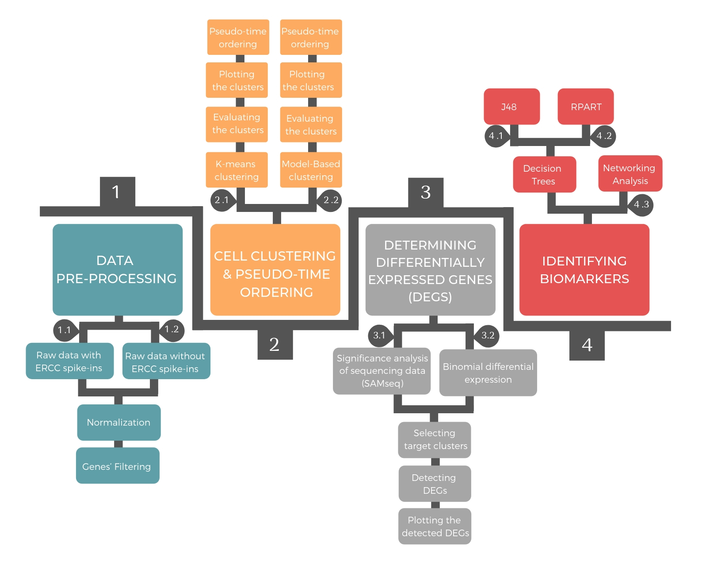

## Required Packages


```R
library(DIscBIO)
library(enrichR, quietly=TRUE)
```

## Loading dataset

The dataset should be formatted in a data frame where columns refer to samples and rows refer to genes. 


```R
FileName<-"valuesG1ms"

#load(paste0(FileName,".rda"))
#DataSet<-get(FileName)

DataSet <- read.csv(file = paste0(FileName,".csv"), sep = ";",header=T)
rownames(DataSet)<-DataSet[,1]
DataSet<-DataSet[,-1]

head(DataSet)
cat(paste0("The ", FileName," dataset contains:","\n","Genes: ",length(DataSet[,1]),"\n","cells: ",length(DataSet[1,]),"\n"))


```


<table>
<thead><tr><th></th><th scope=col>G1</th><th scope=col>G1_1</th><th scope=col>G1_2</th><th scope=col>G1_3</th><th scope=col>G1_4</th><th scope=col>G1_5</th><th scope=col>G1_6</th><th scope=col>G1_7</th><th scope=col>G1_8</th><th scope=col>G1_9</th><th scope=col>...</th><th scope=col>G2_22</th><th scope=col>G2_23</th><th scope=col>G2_24</th><th scope=col>G2_25</th><th scope=col>G2_26</th><th scope=col>G2_27</th><th scope=col>G2_28</th><th scope=col>G2_29</th><th scope=col>G2_30</th><th scope=col>G2_31</th></tr></thead>
<tbody>
	<tr><th scope=row>ENSG00000000003</th><td>360 </td><td>157 </td><td>495 </td><td>437 </td><td>136 </td><td>328 </td><td>253 </td><td>1101</td><td>39  </td><td>253 </td><td>... </td><td>725 </td><td>851 </td><td>299 </td><td>464 </td><td>551 </td><td>620 </td><td>488 </td><td>452 </td><td>424 </td><td>397 </td></tr>
	<tr><th scope=row>ENSG00000000005</th><td>  0 </td><td>  0 </td><td>  0 </td><td>  0 </td><td>  0 </td><td>  0 </td><td>  0 </td><td>   0</td><td> 0  </td><td>  0 </td><td>... </td><td>  0 </td><td>  0 </td><td>  0 </td><td>  0 </td><td>  0 </td><td>  0 </td><td>  0 </td><td>  0 </td><td>  0 </td><td>  0 </td></tr>
	<tr><th scope=row>ENSG00000000419</th><td>111 </td><td>174 </td><td>269 </td><td> 70 </td><td>179 </td><td> 93 </td><td> 57 </td><td>  60</td><td>35  </td><td> 91 </td><td>... </td><td>104 </td><td> 35 </td><td>297 </td><td>208 </td><td> 69 </td><td>113 </td><td>278 </td><td>109 </td><td> 87 </td><td>115 </td></tr>
	<tr><th scope=row>ENSG00000000457</th><td>  2 </td><td>  5 </td><td>  0 </td><td>  0 </td><td>  0 </td><td>  1 </td><td>  1 </td><td>   3</td><td> 0  </td><td>  1 </td><td>... </td><td>  1 </td><td>  0 </td><td>  0 </td><td>  0 </td><td>  3 </td><td>  0 </td><td>  3 </td><td>  0 </td><td>  2 </td><td>  1 </td></tr>
	<tr><th scope=row>ENSG00000000460</th><td>179 </td><td>  0 </td><td>212 </td><td>  0 </td><td>  0 </td><td>135 </td><td> 47 </td><td>   0</td><td> 0  </td><td>159 </td><td>... </td><td> 77 </td><td>  0 </td><td>  0 </td><td>  0 </td><td>202 </td><td>154 </td><td>259 </td><td> 99 </td><td>151 </td><td> 84 </td></tr>
	<tr><th scope=row>ENSG00000000938</th><td>  0 </td><td>  0 </td><td>  0 </td><td>  0 </td><td>  0 </td><td>  0 </td><td>  0 </td><td>   0</td><td> 0  </td><td>  0 </td><td>... </td><td>  0 </td><td>  0 </td><td>  0 </td><td>  0 </td><td>  0 </td><td>  0 </td><td>  0 </td><td>  0 </td><td>  0 </td><td>  0 </td></tr>
</tbody>
</table>


    The valuesG1ms dataset contains:
    Genes: 59838
    cells: 94
    

## 1. Data Pre-processing

Prior to applying data analysis methods, it is standard to pre-process the raw read counts resulted from the sequencing. The preprocessing approach depends on the existence or absence of ERCC spike-ins. In both cases, it includes normalization of read counts and gene filtering. 

#### Normalization of read counts
To account for RNA composition and sequencing depth among samples (single-cells), the normalization method “median of ratios” is used. This method takes the ratio of the gene instantaneous median to the total counts for all genes in that cell (column median). The gene instantaneous median is the product of multiplying the median of the total counts across all cells (row median) with the read of the target gene in each cell. This normalization method makes it possible to compare the normalized counts for each gene equally between samples.

#### Gene filtering
The key idea in filtering genes is to appoint the genes that manifest abundant variation across samples. Filtering genes is a critical step due to its dramatic impact on the downstream analysis. In case the raw data includes ERCC spike-ins, genes will be filtered based on variability in comparison to a noise level estimated from the ERCC spike-ins according to an algorithm developed by Brennecke et al (Brennecke et al., 2013). This algorithm utilizes the dependence of technical noise on the average read count and fits a model to the ERCC spike-ins. Further gene filtering can be implemented based on gene expression.
In case the raw data does not include ERCC spike-ins, genes will be only filtered based on minimum expression in certain number of cells.


```R
sc<- DISCBIO(DataSet)    
```

### 1.1. Filtering and normalizing the raw data that includes ERCCs

Filtering the raw data that includes ERCCs can be done by applying the “NoiseFiltering” function, which includes several parameters:
    - object: the outcome of running the DISCBIO() function.
    - percentile: A numeric value of the percentile. It is used to validate the ERCC spik-ins. Default is 0.8.
    - CV: A numeric value of the coefficient of variation. It is used to validate the ERCC spik-ins. Default is 0.5.
    - geneCol: Color of the genes that did not pass the filtration.
    - FgeneCol: Color of the genes that passt the filtration.
    - erccCol: Color of the ERCC spik-ins.
    - Val: A logical vector that allows plotting only the validated ERCC spike-ins. Default is TRUE. If Val=FALSE will 
      plot all the ERCC spike-ins.
    - plot: A logical vector that allows plotting the technical noise. Default is TRUE. 
    - export: A logical vector that allows writing the final gene list in excel file. Default is TRUE. 
    - quiet: if `TRUE`, suppresses printed output
    
To normalize the raw sequencing reads the function Normalizedata() should be used, this function takes 8 parameters. 
- In case the user would like just to normalize the reads without any further gene filtering the parameters minexpr and minnumber should be set to 0.
- In case the user would like just to normalize the reads and run gene filtering based on gene expression the parameters minexpr and minnumber should have values. This function will discard cells with less than mintotal transcripts. Genes that are not expressed at minexpr transcripts in at least minnumber cells are discarded.
          
The function Normalizedata() normalizes the count reads using the normalization method “median of ratios” 
          
To Finalize the preprocessing the function FinalPreprocessing() should be implemented by setting the parameter "GeneFlitering" to NoiseF ( whether the dditional gene filtering step based on gene expression was implemented on not).


```R
sc<-NoiseFiltering(sc,percentile=0.8, CV=0.3)       

####  Normalizing the reads without any further gene filtering
sc<-Normalizedata(sc, mintotal=1000, minexpr=0, minnumber=0, maxexpr=Inf, downsample=FALSE, dsn=1, rseed=17000) 

####  Additional gene filtering step based on gene expression
#MIínExp<- mean(rowMeans(DataSet,na.rm=TRUE))
#MIínExp
#MinNumber<- round(length(DataSet[1,])/3)    # To be expressed in at least one third of the cells.
#MinNumber
#sc<-Normalizedata(sc, mintotal=1000, minexpr=MIínExp, minnumber=MinNumber, maxexpr=Inf, downsample=FALSE, dsn=1, rseed=17000) 

sc<-FinalPreprocessing(sc,GeneFlitering="NoiseF",export = TRUE) ### The GeneFiltering can be either "NoiseF" or"ExpF"
```

    Cut-off value for the ERCCs=  12.5 
    
    Coefficients of the fit: 
            a0    a1tilde 
     0.0200366 70.4893629 
    Explained variances of log CV^2 values=  0.84 
    
    Number of genes that passed the filtering=  5684 
    
    The filtered gene list was saved as: Noise_filtering_genes_test
    The gene filtering method= Noise filtering
    
     The Filtered Normalized dataset contains:
     Genes: 5684 
     cells: 94 
    
    The Filtered Normalized dataset was saved as: filteredDataset.Rdata
    


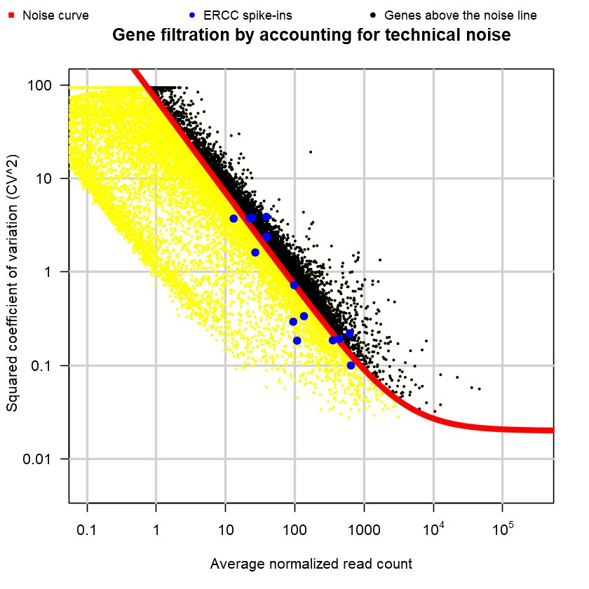


### 1.2. Filtering and normalizing the raw data that does not include ERCCs

To normalize and filter the raw data that does not include ERCCs can be done by applying the function Normalizedata() and giving  the parameters minexpr and minnumber some values. This function will discard cells with less than mintotal transcripts. Genes that are not expressed at minexpr transcripts in at least minnumber cells are discarded. Furthermore, it will normalize the count reads using the normalization method “median of ratios”.
          
To Finalize the preprocessing the function FinalPreprocessing() should be implemented by setting the parameter "GeneFlitering" to ExpF.

###                                               ¤¤¤¤¤¤¤¤¤¤¤¤¤¤¤¤¤¤¤¤ Running this cell will overwrite the previous cell ¤¤¤¤¤¤¤¤¤¤¤¤¤¤¤¤¤¤¤¤


```R
#OnlyExpressionFiltering=TRUE           
OnlyExpressionFiltering=FALSE         

if (OnlyExpressionFiltering==TRUE){
    MIínExp<- mean(rowMeans(DataSet,na.rm=TRUE))
    MIínExp
    MinNumber<- round(length(DataSet[1,])/3)    # To be expressed in at least one third of the cells.
    MinNumber
    sc<-Normalizedata(sc, mintotal=1000, minexpr=MIínExp, minnumber=MinNumber, maxexpr=Inf, downsample=FALSE, dsn=1, rseed=17000) #### In this case this function is used to filter out genes and cells.
    sc<-FinalPreprocessing(sc,GeneFlitering="ExpF",export = TRUE)  
}
```

## 2. Cellular Clustering and Pseudo Time ordering

Cellular clustering is performed according to the gene expression profiles to detect cellular sub-population with unique properties. After clustering, pseudo-temporal ordering is generated to indicate the cellular differentiation degree. 


## 2.1. K-means Clustering

Rare cell type Identification algorithm (RaceID) was used to cluster the pre-processed data using k-means on a similarity distance matrix, which was based on Pearson correlation and the similarity matrix was computed as “1 – Pearson correlation”. The approach of the proposed clustering, i.e., applying k-means on a similarity distance matrix using the Euclidean metric, improves cluster separation. RaceID estimates the number of clusters by finding the minimal clusters' number at the saturation level of gap statistics, which standardizes the within-cluster dispersion. 

The Clustexp() functions has several parameters:
- object: the outcome of running the DISCBIO() function.
- clustnr Maximum number of clusters for the derivation of the cluster number by the saturation of mean within-cluster dispersion. Default is 20.
- bootnr A numeric value of booststrapping runs for \code{clusterboot}. Default is 50.
- metric Is the method to transform the input data to a distance object. 
- Metric has to be one of the following: ["spearman","pearson","kendall","euclidean","maximum","manhattan","canberra","binary","minkowski"]. 
- do.gap A logical vector that allows generating the number of clusters based on the gap statistics. Default is TRUE.
- SE.method The SE.method determines the first local maximum of the gap statistics. 
- The SE.method has to be one of the following:["firstSEmax","Tibs2001SEmax","globalSEmax","firstmax","globalmax"]. Default is "Tibs2001SEmax"
- SE.factor A numeric value of the fraction of the standard deviation by which the local maximum is required to differ from the neighboring points it is compared to. Default is 0.25.
- B.gap Number of bootstrap runs for the calculation of the gap statistics. Default is 50
- cln Number of clusters to be used. Default is \code{NULL} and the cluster number is inferred by the saturation criterion.
- rseed Integer number. Random seed to enforce reproducible clustering results. Default is 17000.
- quiet if `TRUE`, intermediate output is suppressed

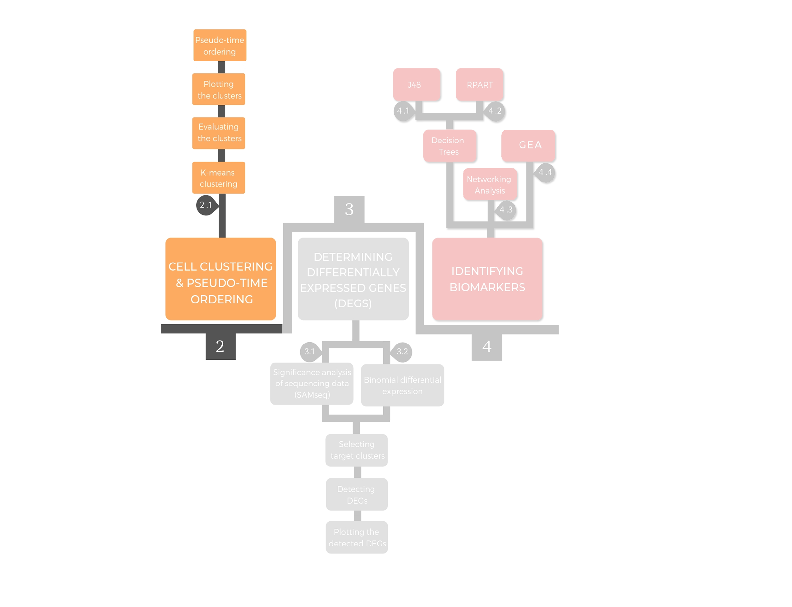


```R
sc<- Clustexp(sc,cln=3,quiet=T)    #### K-means clustering to get three clusters
plotGap(sc)        ### Plotting gap statisticssc<- Clustexp(sc, clustnr=20,bootnr=50,metric="pearson",do.gap=T,SE.method="Tibs2001SEmax",SE.factor=.25,B.gap=50,cln=K,rseed=17000)
```


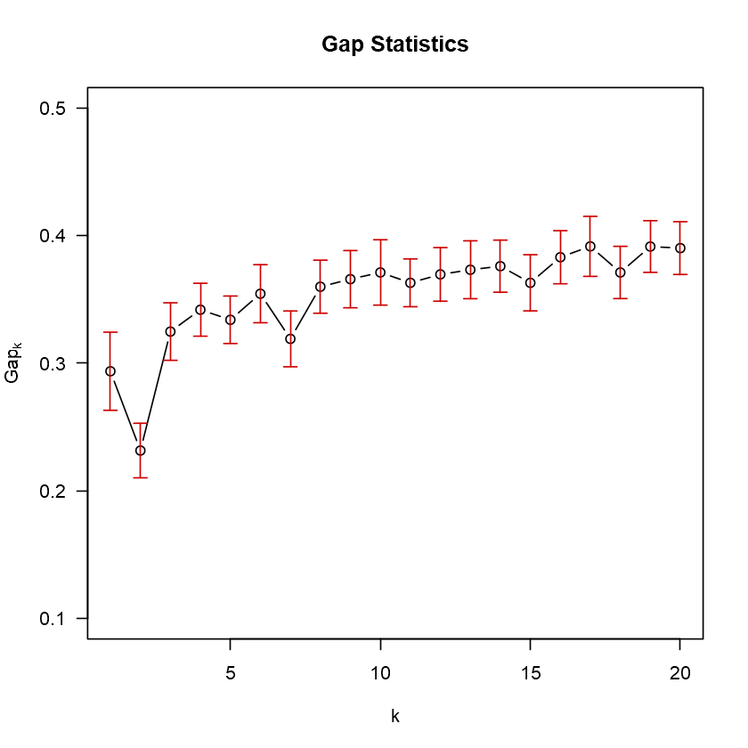


#### 2.1.1. Defining the Cells in the clusters generated by k-means clustering


```R
sc<- comptSNE(sc,rseed=15555,quiet = TRUE)
cat("\t","     Cell-ID"," Cluster Number","\n")
sc@cpart
```

    	      Cell-ID  Cluster Number 
    


<dl class=dl-horizontal>
	<dt>G1</dt>
		<dd>1</dd>
	<dt>G1_1</dt>
		<dd>2</dd>
	<dt>G1_2</dt>
		<dd>1</dd>
	<dt>G1_3</dt>
		<dd>1</dd>
	<dt>G1_4</dt>
		<dd>1</dd>
	<dt>G1_5</dt>
		<dd>1</dd>
	<dt>G1_6</dt>
		<dd>2</dd>
	<dt>G1_7</dt>
		<dd>2</dd>
	<dt>G1_8</dt>
		<dd>3</dd>
	<dt>G1_9</dt>
		<dd>3</dd>
	<dt>G1_10</dt>
		<dd>3</dd>
	<dt>G1_11</dt>
		<dd>1</dd>
	<dt>G1_12</dt>
		<dd>3</dd>
	<dt>G1_13</dt>
		<dd>1</dd>
	<dt>G1_14</dt>
		<dd>1</dd>
	<dt>G1_15</dt>
		<dd>1</dd>
	<dt>G1_16</dt>
		<dd>3</dd>
	<dt>G1_17</dt>
		<dd>2</dd>
	<dt>G1_18</dt>
		<dd>2</dd>
	<dt>G1_19</dt>
		<dd>2</dd>
	<dt>G1_20</dt>
		<dd>3</dd>
	<dt>G1_21</dt>
		<dd>1</dd>
	<dt>G1_22</dt>
		<dd>2</dd>
	<dt>G1_23</dt>
		<dd>1</dd>
	<dt>G1_24</dt>
		<dd>1</dd>
	<dt>G1_25</dt>
		<dd>2</dd>
	<dt>G1_26</dt>
		<dd>3</dd>
	<dt>G1_27</dt>
		<dd>2</dd>
	<dt>G1_28</dt>
		<dd>2</dd>
	<dt>G1_29</dt>
		<dd>2</dd>
	<dt>S</dt>
		<dd>2</dd>
	<dt>S_1</dt>
		<dd>2</dd>
	<dt>S_2</dt>
		<dd>2</dd>
	<dt>S_3</dt>
		<dd>2</dd>
	<dt>S_4</dt>
		<dd>2</dd>
	<dt>S_5</dt>
		<dd>2</dd>
	<dt>S_6</dt>
		<dd>2</dd>
	<dt>S_7</dt>
		<dd>1</dd>
	<dt>S_8</dt>
		<dd>2</dd>
	<dt>S_9</dt>
		<dd>2</dd>
	<dt>S_10</dt>
		<dd>2</dd>
	<dt>S_11</dt>
		<dd>2</dd>
	<dt>S_12</dt>
		<dd>2</dd>
	<dt>S_13</dt>
		<dd>1</dd>
	<dt>S_14</dt>
		<dd>2</dd>
	<dt>S_15</dt>
		<dd>1</dd>
	<dt>S_16</dt>
		<dd>2</dd>
	<dt>S_17</dt>
		<dd>1</dd>
	<dt>S_18</dt>
		<dd>1</dd>
	<dt>S_19</dt>
		<dd>2</dd>
	<dt>S_20</dt>
		<dd>2</dd>
	<dt>S_21</dt>
		<dd>2</dd>
	<dt>S_22</dt>
		<dd>1</dd>
	<dt>S_23</dt>
		<dd>1</dd>
	<dt>S_24</dt>
		<dd>2</dd>
	<dt>S_25</dt>
		<dd>2</dd>
	<dt>S_26</dt>
		<dd>2</dd>
	<dt>S_27</dt>
		<dd>3</dd>
	<dt>S_28</dt>
		<dd>2</dd>
	<dt>S_29</dt>
		<dd>2</dd>
	<dt>S_30</dt>
		<dd>2</dd>
	<dt>S_31</dt>
		<dd>3</dd>
	<dt>G2</dt>
		<dd>2</dd>
	<dt>G2_1</dt>
		<dd>2</dd>
	<dt>G2_2</dt>
		<dd>2</dd>
	<dt>G2_3</dt>
		<dd>3</dd>
	<dt>G2_4</dt>
		<dd>1</dd>
	<dt>G2_5</dt>
		<dd>1</dd>
	<dt>G2_6</dt>
		<dd>2</dd>
	<dt>G2_7</dt>
		<dd>2</dd>
	<dt>G2_8</dt>
		<dd>2</dd>
	<dt>G2_9</dt>
		<dd>1</dd>
	<dt>G2_10</dt>
		<dd>3</dd>
	<dt>G2_11</dt>
		<dd>2</dd>
	<dt>G2_12</dt>
		<dd>1</dd>
	<dt>G2_13</dt>
		<dd>2</dd>
	<dt>G2_14</dt>
		<dd>3</dd>
	<dt>G2_15</dt>
		<dd>1</dd>
	<dt>G2_16</dt>
		<dd>1</dd>
	<dt>G2_17</dt>
		<dd>1</dd>
	<dt>G2_18</dt>
		<dd>2</dd>
	<dt>G2_19</dt>
		<dd>2</dd>
	<dt>G2_20</dt>
		<dd>2</dd>
	<dt>G2_21</dt>
		<dd>1</dd>
	<dt>G2_22</dt>
		<dd>3</dd>
	<dt>G2_23</dt>
		<dd>1</dd>
	<dt>G2_24</dt>
		<dd>2</dd>
	<dt>G2_25</dt>
		<dd>3</dd>
	<dt>G2_26</dt>
		<dd>3</dd>
	<dt>G2_27</dt>
		<dd>2</dd>
	<dt>G2_28</dt>
		<dd>2</dd>
	<dt>G2_29</dt>
		<dd>1</dd>
	<dt>G2_30</dt>
		<dd>2</dd>
	<dt>G2_31</dt>
		<dd>2</dd>
</dl>


#### 2.1.2- Evaluating the stability and consistancy of the clusters

PSCAN enables the robustness assessment of the detected clusters in terms of stability and consistency using Jaccard’s similarity statistics and silhouette coefficients. Jaccard’s similarity index provides a comparison of members among clusters to evaluate the stability of the clusters with a range from 0% to 100%. The higher the percentage, the more stable the cluster is. Silhouette coefficients estimate how close each sample in one cluster is to samples in the neighboring clusters, reflecting the consistency of each cluster with a range of [-1, 1]. The higher the cluster mean coefficient, the more consistent the cluster is.


```R
# Silhouette of k-means clusters
par(mar=c(6,2,4,2))
plotSilhouette(sc,K=3)       # K is the number of clusters
```


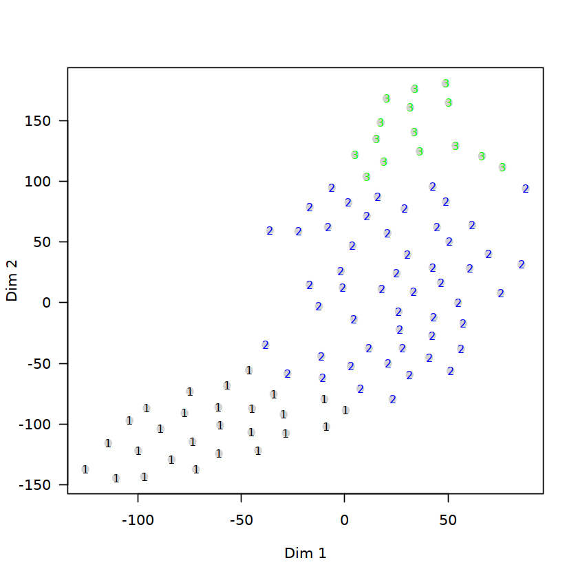


```R
Jaccard(sc,Clustering="K-means", K=3, plot = TRUE)     # Jaccard of k-means clusters
```


<ol class=list-inline>
	<li>0.68</li>
	<li>0.766</li>
	<li>0.681</li>
</ol>


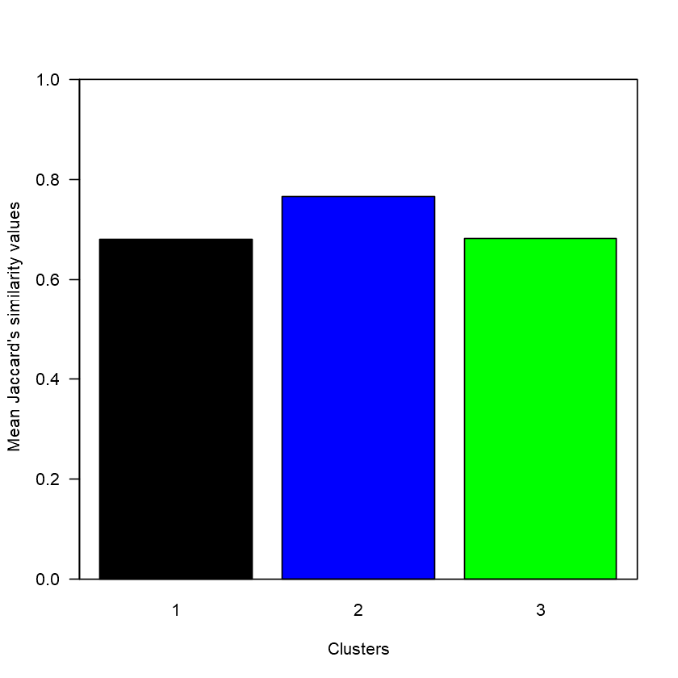


#### 2.1.3. Cluster plotting using tSNE maps

Here you visualize the K-means clusters using t-distributed stochastic neighbor embedding (tSNE), which is a non-linear dimensionality reduction method that places neighbor cells close to each other. 


```R
############ Plotting K-means clusters
plottSNE(sc)
plotKmeansLabelstSNE(sc)                                         # To plot the the ID of the cells in eacj cluster
plotSymbolstSNE(sc,types=sub("(\\_\\d+)$","", names(sc@ndata)))  # To plot the the ID of the cells in eacj cluster
```


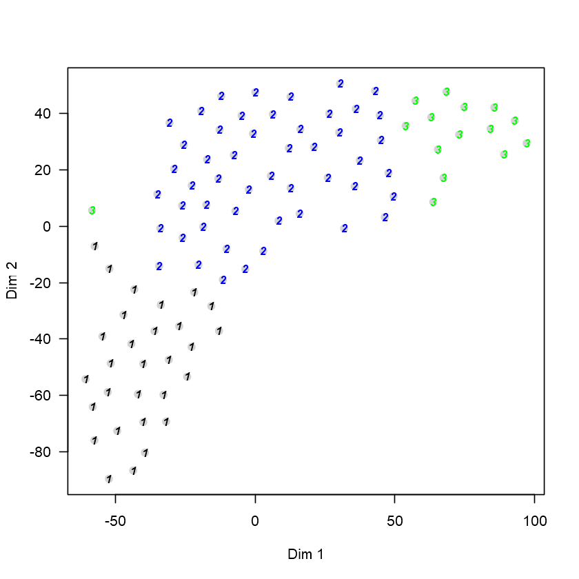


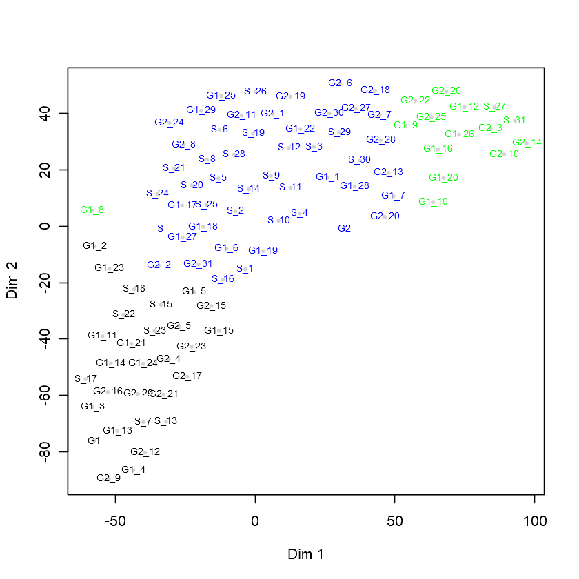


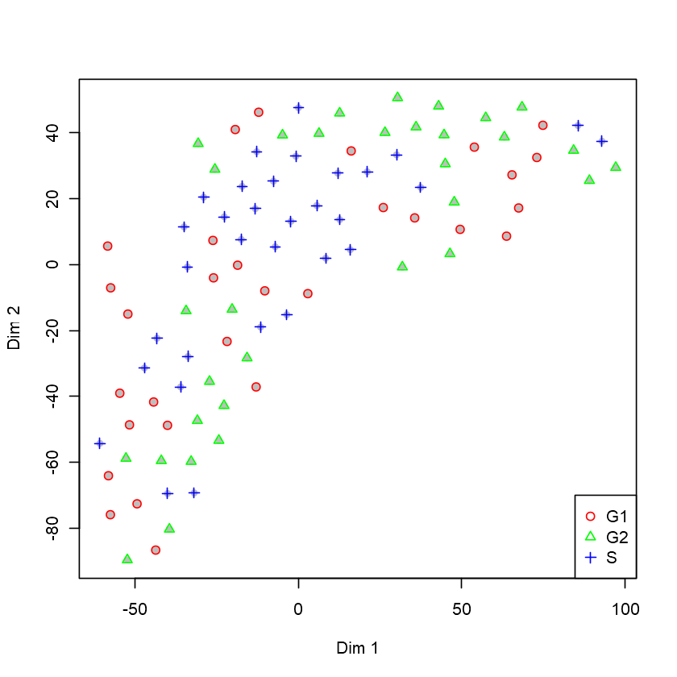


### Defining outlier cells based on K-means Clustering

Outlier identification is implemented using a background model based on distribution of transcript counts within a cluster. Outlier cells are detected if the probability for that cell c that a minimum number of genes Gmin of observing total counts TGmin is less than a specific threshold Pthr, as given by the red dotted line. Outlier cells in K-means clusters can be detected by running the FindOutliersKM() function.
 
In case the user decided to remove outlier cells, the user should set RemovingOutliers to TRUE and then start from the beginning (Data Pre-processing). 


```R
outlg<-round(length(sc@fdata[,1])/200)     # The cell will be considered as an outlier if it has a minimum of 0.5% of the number of filtered genes as outlier genes. 
Outliers<- FindOutliersKM(sc, K=3, outminc=5,outlg=outlg,probthr=.5*1e-3,thr=2**-(1:40),outdistquant=.75, plot = TRUE, quiet = FALSE)

RemovingOutliers=FALSE     
# RemovingOutliers=TRUE                    # Removing the defined outlier cells based on K-means Clustering

if(RemovingOutliers==TRUE){
    names(Outliers)=NULL
    Outliers
    DataSet=DataSet[-Outliers]
    dim(DataSet)
    colnames(DataSet)
    cat("Outlier cells were removed, now you need to start from the beginning")
}
```

    The following cells are considered as outlier cells: 1 13 22 
       G1 G1_12 G1_21 
        1    13    22 
    


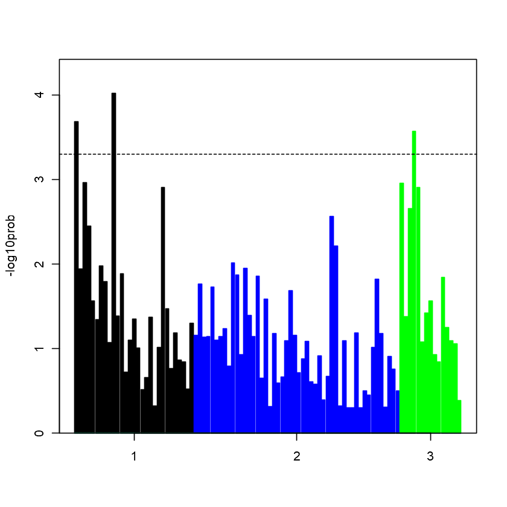


#### 2.1.4. Cellular pseudo-time ordering based on k-means clusters 


```R
sc<-KmeanOrder(sc,quiet = FALSE, export = TRUE)
plotOrderKMtsne(sc)
```

       order orderID
    1      1    S_13
    2      2     S_7
    3      3   G2_29
    4      4   G2_21
    5      5   G1_13
    6      6    S_17
    7      7   G2_23
    8      8   G2_17
    9      9    S_15
    10    10   G1_24
    11    11    G1_3
    12    12    G2_4
    13    13   G1_14
    14    14    G2_5
    15    15   G1_21
    16    16   G1_11
    17    17   G2_16
    18    18    S_18
    19    19    G1_4
    20    20    S_23
    21    21   G2_12
    22    22    S_22
    23    23      G1
    24    24   G1_15
    25    25   G2_15
    26    26    G1_5
    27    27   G1_23
    28    28    G2_9
    29    29    G1_2
    30    30    G2_2
    31    31    S_16
    32    32       S
    33    33    S_24
    34    34   G1_18
    35    35   G1_27
    36    36   G2_31
    37    37    S_25
    38    38     S_2
    39    39      G2
    40    40   G2_24
    41    41    S_21
    42    42   G1_17
    43    43    S_14
    44    44     S_1
    45    45   G1_19
    46    46    S_20
    47    47    G2_8
    48    48    G1_6
    49    49     S_8
    50    50     S_5
    51    51    G2_1
    52    52    S_28
    53    53     S_6
    54    54    S_10
    55    55     S_4
    56    56     S_3
    57    57   G2_19
    58    58   G1_25
    59    59     S_9
    60    60    S_12
    61    61    S_11
    62    62   G1_29
    63    63    S_26
    64    64    S_19
    65    65   G1_22
    66    66    S_30
    67    67   G2_28
    68    68   G2_11
    69    69   G2_20
    70    70    S_29
    71    71   G1_28
    72    72    G1_1
    73    73   G2_13
    74    74   G2_18
    75    75    G2_6
    76    76   G2_30
    77    77    G1_7
    78    78    G2_7
    79    79   G2_27
    80    80    G1_8
    81    81   G2_25
    82    82   G1_10
    83    83    G1_9
    84    84   G2_22
    85    85   G2_26
    86    86   G1_16
    87    87   G1_20
    88    88   G1_12
    89    89   G1_26
    90    90    S_27
    91    91   G2_10
    92    92    S_31
    93    93    G2_3
    94    94   G2_14
    


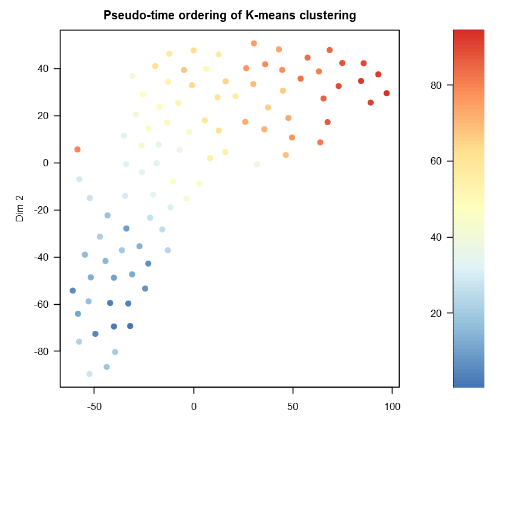


#### 2.1.5 Plotting the K-means clusters in heatmap

The similarities between single-cells were computed by Euclidean distances of Pearson transcriptome correlation matrix. Based on these similarities, a heatmap portrayal of cell-to-cell distances was plotted using Euclidean as the distance measure and the single linkage as the clustering method, cluster centers were ordered by hierarchic clustering. 


```R
KMclustheatmap(sc,hmethod="single", plot = TRUE) 
```


<ol class=list-inline>
	<li>3</li>
	<li>1</li>
	<li>2</li>
</ol>


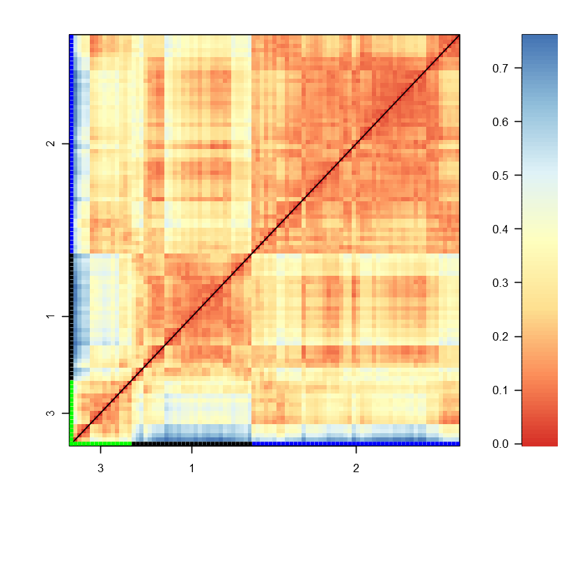


#### 2.1.6 Plotting the gene expression of a particular gene in a tSNE map


```R
g='ENSG00000210082'                   #### Plotting the expression of  MT-RNR2
plotExptSNE(sc,g)
```


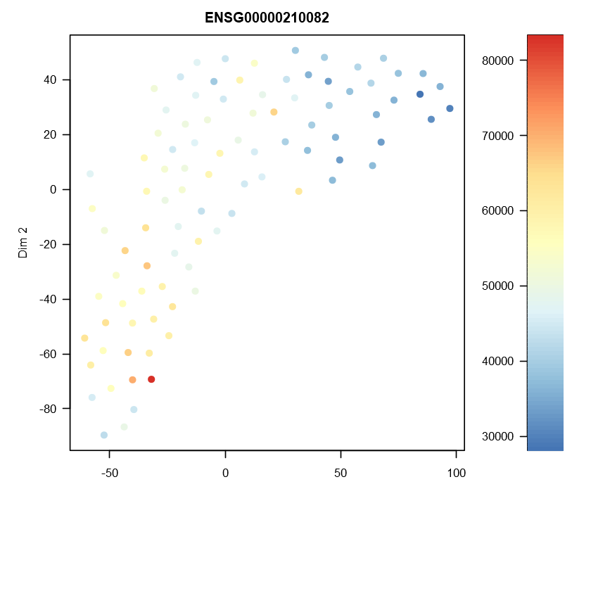


## 3. Determining differentially expressed genes (DEGs) For K-means Clustering

Differentially expressed genes between individual clusters are identified using the significance analysis of sequencing data (SAMseq), which is a new function in significance analysis of microarrays (Li and Tibshirani 2011) in the samr package v2.0 (Tibshirani et all., 2015). SAMseq is a non-parametric statistical function dependent on Wilcoxon rank statistic that equalizes the sizes of the library by a resampling method accounting for the various sequencing depths. The analysis is implemented over the pure raw dataset that has the unnormalized expression read counts after excluding the ERCCs. Furthermore, DEGs in each cluster comparing to all the remaining clusters are determined using binomial differential expression, which is based on binomial counting statistics.

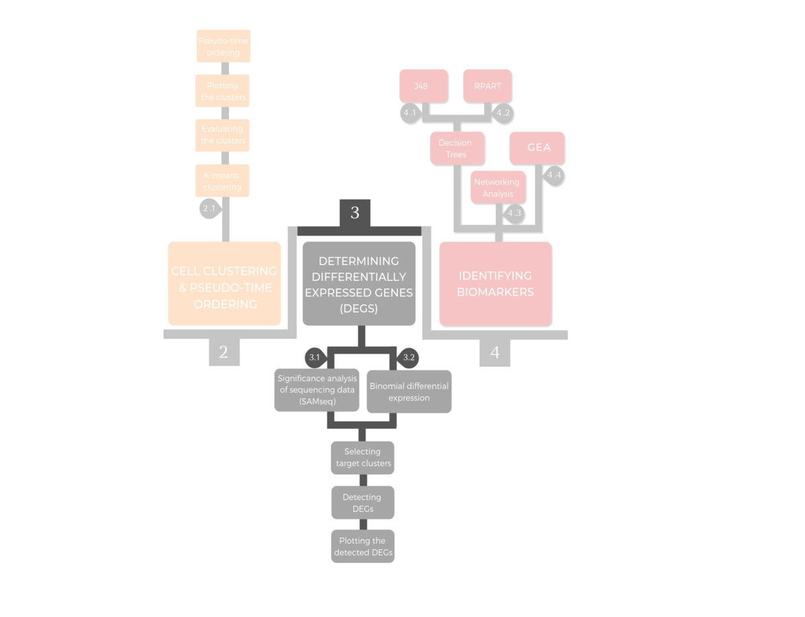

## 3.1 Identifying DEGs using SAMseq

The user can define DEGs between all clusters generated by either K-means or model based clustering by applying the “DEGanalysis” function. Another alternative is to define DEGs between particular clusters generated by K-means clustering by applying the “DEGanalysis2clust” function. The outcome of these two functions is a list of two components:
- The first component is a data frame showing the Ensembl gage name and the symbole of the detected DEGs
- The second component is table showing the comparisons, Target cluster, Number of genes and the File name. This component will be used for the downstream analysis.

### 3.1.1 Determining DEGs between two particular clusters


```R
####### differential expression analysis between cluster 1 and cluster 3 of the Model-Based clustering using FDR of 0.05
cdiff<-DEGanalysis2clust(sc,Clustering="K-means",K=3,fdr=0.05,name="Name",First="CL1",Second="CL3",export = TRUE,quiet=T)     
```

    The results of DEGs are saved in your directory 
    Low-regulated genes in the CL3 in CL1 VS CL3
    The results of DEGs are saved in your directory 
    Up-regulated genes in the CL3 in CL1 VS CL3
    


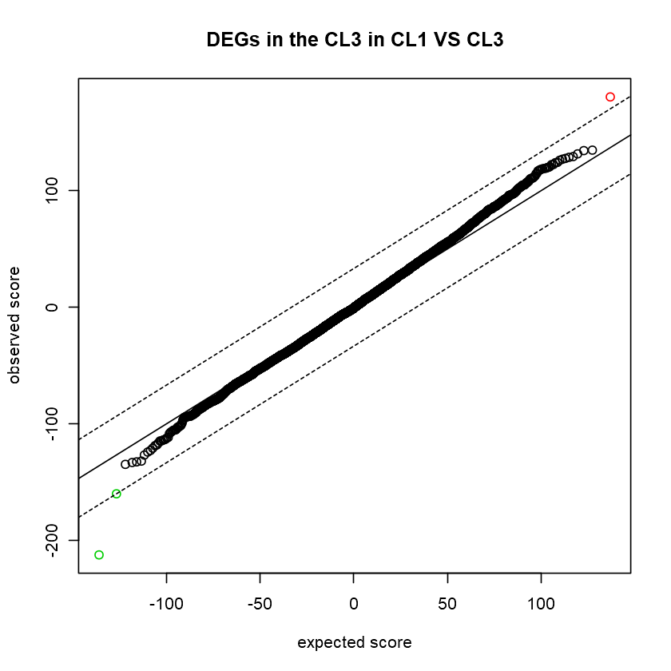


```R
#### To show the result table
head(cdiff[[1]])                  # The first component 
head(cdiff[[2]])                  # The second component 
```


<table>
<thead><tr><th scope=col>DEGsE</th><th scope=col>DEGsS</th></tr></thead>
<tbody>
	<tr><td>ENSG00000198888</td><td>ND1            </td></tr>
	<tr><td>ENSG00000210082</td><td>MTRNR2         </td></tr>
	<tr><td>ENSG00000075624</td><td>ACTB           </td></tr>
</tbody>
</table>


<table>
<thead><tr><th scope=col>Comparisons</th><th scope=col>Target cluster</th><th scope=col>Gene number</th><th scope=col>File name</th><th scope=col>Gene number</th><th scope=col>File name</th></tr></thead>
<tbody>
	<tr><td>CL1 VS CL3                         </td><td>CL3                                </td><td>1                                  </td><td>Up-regulated-NameCL3inCL1VSCL3.csv </td><td>2                                  </td><td>Low-regulated-NameCL3inCL1VSCL3.csv</td></tr>
	<tr><td>CL1 VS CL3                         </td><td>CL1                                </td><td>1                                  </td><td>Low-regulated-NameCL1inCL1VSCL3.csv</td><td>2                                  </td><td>Up-regulated-NameCL1inCL1VSCL3.csv </td></tr>
</tbody>
</table>


### 3.1.2 Determining DEGs between all clusters


##                                         ¤¤¤¤¤¤¤¤¤¤¤¤¤¤¤¤ Running this cell will overwrite the previous one ¤¤¤¤¤¤¤¤¤¤¤¤¤¤¤¤


```R
cdiff<-DEGanalysis(sc,Clustering="K-means",K=3,fdr=0.05,name="all_clusters",export = TRUE,quiet=T)   ####### differential expression analysis between all clusters
```


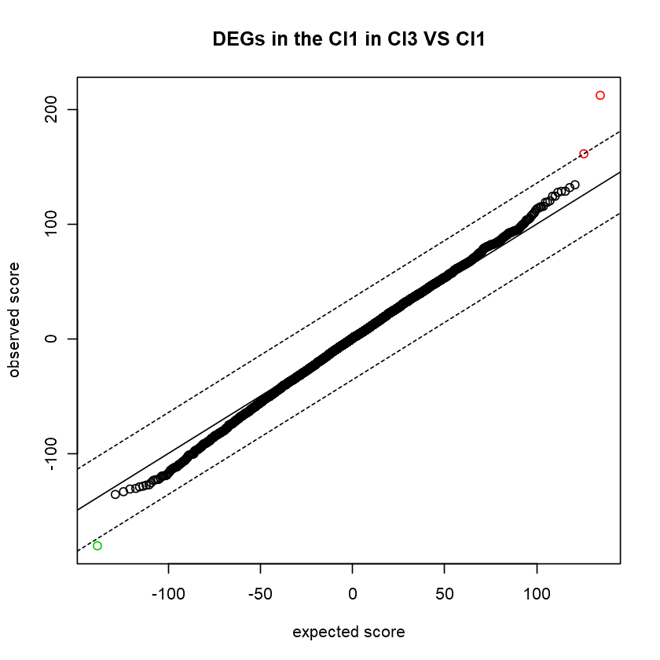


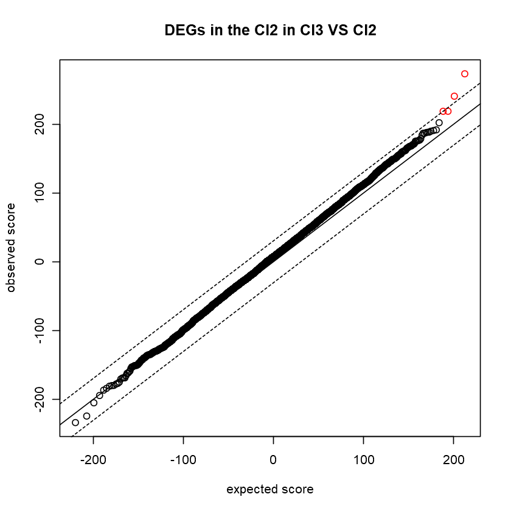


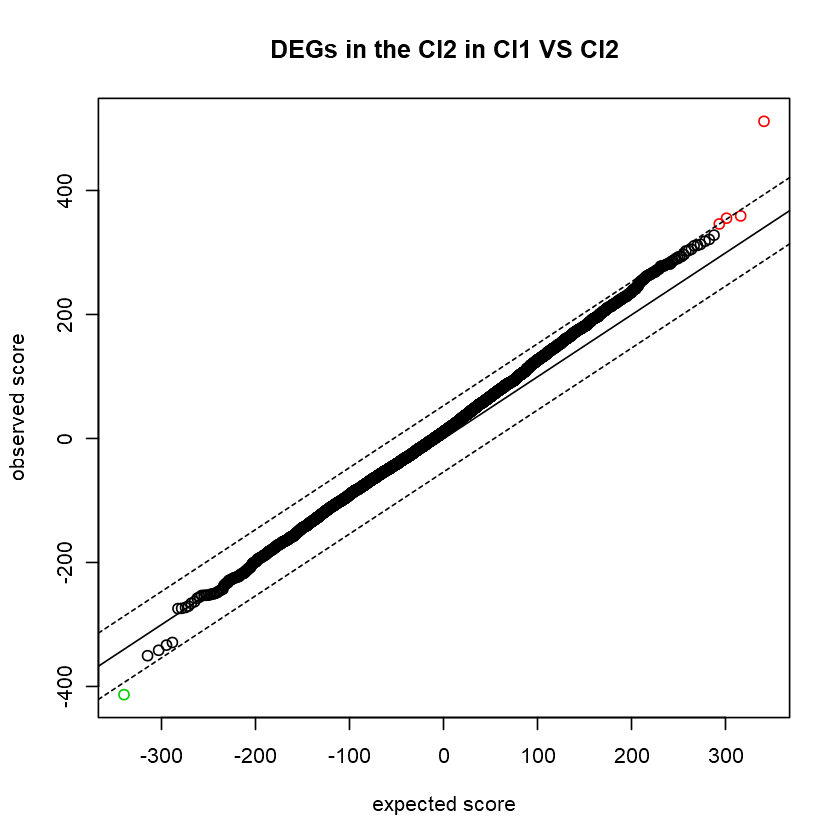


```R
#### To show the result table
head(cdiff[[1]])                  # The first component 
head(cdiff[[2]])                  # The second component
```


<table>
<thead><tr><th scope=col>DEGsE</th><th scope=col>DEGsS</th></tr></thead>
<tbody>
	<tr><td>ENSG00000075624</td><td>ACTB           </td></tr>
	<tr><td>ENSG00000198888</td><td>ND1            </td></tr>
	<tr><td>ENSG00000210082</td><td>MTRNR2         </td></tr>
	<tr><td>ENSG00000168297</td><td>PXK            </td></tr>
	<tr><td>ENSG00000198888</td><td>ND1            </td></tr>
	<tr><td>ENSG00000210082</td><td>MTRNR2         </td></tr>
</tbody>
</table>


<table>
<thead><tr><th scope=col>Comparisons</th><th scope=col>Target cluster</th><th scope=col>Gene number</th><th scope=col>File name</th><th scope=col>Gene number</th><th scope=col>File name</th></tr></thead>
<tbody>
	<tr><td>Cl3 VS Cl1                                 </td><td>Cl1                                        </td><td>2                                          </td><td>Up-regulated-all_clustersCl1inCl3VSCl1.csv </td><td>1                                          </td><td>Low-regulated-all_clustersCl1inCl3VSCl1.csv</td></tr>
	<tr><td>Cl3 VS Cl2                                 </td><td>Cl2                                        </td><td>4                                          </td><td>Up-regulated-all_clustersCl2inCl3VSCl2.csv </td><td>0                                          </td><td>Low-regulated-all_clustersCl2inCl3VSCl2.csv</td></tr>
	<tr><td>Cl1 VS Cl2                                 </td><td>Cl2                                        </td><td>4                                          </td><td>Up-regulated-all_clustersCl2inCl1VSCl2.csv </td><td>1                                          </td><td>Low-regulated-all_clustersCl2inCl1VSCl2.csv</td></tr>
	<tr><td>Cl3 VS Cl1                                 </td><td>Cl3                                        </td><td>2                                          </td><td>Low-regulated-all_clustersCl3inCl3VSCl1.csv</td><td>1                                          </td><td>Up-regulated-all_clustersCl3inCl3VSCl1.csv </td></tr>
	<tr><td>Cl3 VS Cl2                                 </td><td>Cl3                                        </td><td>4                                          </td><td>Low-regulated-all_clustersCl3inCl3VSCl2.csv</td><td>0                                          </td><td>Up-regulated-all_clustersCl3inCl3VSCl2.csv </td></tr>
	<tr><td>Cl1 VS Cl2                                 </td><td>Cl1                                        </td><td>4                                          </td><td>Low-regulated-all_clustersCl1inCl1VSCl2.csv</td><td>1                                          </td><td>Up-regulated-all_clustersCl1inCl1VSCl2.csv </td></tr>
</tbody>
</table>


#### 3.2 Identifying DEGs using binomial differential expression

The function KMClustDiffGenes identifies differentially regulated genes for each cluster of the K-means clustering in 
comparison to the ensemble of all cells. It returns a list with a data.frame element for each cluster that contains the mean expression across all cells not in the cluster (mean.ncl) and in the cluster (mean.cl), the fold-change in the cluster versus all remaining cells (fc), and the p-value for differential expression between all cells in a cluster and all remaining cells. The p-value is computed based on the overlap of negative binomials fitted to the count distributions within the two groups akin to DESeq.


```R
cdiffBinomial<-KMClustDiffGenes(sc,K=3,fdr=.01,,quiet=T)    ########## Binomial differential expression analysis
#### To show the result table
head(cdiffBinomial[[1]])                  # The first component 
head(cdiffBinomial[[2]])                  # The second component
```


<table>
<thead><tr><th scope=col>DEGsE</th><th scope=col>DEGsS</th></tr></thead>
<tbody>
	<tr><td>ENSG00000011426</td><td>ANLN           </td></tr>
	<tr><td>ENSG00000011485</td><td>PPP5C          </td></tr>
	<tr><td>ENSG00000022267</td><td>FHL1           </td></tr>
	<tr><td>ENSG00000047849</td><td>MAP4           </td></tr>
	<tr><td>ENSG00000051180</td><td>RAD51          </td></tr>
	<tr><td>ENSG00000052802</td><td>MSMO1          </td></tr>
</tbody>
</table>


<table>
<thead><tr><th scope=col>Target Cluster</th><th scope=col>VS</th><th scope=col>Gene number</th><th scope=col>File name</th><th scope=col>Gene number</th><th scope=col>File name</th></tr></thead>
<tbody>
	<tr><td>Cluster 1            </td><td>Remaining Clusters   </td><td> 34                  </td><td>Up-DEG-cluster1.csv  </td><td> 71                  </td><td>Down-DEG-cluster1.csv</td></tr>
	<tr><td>Cluster 2            </td><td>Remaining Clusters   </td><td>  7                  </td><td>Up-DEG-cluster2.csv  </td><td>  7                  </td><td>Down-DEG-cluster2.csv</td></tr>
	<tr><td>Cluster 3            </td><td>Remaining Clusters   </td><td>357                  </td><td>Up-DEG-cluster3.csv  </td><td>295                  </td><td>Down-DEG-cluster3.csv</td></tr>
</tbody>
</table>


### Plotting the DEGs

Volcano plots are used to readily show the DEGs by plotting significance versus fold-change on the y and x axes, respectively.


```R
name<-cdiffBinomial[[2]][3,4]    ############ Selecting the DEGs' table  ##############
U<-read.csv(file=paste0(name),head=TRUE,sep=",")
Vplot<-VolcanoPlot(U,value=0.001,name=name,FS=.3,fc=1)

#### In case the output of this function is an error "Error in plot.window(...): need finite 'ylim' values", the adj should be set to TRUE
### In case the user would like to get the names of the significant DEGs then FS should be set to a value of 0.3 or higher.
```


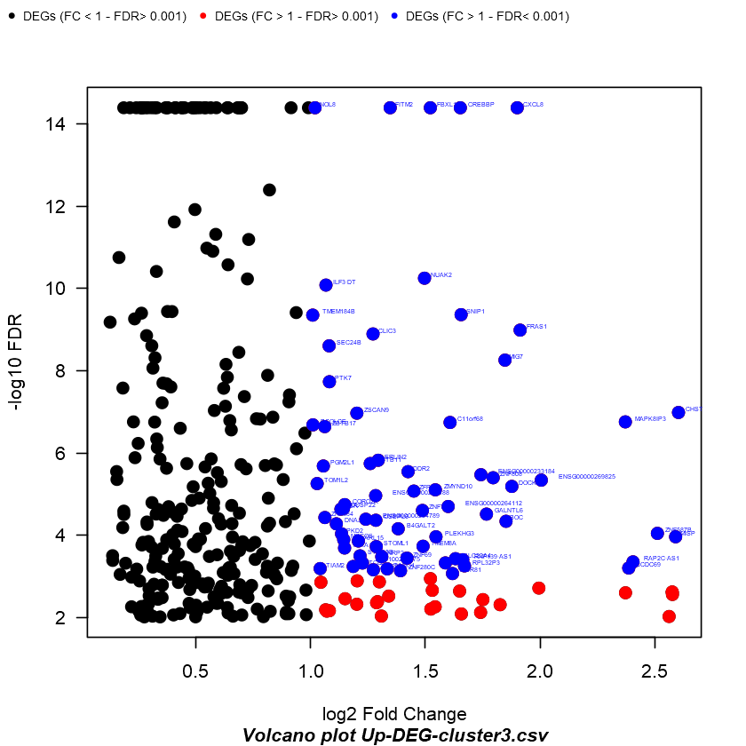


## 4. Identifying biomarkers (decision trees and networking analysis) 

There are several methods to identify biomarkers, among them are decision trees and hub detection through networking analysis. The outcome of STRING analysis is stored in tab separated values (TSV) files. These TSV files served as an input to check both the connectivity degree and the betweenness centrality, which reflects the communication flow in the defined PPI networks 

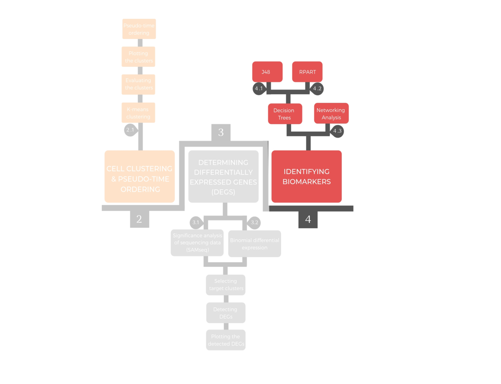

Decision trees are one of the most efficient classification techniques in biomarkers discovery. Here we use it to predict the sub-population of a target cell based on transcriptomic data. Two types of decision trees can be performed: classification and regression trees (CART) and J48. The decision tree analysis is implemented over a training dataset, which consisted of the DEGs obtained by either SAMseq or the binomial differential expression. The performance of the generated trees can be evaluated for error estimation by ten-fold cross validation assessment using the "J48DTeval" and "RpartEVAL" functions. The decision tree analysis requires the dataset to be class vectored by applying the “ClassVectoringDT” function.


```R
#sigDEG<-cdiff[[1]]             # DEGs gene list from SANseq
sigDEG<-cdiffBinomial[[1]]      # DEGs gene list from Binomial analysis
First="CL1"
Second="CL3"
DATAforDT<-ClassVectoringDT(sc,Clustering="K-means",K=3,First=First,Second=Second,sigDEG)
```

    The DEGs filtered normalized dataset contains:
     Genes: 703 
     cells: 44

### 4.1. J48 Decision Tree


```R
j48dt<-J48DT(DATAforDT)
summary(j48dt) 
```

    J48 pruned tree
    ------------------
    
    MTRNR2 <= 41518.323682: CL3 (14.0)
    MTRNR2 > 41518.323682: CL1 (30.0/1.0)
    
    Number of Leaves  : 	2
    
    Size of the tree : 	3
    
    


    
    === Summary ===
    
    Correctly Classified Instances          43               97.7273 %
    Incorrectly Classified Instances         1                2.2727 %
    Kappa statistic                          0.9486
    Mean absolute error                      0.0439
    Root mean squared error                  0.1482
    Relative absolute error                  9.7301 %
    Root relative squared error             31.2661 %
    Total Number of Instances               44     
    
    === Confusion Matrix ===
    
      a  b   <-- classified as
     29  0 |  a = CL1
      1 14 |  b = CL3


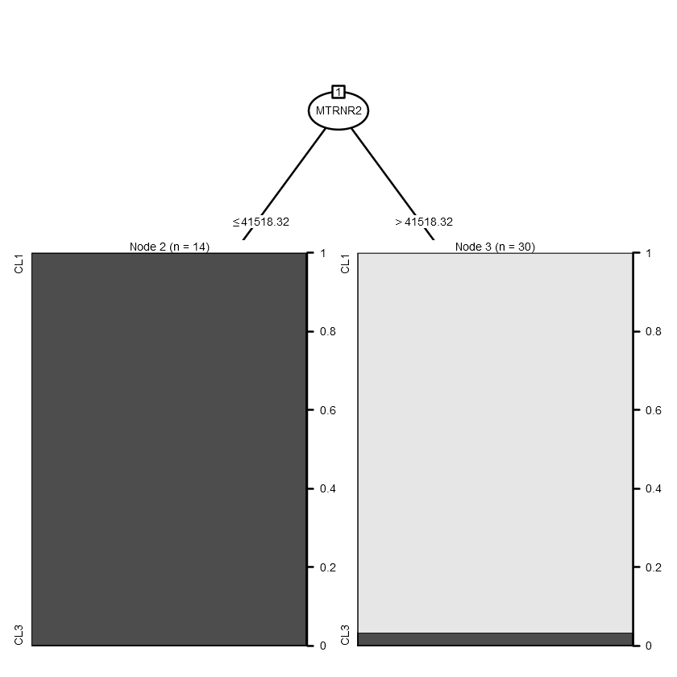


#### 4.1.1. Evaluating the performance of the J48 Decision Tree


```R
j48dt<-J48DTeval(DATAforDT,num.folds=10,First=First,Second=Second)
```

    Fold 1 of 10 
    Fold 2 of 10 
    Fold 3 of 10 
    Fold 4 of 10 
    Fold 5 of 10 
    Fold 6 of 10 
    Fold 7 of 10 
    Fold 8 of 10 
    Fold 9 of 10 
    Fold 10 of 10 
    TP FN FP TN 
    29  0  2 13 
                 CL1 CL3
    PredictedCL1  29   2
    PredictedCL3   0  13
    J48 SN: 1
    J48 SP: 0.8666667
    J48 ACC: 0.9545455
    J48 MCC: 0.9004181
    

### 4.2. RPART Decision Tree


```R
rpartDT<-RpartDT(DATAforDT)
```

    n= 44 
    
    node), split, n, loss, yval, (yprob)
          * denotes terminal node
    
    1) root 44 15 CL1 (0.65909091 0.34090909)  
      2) MTRNR2>=41999.57 30  1 CL1 (0.96666667 0.03333333)  
        4) ZMYND10< 265.1516 29  0 CL1 (1.00000000 0.00000000) *
        5) ZMYND10>=265.1516 1  0 CL3 (0.00000000 1.00000000) *
      3) MTRNR2< 41999.57 14  0 CL3 (0.00000000 1.00000000) *
    


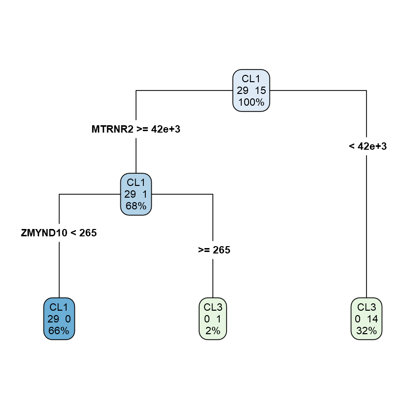


#### 4.2.1. Evaluating the performance of the RPART Decision Tree


```R
rpartEVAL<-RpartEVAL(DATAforDT,num.folds=10,First=First,Second=Second)
```

    Fold 1 of 10 
    Fold 2 of 10 
    Fold 3 of 10 
    Fold 4 of 10 
    Fold 5 of 10 
    Fold 6 of 10 
    Fold 7 of 10 
    Fold 8 of 10 
    Fold 9 of 10 
    Fold 10 of 10 
    TP FN FP TN 
    28  1  1 14 
                 CL1 CL3
    PredictedCL1  28   1
    PredictedCL3   1  14
    Rpart SN: 0.9655172
    Rpart SP: 0.9333333
    Rpart ACC: 0.9545455
    Rpart MCC: 0.8988506
    

### 4.3. Networking Analysis

To define protein-protein interactions (PPI) over a list of genes, STRING-api is used. The outcome of STRING analysis was stored in tab separated values (TSV) files. These TSV files served as an input to check both the connectivity degree and the betweenness centrality, which reflects the communication flow in the defined PPI networks.

### 4.3.1 All DEGs


```R
DEGs="All DEGs"
FileName=paste0(DEGs)

data<-cdiffBinomial[[1]] [,2]           # DEGs gene list from Binomial analysis (taking only the firat 100 genes)
#data<-cdiff[[1]] [,2]                  # From the table of the differential expression analysis between all pairs of clusters

ppi<-PPI(data,FileName)

networking<-NetAnalysis(ppi)
networking                            ##### In case the Examine response components = 200 and an error "linkmat[i, ]" appeared, that means there are no PPI.
```

    Examine response components = 200 	 200 means successful 
    

    No encoding supplied: defaulting to UTF-8.
    

    Number of nodes:  599 
    Number of links:  3811 
    Link Density:  6.36227 
    The connectance of the graph:  0.01063925 
    Mean Distences 3.139471 
    Average Path Length 3.139471 
     
    


<table>
<thead><tr><th></th><th scope=col>names</th><th scope=col>degree</th><th scope=col>betweenness</th></tr></thead>
<tbody>
	<tr><th scope=row>360</th><td>CDK1      </td><td>98        </td><td>3008.24190</td></tr>
	<tr><th scope=row>469</th><td>UBC       </td><td>83        </td><td>1295.95300</td></tr>
	<tr><th scope=row>205</th><td>ACTB      </td><td>79        </td><td>7222.34268</td></tr>
	<tr><th scope=row>452</th><td>HSPA8     </td><td>78        </td><td>1083.23581</td></tr>
	<tr><th scope=row>96</th><td>PLK1      </td><td>76        </td><td>1967.53094</td></tr>
	<tr><th scope=row>3</th><td>AURKA     </td><td>75        </td><td>  30.73708</td></tr>
	<tr><th scope=row>24</th><td>CCNB1     </td><td>74        </td><td> 644.13068</td></tr>
	<tr><th scope=row>267</th><td>CDC20     </td><td>71        </td><td>1878.80675</td></tr>
	<tr><th scope=row>311</th><td>PCNA      </td><td>64        </td><td> 947.97115</td></tr>
	<tr><th scope=row>183</th><td>CTNNB1    </td><td>63        </td><td>4927.14221</td></tr>
	<tr><th scope=row>200</th><td>UBE2C     </td><td>63        </td><td>1836.67082</td></tr>
	<tr><th scope=row>86</th><td>CCNB2     </td><td>60        </td><td> 862.11581</td></tr>
	<tr><th scope=row>97</th><td>TPX2      </td><td>57        </td><td> 674.00738</td></tr>
	<tr><th scope=row>131</th><td>TYMS      </td><td>56        </td><td>2095.02780</td></tr>
	<tr><th scope=row>333</th><td>RAD51     </td><td>56        </td><td> 849.26818</td></tr>
	<tr><th scope=row>265</th><td>KIF2C     </td><td>55        </td><td> 915.76361</td></tr>
	<tr><th scope=row>501</th><td>CDC6      </td><td>54        </td><td>   0.00000</td></tr>
	<tr><th scope=row>52</th><td>CENPE     </td><td>53        </td><td> 441.27647</td></tr>
	<tr><th scope=row>102</th><td>BUB1      </td><td>53        </td><td> 239.12898</td></tr>
	<tr><th scope=row>117</th><td>MCM7      </td><td>53        </td><td>1493.85870</td></tr>
	<tr><th scope=row>216</th><td>RRM2      </td><td>53        </td><td> 713.52270</td></tr>
	<tr><th scope=row>238</th><td>NEK2      </td><td>52        </td><td> 841.55123</td></tr>
	<tr><th scope=row>432</th><td>PPP2CA    </td><td>52        </td><td> 916.27054</td></tr>
	<tr><th scope=row>262</th><td>ORC1      </td><td>51        </td><td> 667.93200</td></tr>
	<tr><th scope=row>254</th><td>TTK       </td><td>50        </td><td> 187.10483</td></tr>
	<tr><th scope=row>358</th><td>KIF20A    </td><td>50        </td><td> 337.40603</td></tr>
	<tr><th scope=row>98</th><td>RRM1      </td><td>49        </td><td>1042.36292</td></tr>
	<tr><th scope=row>109</th><td>FEN1      </td><td>49        </td><td> 673.41000</td></tr>
	<tr><th scope=row>346</th><td>PTTG1     </td><td>49        </td><td> 130.81490</td></tr>
	<tr><th scope=row>17</th><td>DLGAP5    </td><td>48        </td><td>  14.67405</td></tr>
	<tr><th scope=row>...</th><td>...</td><td>...</td><td>...</td></tr>
	<tr><th scope=row>557</th><td>TMSB10 </td><td>1      </td><td>0      </td></tr>
	<tr><th scope=row>560</th><td>NRBP1  </td><td>1      </td><td>0      </td></tr>
	<tr><th scope=row>562</th><td>KLF10  </td><td>1      </td><td>0      </td></tr>
	<tr><th scope=row>563</th><td>HSDL1  </td><td>1      </td><td>0      </td></tr>
	<tr><th scope=row>565</th><td>DAGLB  </td><td>1      </td><td>0      </td></tr>
	<tr><th scope=row>566</th><td>NUAK2  </td><td>1      </td><td>0      </td></tr>
	<tr><th scope=row>569</th><td>GORAB  </td><td>1      </td><td>0      </td></tr>
	<tr><th scope=row>572</th><td>EXTL3  </td><td>1      </td><td>0      </td></tr>
	<tr><th scope=row>573</th><td>ZNF202 </td><td>1      </td><td>0      </td></tr>
	<tr><th scope=row>575</th><td>MOCOS  </td><td>1      </td><td>0      </td></tr>
	<tr><th scope=row>576</th><td>ZBTB11 </td><td>1      </td><td>0      </td></tr>
	<tr><th scope=row>577</th><td>STARD7 </td><td>1      </td><td>0      </td></tr>
	<tr><th scope=row>578</th><td>ZNF350 </td><td>1      </td><td>0      </td></tr>
	<tr><th scope=row>579</th><td>REEP3  </td><td>1      </td><td>0      </td></tr>
	<tr><th scope=row>580</th><td>REEP4  </td><td>1      </td><td>0      </td></tr>
	<tr><th scope=row>581</th><td>DNER   </td><td>1      </td><td>0      </td></tr>
	<tr><th scope=row>582</th><td>IL13RA1</td><td>1      </td><td>0      </td></tr>
	<tr><th scope=row>584</th><td>MLX    </td><td>1      </td><td>0      </td></tr>
	<tr><th scope=row>585</th><td>ZNF292 </td><td>1      </td><td>0      </td></tr>
	<tr><th scope=row>586</th><td>FAM98A </td><td>1      </td><td>0      </td></tr>
	<tr><th scope=row>587</th><td>RCBTB2 </td><td>1      </td><td>0      </td></tr>
	<tr><th scope=row>588</th><td>MNS1   </td><td>1      </td><td>0      </td></tr>
	<tr><th scope=row>589</th><td>BCDIN3D</td><td>1      </td><td>0      </td></tr>
	<tr><th scope=row>590</th><td>NRP2   </td><td>1      </td><td>0      </td></tr>
	<tr><th scope=row>591</th><td>ZNF789 </td><td>1      </td><td>0      </td></tr>
	<tr><th scope=row>592</th><td>THUMPD1</td><td>1      </td><td>0      </td></tr>
	<tr><th scope=row>595</th><td>GYG1   </td><td>1      </td><td>0      </td></tr>
	<tr><th scope=row>596</th><td>CRHBP  </td><td>1      </td><td>0      </td></tr>
	<tr><th scope=row>597</th><td>ABCB8  </td><td>1      </td><td>0      </td></tr>
	<tr><th scope=row>598</th><td>TENM3  </td><td>1      </td><td>0      </td></tr>
</tbody>
</table>


```R
data=networking[1:25,1]              # plotting the network of the top 25 highly connected genes 
network<-Networking(data,FileName,plot_width = 25, plot_height = 10)
```

    Examine response components = 200 	 200 means successful 
    
     You can see the network with high resolution by clicking on the following link: 
     https://string-db.org/api/highres_image/network?identifiers=CDK1%0dUBC%0dACTB%0dHSPA8%0dPLK1%0dAURKA%0dCCNB1%0dCDC20%0dPCNA%0dCTNNB1%0dUBE2C%0dCCNB2%0dTPX2%0dTYMS%0dRAD51%0dKIF2C%0dCDC6%0dCENPE%0dBUB1%0dMCM7%0dRRM2%0dNEK2%0dPPP2CA%0dORC1%0dTTK&species=9606


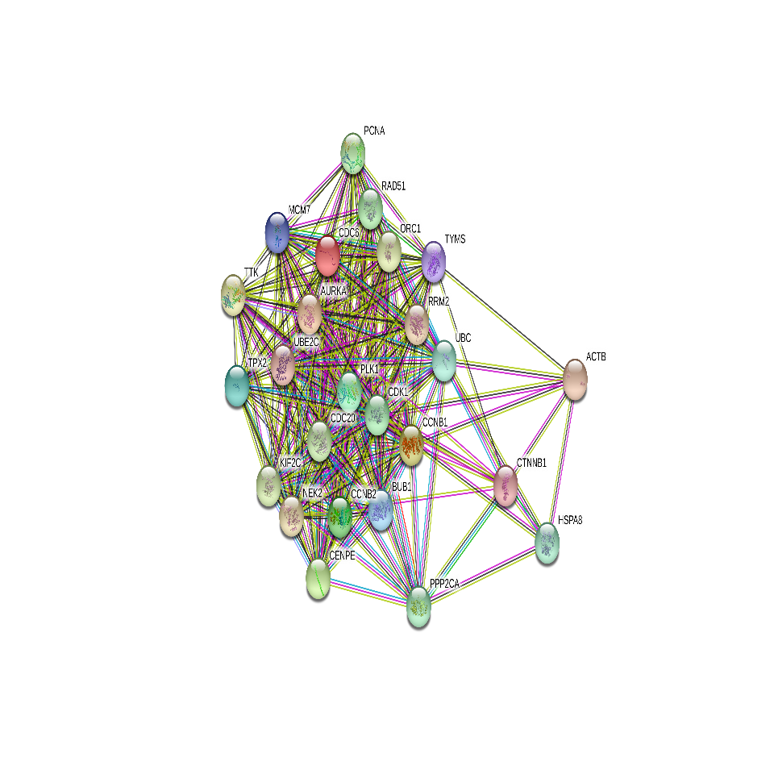


### 4.3.2 Particular set of DEGs 


```R
############ Selecting the DEGs' table  ##############
DEGs=cdiffBinomial[[2]][1,4]     # Up-regulated genes in cluster 1 (from the Binomial analysis)
#DEGs=cdiff[[2]][1,4]             # Up-regulated genes in cluster 1 (from SAMseq)
FileName=paste0(DEGs)

data<-read.csv(file=paste0(DEGs),head=TRUE,sep=",")
data<-data[,3]

ppi<-PPI(data,FileName)

networking<-NetAnalysis(ppi)
networking                            ##### In case the Examine response components = 200 and an error "linkmat[i, ]" appeared, that means there are no PPI.

network<-Networking(data,FileName)
```

    Examine response components = 200 	 200 means successful 
    

    No encoding supplied: defaulting to UTF-8.
    

    Number of nodes:  21 
    Number of links:  34 
    Link Density:  1.619048 
    The connectance of the graph:  0.08095238 
    Mean Distences 1.028571 
    Average Path Length 1.028571 
     
    


<table>
<thead><tr><th></th><th scope=col>names</th><th scope=col>degree</th><th scope=col>betweenness</th></tr></thead>
<tbody>
	<tr><th scope=row>1</th><td>SQLE   </td><td>5      </td><td>0      </td></tr>
	<tr><th scope=row>2</th><td>HMGCR  </td><td>5      </td><td>0      </td></tr>
	<tr><th scope=row>5</th><td>DHCR7  </td><td>5      </td><td>0      </td></tr>
	<tr><th scope=row>6</th><td>FDPS   </td><td>5      </td><td>0      </td></tr>
	<tr><th scope=row>12</th><td>IDI1   </td><td>5      </td><td>0      </td></tr>
	<tr><th scope=row>17</th><td>MSMO1  </td><td>5      </td><td>0      </td></tr>
	<tr><th scope=row>19</th><td>RPS3   </td><td>5      </td><td>0      </td></tr>
	<tr><th scope=row>7</th><td>MT-CO1 </td><td>4      </td><td>0      </td></tr>
	<tr><th scope=row>8</th><td>PTGS1  </td><td>4      </td><td>0      </td></tr>
	<tr><th scope=row>9</th><td>MT-ATP6</td><td>4      </td><td>0      </td></tr>
	<tr><th scope=row>10</th><td>MT-ND1 </td><td>4      </td><td>0      </td></tr>
	<tr><th scope=row>3</th><td>MCM7   </td><td>3      </td><td>0      </td></tr>
	<tr><th scope=row>18</th><td>CDC6   </td><td>3      </td><td>0      </td></tr>
	<tr><th scope=row>4</th><td>PABPC1 </td><td>2      </td><td>1      </td></tr>
	<tr><th scope=row>13</th><td>RAD51  </td><td>2      </td><td>0      </td></tr>
	<tr><th scope=row>15</th><td>CDKN1A </td><td>2      </td><td>0      </td></tr>
	<tr><th scope=row>11</th><td>S100A10</td><td>1      </td><td>0      </td></tr>
	<tr><th scope=row>14</th><td>PAIP2  </td><td>1      </td><td>0      </td></tr>
	<tr><th scope=row>16</th><td>DSN1   </td><td>1      </td><td>0      </td></tr>
	<tr><th scope=row>20</th><td>DAGLB  </td><td>1      </td><td>0      </td></tr>
	<tr><th scope=row>21</th><td>SDCBP  </td><td>1      </td><td>0      </td></tr>
</tbody>
</table>


    Examine response components = 200 	 200 means successful 
    
     You can see the network with high resolution by clicking on the following link: 
     https://string-db.org/api/highres_image/network?identifiers=RAD51%0dMSMO1%0dIDI1%0dPABPC1%0dCDC6%0dSQLE%0dHMGCR%0dPAIP2%0dCDKN1A%0dRTN3%0dSDCBP%0dUSO1%0dADM%0dRPS3%0dNPAT%0dDSN1%0dFDPS%0dERAP2%0dDAGLB%0dZNF143%0dMCM7%0dB2M%0dDHCR7%0dMX2%0dZNF292%0dFAM111B%0dZNF136%0dS100A10%0dCOX1%0dND1%0dATP6%0dCOX3%0dMTRNR2%0dMTRNR1&species=9606


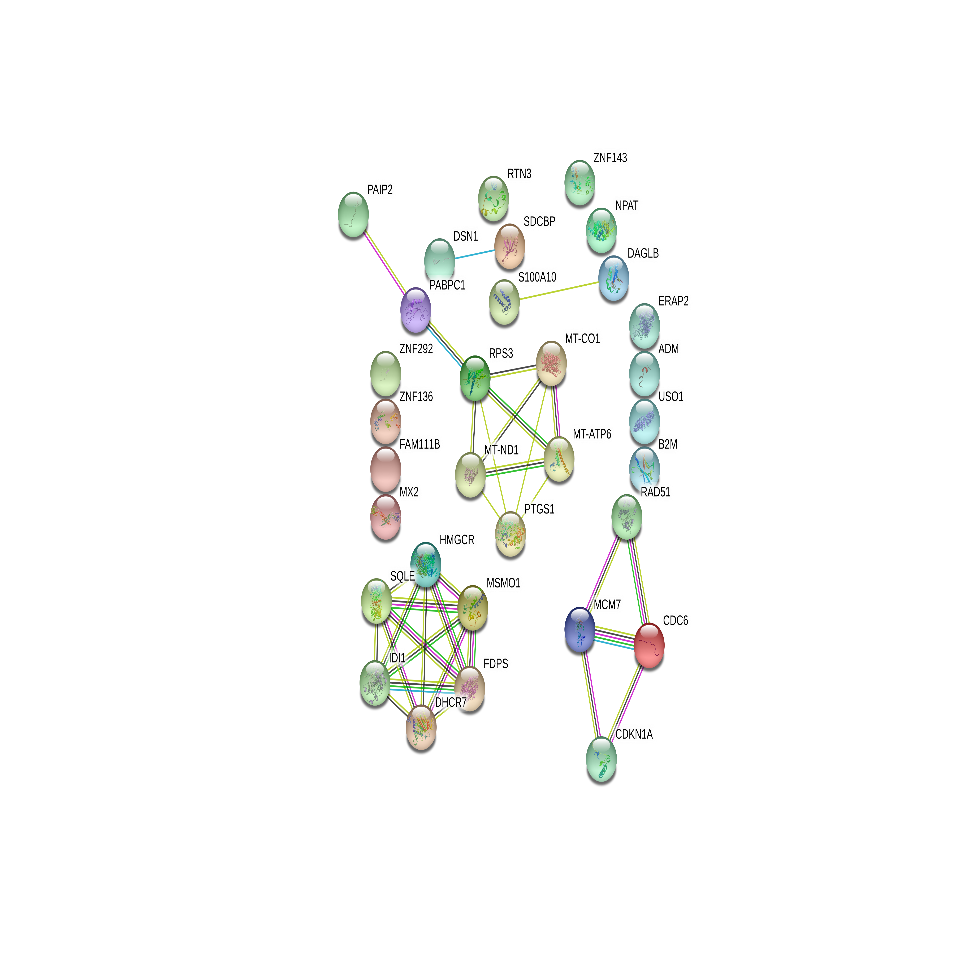


### 4.4 Gene Enrichment Analysis


```R
dbs <- listEnrichrDbs()
head(dbs)
#print(dbs)
```


<table>
<thead><tr><th scope=col>geneCoverage</th><th scope=col>genesPerTerm</th><th scope=col>libraryName</th><th scope=col>link</th><th scope=col>numTerms</th></tr></thead>
<tbody>
	<tr><td>13362                                                   </td><td> 275                                                    </td><td>Genome_Browser_PWMs                                     </td><td>http://hgdownload.cse.ucsc.edu/goldenPath/hg18/database/</td><td>615                                                     </td></tr>
	<tr><td>27884                                                   </td><td>1284                                                    </td><td>TRANSFAC_and_JASPAR_PWMs                                </td><td>http://jaspar.genereg.net/html/DOWNLOAD/                </td><td>326                                                     </td></tr>
	<tr><td> 6002                                                   </td><td>  77                                                    </td><td>Transcription_Factor_PPIs                               </td><td>                                                        </td><td>290                                                     </td></tr>
	<tr><td>47172                                                   </td><td>1370                                                    </td><td>ChEA_2013                                               </td><td>http://amp.pharm.mssm.edu/lib/cheadownload.jsp          </td><td>353                                                     </td></tr>
	<tr><td>47107                                                   </td><td> 509                                                    </td><td>Drug_Perturbations_from_GEO_2014                        </td><td>http://www.ncbi.nlm.nih.gov/geo/                        </td><td>701                                                     </td></tr>
	<tr><td>21493                                                   </td><td>3713                                                    </td><td>ENCODE_TF_ChIP-seq_2014                                 </td><td>http://genome.ucsc.edu/ENCODE/downloads.html            </td><td>498                                                     </td></tr>
</tbody>
</table>


```R
############ Selecting the DEGs' table  ##############
DEGs=cdiffBinomial[[2]][1,4]     # Up-regulated genes in cluster 1 (from the Binomial analysis)
#DEGs=cdiff[[2]][1,4]              # Up-regulated genes in cluster 1 (from SAMseq)

data<-read.csv(file=paste0(DEGs),head=TRUE,sep=",")
data<-as.character(data[,3])

dbs <- c("KEGG_2013","GO_Molecular_Function_2015", "GO_Biological_Process_2015")
enriched <- enrichr(data, dbs)
KEGG_2013<-enriched[[1]][,c(1,2,3,9)]
GO_Molecular_Function_2015<-enriched[[2]][,c(1,2,3,9)]
GO_Biological_Process_2015<-enriched[[3]][,c(1,2,3,9)]

GEA<-rbind(KEGG_2013,GO_Molecular_Function_2015,GO_Biological_Process_2015)
GEA
```

    Uploading data to Enrichr... Done.
      Querying KEGG_2013... Done.
      Querying GO_Molecular_Function_2015... Done.
      Querying GO_Biological_Process_2015... Done.
    Parsing results... Done.
    


<table>
<thead><tr><th scope=col>Term</th><th scope=col>Overlap</th><th scope=col>P.value</th><th scope=col>Genes</th></tr></thead>
<tbody>
	<tr><td>HSA00100 BIOSYNTHESIS OF STEROIDS                                                                                                                                                </td><td>5/24                                                                                                                                                                             </td><td>4.335571e-10                                                                                                                                                                     </td><td>FDPS;IDI1;SQLE;HMGCR;DHCR7                                                                                                                                                       </td></tr>
	<tr><td>HSA00900 TERPENOID BIOSYNTHESIS                                                                                                                                                  </td><td>3/6                                                                                                                                                                              </td><td>8.944946e-08                                                                                                                                                                     </td><td>FDPS;IDI1;SQLE                                                                                                                                                                   </td></tr>
	<tr><td>HSA00190 OXIDATIVE PHOSPHORYLATION                                                                                                                                               </td><td>4/128                                                                                                                                                                            </td><td>6.396461e-05                                                                                                                                                                     </td><td>ATP6;COX3;COX1;ND1                                                                                                                                                               </td></tr>
	<tr><td>HSA04110 CELL CYCLE                                                                                                                                                              </td><td>3/115                                                                                                                                                                            </td><td>9.731341e-04                                                                                                                                                                     </td><td>CDKN1A;MCM7;CDC6                                                                                                                                                                 </td></tr>
	<tr><td>HSA00130 UBIQUINONE BIOSYNTHESIS                                                                                                                                                 </td><td>1/15                                                                                                                                                                             </td><td>2.520732e-02                                                                                                                                                                     </td><td>ND1                                                                                                                                                                              </td></tr>
	<tr><td>HSA05219 BLADDER CANCER                                                                                                                                                          </td><td>1/42                                                                                                                                                                             </td><td>6.903526e-02                                                                                                                                                                     </td><td>CDKN1A                                                                                                                                                                           </td></tr>
	<tr><td>HSA05214 GLIOMA                                                                                                                                                                  </td><td>1/64                                                                                                                                                                             </td><td>1.033272e-01                                                                                                                                                                     </td><td>CDKN1A                                                                                                                                                                           </td></tr>
	<tr><td>HSA04115 P53 SIGNALING PATHWAY                                                                                                                                                   </td><td>1/68                                                                                                                                                                             </td><td>1.094290e-01                                                                                                                                                                     </td><td>CDKN1A                                                                                                                                                                           </td></tr>
	<tr><td>HSA05218 MELANOMA                                                                                                                                                                </td><td>1/71                                                                                                                                                                             </td><td>1.139788e-01                                                                                                                                                                     </td><td>CDKN1A                                                                                                                                                                           </td></tr>
	<tr><td>HSA05212 PANCREATIC CANCER                                                                                                                                                       </td><td>1/73                                                                                                                                                                             </td><td>1.169995e-01                                                                                                                                                                     </td><td>RAD51                                                                                                                                                                            </td></tr>
	<tr><td>HSA05220 CHRONIC MYELOID LEUKEMIA                                                                                                                                                </td><td>1/76                                                                                                                                                                             </td><td>1.215118e-01                                                                                                                                                                     </td><td>CDKN1A                                                                                                                                                                           </td></tr>
	<tr><td>HSA04612 ANTIGEN PROCESSING AND PRESENTATION                                                                                                                                     </td><td>1/83                                                                                                                                                                             </td><td>1.319537e-01                                                                                                                                                                     </td><td>B2M                                                                                                                                                                              </td></tr>
	<tr><td>HSA04012 ERBB SIGNALING PATHWAY                                                                                                                                                  </td><td>1/87                                                                                                                                                                             </td><td>1.378663e-01                                                                                                                                                                     </td><td>CDKN1A                                                                                                                                                                           </td></tr>
	<tr><td>HSA05215 PROSTATE CANCER                                                                                                                                                         </td><td>1/87                                                                                                                                                                             </td><td>1.378663e-01                                                                                                                                                                     </td><td>CDKN1A                                                                                                                                                                           </td></tr>
	<tr><td>HSA03010 RIBOSOME                                                                                                                                                                </td><td>1/98                                                                                                                                                                             </td><td>1.539251e-01                                                                                                                                                                     </td><td>RPS3                                                                                                                                                                             </td></tr>
	<tr><td>protein C-terminus binding (GO:0008022)                                                                                                                                          </td><td>4/162                                                                                                                                                                            </td><td>1.591468e-04                                                                                                                                                                     </td><td>SDCBP;NPAT;RAD51;PABPC1                                                                                                                                                          </td></tr>
	<tr><td>translation regulator activity (GO:0045182)                                                                                                                                      </td><td>2/33                                                                                                                                                                             </td><td>1.432948e-03                                                                                                                                                                     </td><td>PABPC1;PAIP2                                                                                                                                                                     </td></tr>
	<tr><td>oxidoreductase activity, acting on paired donors, with incorporation or reduction of molecular oxygen, NAD(P)H as one donor, and incorporation of one atom of oxygen (GO:0016709)</td><td>2/40                                                                                                                                                                             </td><td>2.101154e-03                                                                                                                                                                     </td><td>SQLE;MSMO1                                                                                                                                                                       </td></tr>
	<tr><td>damaged DNA binding (GO:0003684)                                                                                                                                                 </td><td>2/64                                                                                                                                                                             </td><td>5.294007e-03                                                                                                                                                                     </td><td>RAD51;RPS3                                                                                                                                                                       </td></tr>
	<tr><td>single-stranded DNA binding (GO:0003697)                                                                                                                                         </td><td>2/76                                                                                                                                                                             </td><td>7.389477e-03                                                                                                                                                                     </td><td>RAD51;MCM7                                                                                                                                                                       </td></tr>
	<tr><td>DNA-dependent ATPase activity (GO:0008094)                                                                                                                                       </td><td>2/80                                                                                                                                                                             </td><td>8.158601e-03                                                                                                                                                                     </td><td>RAD51;MCM7                                                                                                                                                                       </td></tr>
	<tr><td>protein N-terminus binding (GO:0047485)                                                                                                                                          </td><td>2/89                                                                                                                                                                             </td><td>1.001459e-02                                                                                                                                                                     </td><td>SDCBP;NPAT                                                                                                                                                                       </td></tr>
	<tr><td>monooxygenase activity (GO:0004497)                                                                                                                                              </td><td>2/99                                                                                                                                                                             </td><td>1.227520e-02                                                                                                                                                                     </td><td>SQLE;MSMO1                                                                                                                                                                       </td></tr>
	<tr><td>translation activator activity (GO:0008494)                                                                                                                                      </td><td>1/9                                                                                                                                                                              </td><td>1.519926e-02                                                                                                                                                                     </td><td>PABPC1                                                                                                                                                                           </td></tr>
	<tr><td>mRNA binding (GO:0003729)                                                                                                                                                        </td><td>2/112                                                                                                                                                                            </td><td>1.551472e-02                                                                                                                                                                     </td><td>RPS3;PAIP2                                                                                                                                                                       </td></tr>
	<tr><td>NADPH binding (GO:0070402)                                                                                                                                                       </td><td>1/10                                                                                                                                                                             </td><td>1.687417e-02                                                                                                                                                                     </td><td>HMGCR                                                                                                                                                                            </td></tr>
	<tr><td>poly(A) binding (GO:0008143)                                                                                                                                                     </td><td>1/12                                                                                                                                                                             </td><td>2.021569e-02                                                                                                                                                                     </td><td>PABPC1                                                                                                                                                                           </td></tr>
	<tr><td>cyclin-dependent protein serine/threonine kinase inhibitor activity (GO:0004861)                                                                                                 </td><td>1/12                                                                                                                                                                             </td><td>2.021569e-02                                                                                                                                                                     </td><td>CDKN1A                                                                                                                                                                           </td></tr>
	<tr><td>poly(U) RNA binding (GO:0008266)                                                                                                                                                 </td><td>1/13                                                                                                                                                                             </td><td>2.188232e-02                                                                                                                                                                     </td><td>PABPC1                                                                                                                                                                           </td></tr>
	<tr><td>neurexin family protein binding (GO:0042043)                                                                                                                                     </td><td>1/13                                                                                                                                                                             </td><td>2.188232e-02                                                                                                                                                                     </td><td>SDCBP                                                                                                                                                                            </td></tr>
	<tr><td>...</td><td>...</td><td>...</td><td>...</td></tr>
	<tr><td>purine ribonucleoside monophosphate metabolic process (GO:0009167)             </td><td>1/402                                                                          </td><td>0.4988933                                                                      </td><td>RAD51                                                                          </td></tr>
	<tr><td>cellular ion homeostasis (GO:0006873)                                          </td><td>1/402                                                                          </td><td>0.4988933                                                                      </td><td>ADM                                                                            </td></tr>
	<tr><td>DNA repair (GO:0006281)                                                        </td><td>1/403                                                                          </td><td>0.4997627                                                                      </td><td>RAD51                                                                          </td></tr>
	<tr><td>embryonic morphogenesis (GO:0048598)                                           </td><td>1/403                                                                          </td><td>0.4997627                                                                      </td><td>ADM                                                                            </td></tr>
	<tr><td>purine nucleoside monophosphate metabolic process (GO:0009126)                 </td><td>1/403                                                                          </td><td>0.4997627                                                                      </td><td>RAD51                                                                          </td></tr>
	<tr><td>organ morphogenesis (GO:0009887)                                               </td><td>1/405                                                                          </td><td>0.5014970                                                                      </td><td>ADM                                                                            </td></tr>
	<tr><td>regulation of cell morphogenesis (GO:0022604)                                  </td><td>1/408                                                                          </td><td>0.5040875                                                                      </td><td>S100A10                                                                        </td></tr>
	<tr><td>cellular response to organonitrogen compound (GO:0071417)                      </td><td>1/411                                                                          </td><td>0.5066650                                                                      </td><td>RAD51                                                                          </td></tr>
	<tr><td>secretion by cell (GO:0032940)                                                 </td><td>1/415                                                                          </td><td>0.5100814                                                                      </td><td>ADM                                                                            </td></tr>
	<tr><td>ribonucleoside monophosphate metabolic process (GO:0009161)                    </td><td>1/416                                                                          </td><td>0.5109319                                                                      </td><td>RAD51                                                                          </td></tr>
	<tr><td>regulation of cell activation (GO:0050865)                                     </td><td>1/420                                                                          </td><td>0.5143196                                                                      </td><td>CDKN1A                                                                         </td></tr>
	<tr><td>metal ion homeostasis (GO:0055065)                                             </td><td>1/422                                                                          </td><td>0.5160050                                                                      </td><td>ADM                                                                            </td></tr>
	<tr><td>nucleoside monophosphate metabolic process (GO:0009123)                        </td><td>1/427                                                                          </td><td>0.5201934                                                                      </td><td>RAD51                                                                          </td></tr>
	<tr><td>negative regulation of cell cycle (GO:0045786)                                 </td><td>1/430                                                                          </td><td>0.5226896                                                                      </td><td>CDKN1A                                                                         </td></tr>
	<tr><td>synaptic transmission (GO:0007268)                                             </td><td>1/434                                                                          </td><td>0.5259982                                                                      </td><td>SDCBP                                                                          </td></tr>
	<tr><td>cellular response to nitrogen compound (GO:1901699)                            </td><td>1/438                                                                          </td><td>0.5292846                                                                      </td><td>RAD51                                                                          </td></tr>
	<tr><td>regulation of establishment of protein localization (GO:0070201)               </td><td>1/442                                                                          </td><td>0.5325489                                                                      </td><td>CDKN1A                                                                         </td></tr>
	<tr><td>immune response-regulating cell surface receptor signaling pathway (GO:0002768)</td><td>1/444                                                                          </td><td>0.5341727                                                                      </td><td>CDKN1A                                                                         </td></tr>
	<tr><td>cellular chemical homeostasis (GO:0055082)                                     </td><td>1/452                                                                          </td><td>0.5406137                                                                      </td><td>ADM                                                                            </td></tr>
	<tr><td>positive regulation of protein kinase activity (GO:0045860)                    </td><td>1/456                                                                          </td><td>0.5438016                                                                      </td><td>CDKN1A                                                                         </td></tr>
	<tr><td>response to other organism (GO:0051707)                                        </td><td>1/462                                                                          </td><td>0.5485434                                                                      </td><td>MX2                                                                            </td></tr>
	<tr><td>nitrogen compound transport (GO:0071705)                                       </td><td>1/464                                                                          </td><td>0.5501133                                                                      </td><td>MX2                                                                            </td></tr>
	<tr><td>cation homeostasis (GO:0055080)                                                </td><td>1/465                                                                          </td><td>0.5508962                                                                      </td><td>ADM                                                                            </td></tr>
	<tr><td>coagulation (GO:0050817)                                                       </td><td>1/472                                                                          </td><td>0.5563401                                                                      </td><td>DAGLB                                                                          </td></tr>
	<tr><td>blood coagulation (GO:0007596)                                                 </td><td>1/472                                                                          </td><td>0.5563401                                                                      </td><td>DAGLB                                                                          </td></tr>
	<tr><td>hemostasis (GO:0007599)                                                        </td><td>1/478                                                                          </td><td>0.5609553                                                                      </td><td>DAGLB                                                                          </td></tr>
	<tr><td>positive regulation of kinase activity (GO:0033674)                            </td><td>1/480                                                                          </td><td>0.5624833                                                                      </td><td>CDKN1A                                                                         </td></tr>
	<tr><td>positive regulation of GTPase activity (GO:0043547)                            </td><td>1/482                                                                          </td><td>0.5640061                                                                      </td><td>S100A10                                                                        </td></tr>
	<tr><td>positive regulation of GTP catabolic process (GO:0033126)                      </td><td>1/483                                                                          </td><td>0.5647656                                                                      </td><td>S100A10                                                                        </td></tr>
	<tr><td>multicellular organismal reproductive process (GO:0048609)                     </td><td>1/491                                                                          </td><td>0.5707955                                                                      </td><td>PAIP2                                                                          </td></tr>
</tbody>
</table>


## 2.2. Model-Based clustering

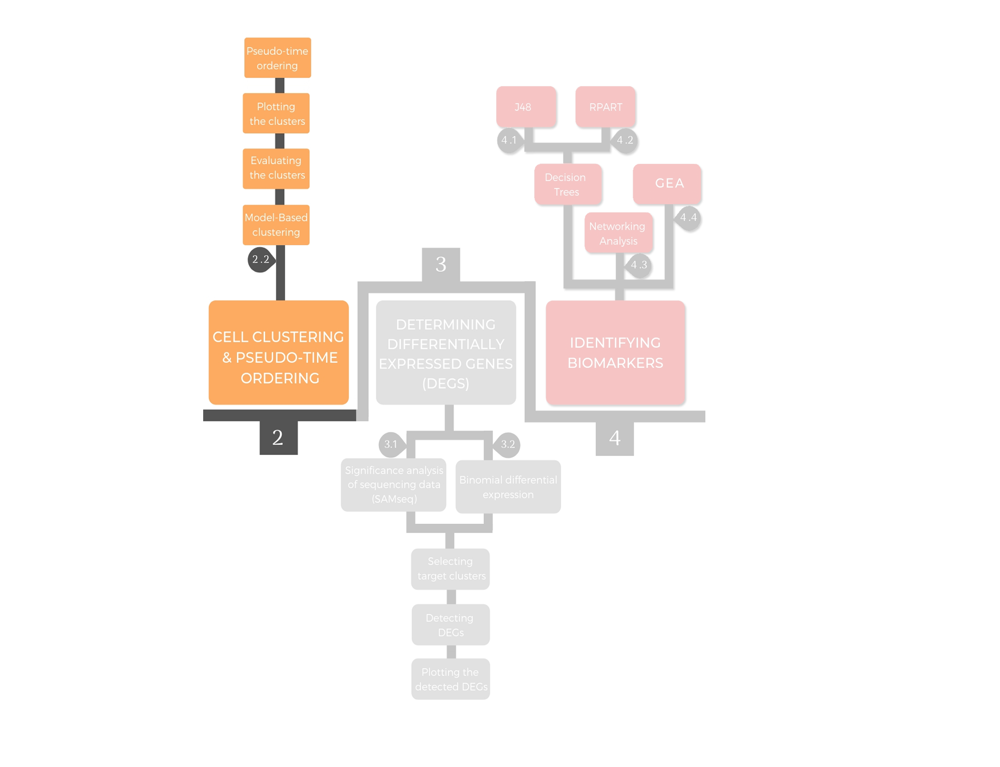

Model-based clustering assumes that the data are generated by a model and attempts to recover the original model from the data to define cellular clusters.

#### 2.2.1. Defining the Cells in the clusters generated by model-based clustering


```R
sc <- Exprmclust(sc,K =3,reduce = TRUE,quiet = TRUE) 
cat("\t","     Cell-ID"," Cluster Number","\n")
sc@MBclusters$clusterid

```

    	      Cell-ID  Cluster Number 
    


<dl class=dl-horizontal>
	<dt>G1</dt>
		<dd>1</dd>
	<dt>G1_1</dt>
		<dd>1</dd>
	<dt>G1_2</dt>
		<dd>1</dd>
	<dt>G1_3</dt>
		<dd>1</dd>
	<dt>G1_4</dt>
		<dd>1</dd>
	<dt>G1_5</dt>
		<dd>1</dd>
	<dt>G1_6</dt>
		<dd>1</dd>
	<dt>G1_7</dt>
		<dd>1</dd>
	<dt>G1_8</dt>
		<dd>1</dd>
	<dt>G1_9</dt>
		<dd>1</dd>
	<dt>G1_10</dt>
		<dd>1</dd>
	<dt>G1_11</dt>
		<dd>1</dd>
	<dt>G1_12</dt>
		<dd>1</dd>
	<dt>G1_13</dt>
		<dd>1</dd>
	<dt>G1_14</dt>
		<dd>1</dd>
	<dt>G1_15</dt>
		<dd>1</dd>
	<dt>G1_16</dt>
		<dd>1</dd>
	<dt>G1_17</dt>
		<dd>1</dd>
	<dt>G1_18</dt>
		<dd>1</dd>
	<dt>G1_19</dt>
		<dd>3</dd>
	<dt>G1_20</dt>
		<dd>1</dd>
	<dt>G1_21</dt>
		<dd>1</dd>
	<dt>G1_22</dt>
		<dd>1</dd>
	<dt>G1_23</dt>
		<dd>1</dd>
	<dt>G1_24</dt>
		<dd>1</dd>
	<dt>G1_25</dt>
		<dd>2</dd>
	<dt>G1_26</dt>
		<dd>1</dd>
	<dt>G1_27</dt>
		<dd>3</dd>
	<dt>G1_28</dt>
		<dd>1</dd>
	<dt>G1_29</dt>
		<dd>1</dd>
	<dt>S</dt>
		<dd>3</dd>
	<dt>S_1</dt>
		<dd>1</dd>
	<dt>S_2</dt>
		<dd>3</dd>
	<dt>S_3</dt>
		<dd>3</dd>
	<dt>S_4</dt>
		<dd>3</dd>
	<dt>S_5</dt>
		<dd>3</dd>
	<dt>S_6</dt>
		<dd>1</dd>
	<dt>S_7</dt>
		<dd>1</dd>
	<dt>S_8</dt>
		<dd>3</dd>
	<dt>S_9</dt>
		<dd>1</dd>
	<dt>S_10</dt>
		<dd>3</dd>
	<dt>S_11</dt>
		<dd>3</dd>
	<dt>S_12</dt>
		<dd>3</dd>
	<dt>S_13</dt>
		<dd>3</dd>
	<dt>S_14</dt>
		<dd>1</dd>
	<dt>S_15</dt>
		<dd>1</dd>
	<dt>S_16</dt>
		<dd>3</dd>
	<dt>S_17</dt>
		<dd>1</dd>
	<dt>S_18</dt>
		<dd>3</dd>
	<dt>S_19</dt>
		<dd>3</dd>
	<dt>S_20</dt>
		<dd>3</dd>
	<dt>S_21</dt>
		<dd>3</dd>
	<dt>S_22</dt>
		<dd>3</dd>
	<dt>S_23</dt>
		<dd>1</dd>
	<dt>S_24</dt>
		<dd>3</dd>
	<dt>S_25</dt>
		<dd>3</dd>
	<dt>S_26</dt>
		<dd>3</dd>
	<dt>S_27</dt>
		<dd>3</dd>
	<dt>S_28</dt>
		<dd>3</dd>
	<dt>S_29</dt>
		<dd>3</dd>
	<dt>S_30</dt>
		<dd>1</dd>
	<dt>S_31</dt>
		<dd>3</dd>
	<dt>G2</dt>
		<dd>1</dd>
	<dt>G2_1</dt>
		<dd>2</dd>
	<dt>G2_2</dt>
		<dd>1</dd>
	<dt>G2_3</dt>
		<dd>3</dd>
	<dt>G2_4</dt>
		<dd>2</dd>
	<dt>G2_5</dt>
		<dd>2</dd>
	<dt>G2_6</dt>
		<dd>2</dd>
	<dt>G2_7</dt>
		<dd>2</dd>
	<dt>G2_8</dt>
		<dd>1</dd>
	<dt>G2_9</dt>
		<dd>3</dd>
	<dt>G2_10</dt>
		<dd>1</dd>
	<dt>G2_11</dt>
		<dd>3</dd>
	<dt>G2_12</dt>
		<dd>1</dd>
	<dt>G2_13</dt>
		<dd>2</dd>
	<dt>G2_14</dt>
		<dd>2</dd>
	<dt>G2_15</dt>
		<dd>1</dd>
	<dt>G2_16</dt>
		<dd>1</dd>
	<dt>G2_17</dt>
		<dd>2</dd>
	<dt>G2_18</dt>
		<dd>2</dd>
	<dt>G2_19</dt>
		<dd>2</dd>
	<dt>G2_20</dt>
		<dd>2</dd>
	<dt>G2_21</dt>
		<dd>1</dd>
	<dt>G2_22</dt>
		<dd>2</dd>
	<dt>G2_23</dt>
		<dd>2</dd>
	<dt>G2_24</dt>
		<dd>1</dd>
	<dt>G2_25</dt>
		<dd>2</dd>
	<dt>G2_26</dt>
		<dd>3</dd>
	<dt>G2_27</dt>
		<dd>2</dd>
	<dt>G2_28</dt>
		<dd>2</dd>
	<dt>G2_29</dt>
		<dd>1</dd>
	<dt>G2_30</dt>
		<dd>1</dd>
	<dt>G2_31</dt>
		<dd>1</dd>
</dl>


#### 2.2.2. Cluster plotting using PCA and tSNE maps

To visualize the detected clusters, two common dimensionality reduction tools are implemented: tSNE map and principal component analysis (PCA), which is a linear dimensionality reduction method that preserves the global structure and shows how the measurements themselves are related to each other.  


```R
PlotmclustMB(sc)
PCAplotSymbols(sc)
```


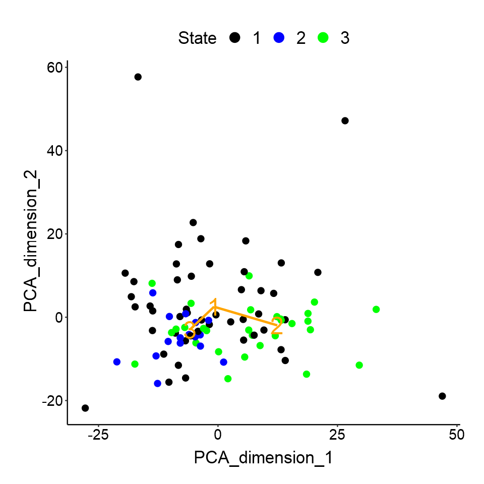


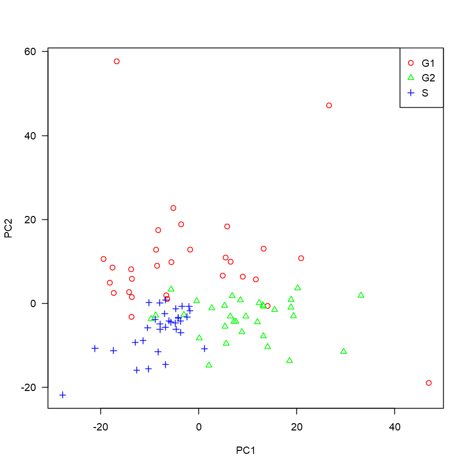


```R
# Plotting the model-based clusters in tSNE maps
sc<- comptsneMB(sc,rseed=15555,quiet = TRUE)
plottsneMB(sc,K=3)
plotMBLabelstSNE(sc)
```


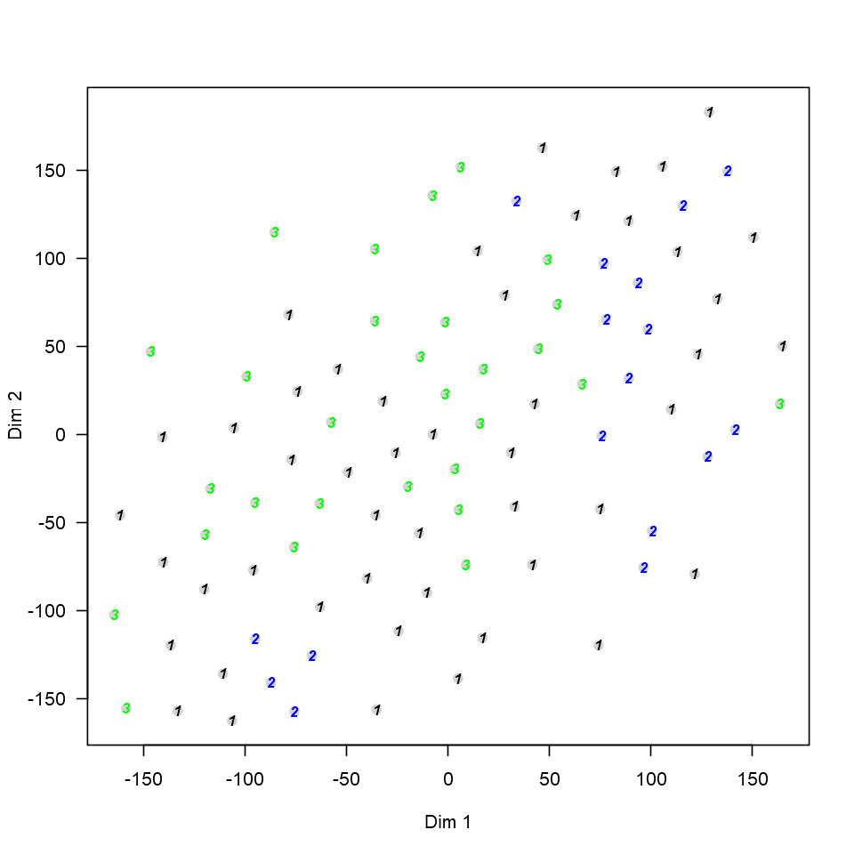


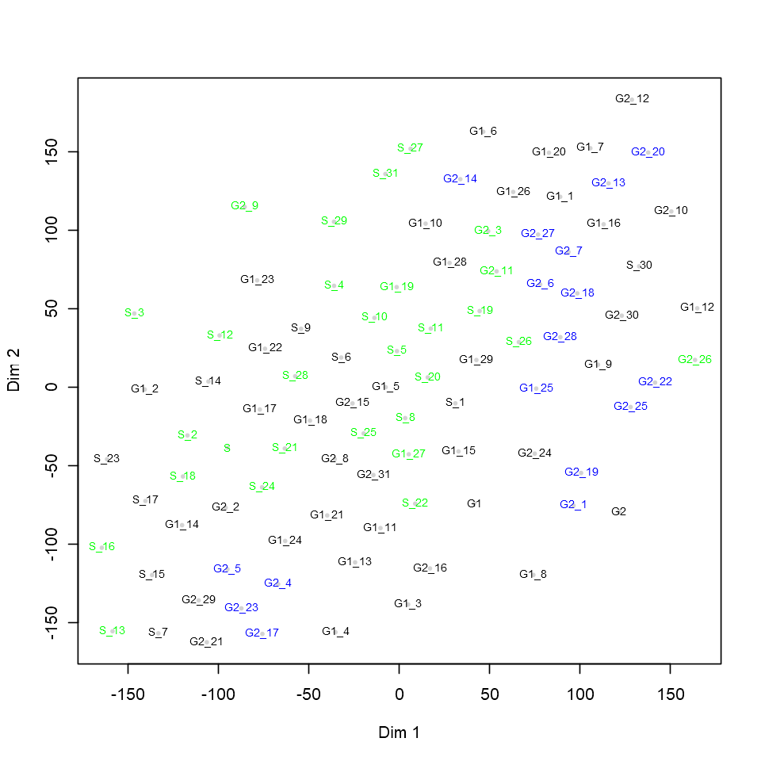


#### 2.2.3. Evaluating the stability and consistancy of the clusters


```R
# Silhouette of Model-based clusters
par(mar=c(6,2,4,2))
plotsilhouetteMB(sc,K=3)
```


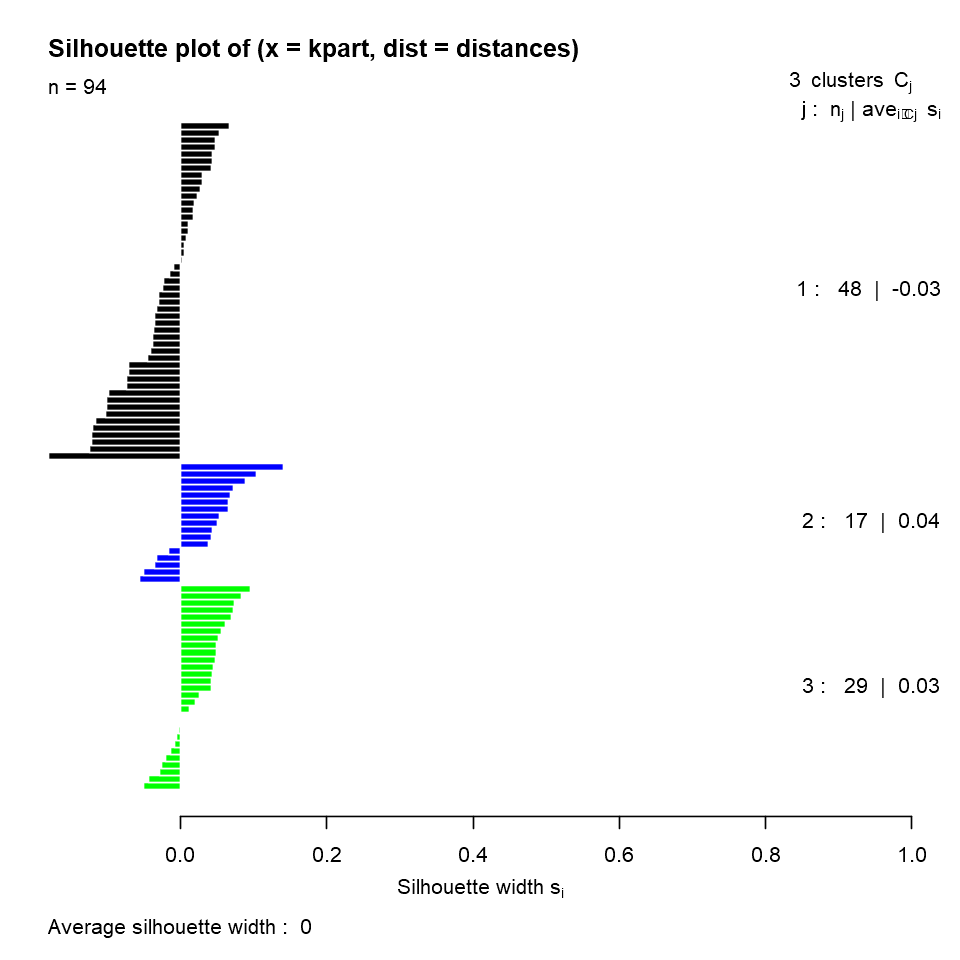


```R
sc<- Clustexp(sc,cln=3,quiet=T)                  
Jaccard(sc,Clustering="MB", K=3, plot = TRUE)    # Jaccard of Model based clusters
```


<ol class=list-inline>
	<li>0.66</li>
	<li>0.766</li>
	<li>0.812</li>
</ol>


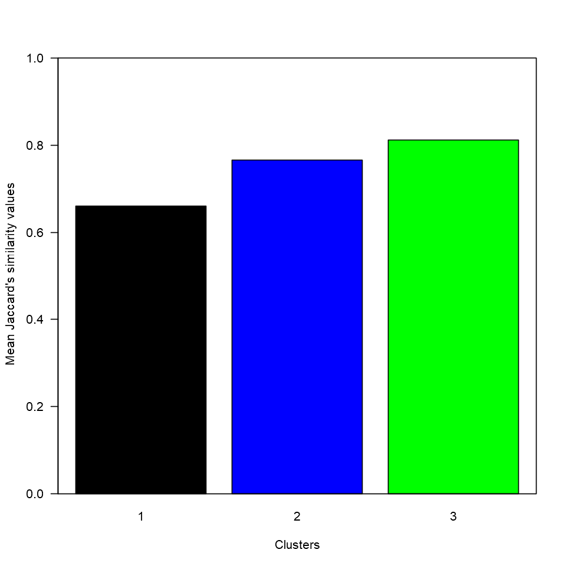


### Defining outlier cells based on Model-Based Clustering


```R
outlg<-round(length(sc@fdata[,1])/200)     # The cell will be considered as an outlier if it has a minimum of 0.5% of the number of filtered genes as outlier genes. 
Outliers<- FindOutliersMB(sc, K=3, outminc=5,outlg=outlg,probthr=.5*1e-3,thr=2**-(1:40),outdistquant=.75, plot = TRUE, quiet = T)

RemovingOutliers=FALSE     
# RemovingOutliers=TRUE                    # Removing the defined outlier cells based on K-means Clustering

if(RemovingOutliers==TRUE){
    names(Outliers)=NULL
    Outliers
    DataSet=DataSet[-Outliers]
    dim(DataSet)
    colnames(DataSet)
    cat("Outlier cells were removed, now you need to start from the beginning")
}
```


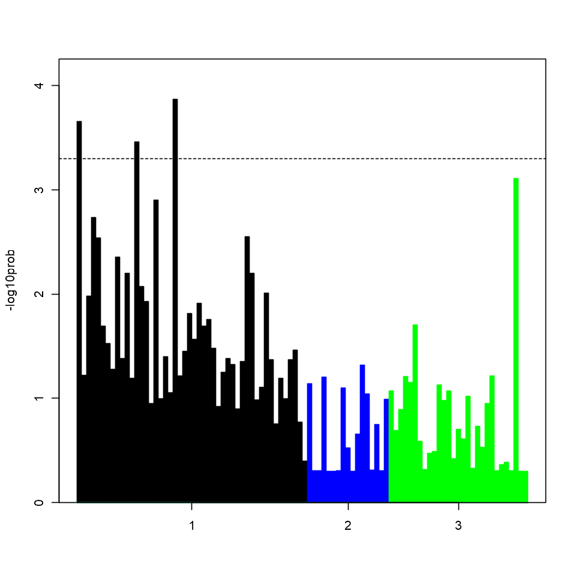


### 2.2.4. Cellular pseudo-time ordering based on Model-based clusters


```R
sc<-MB_Order(sc,quiet = FALSE, export = TRUE)
```

       order orderID
    1      1   G2_20
    2      2   G2_17
    3      3   G2_14
    4      4   G2_13
    5      5   G2_19
    6      6   G1_25
    7      7    G2_4
    8      8   G2_18
    9      9   G2_22
    10    10   G2_23
    11    11    G2_5
    12    12    G2_7
    13    13   G2_28
    14    14   G2_25
    15    15    G2_6
    16    16   G2_27
    17    17    G2_1
    18    18   G1_16
    19    19      G2
    20    20   G2_10
    21    21   G2_12
    22    22   G2_29
    23    23    G1_7
    24    24   G2_24
    25    25    G1_4
    26    26    G1_9
    27    27   G1_26
    28    28    G2_8
    29    29    G1_1
    30    30   G2_30
    31    31   G2_31
    32    32   G1_20
    33    33   G1_15
    34    34   G1_29
    35    35    G1_3
    36    36   G1_21
    37    37    G1_8
    38    38   G1_13
    39    39      G1
    40    40   G1_12
    41    41   G1_28
    42    42   G1_23
    43    43   G2_16
    44    44   G1_17
    45    45   G2_15
    46    46   G1_11
    47    47   G1_18
    48    48   G1_10
    49    49   G1_14
    50    50    G2_2
    51    51     S_6
    52    52    G1_5
    53    53   G1_24
    54    54    G1_6
    55    55   G2_21
    56    56    G1_2
    57    57   G1_22
    58    58    S_17
    59    59     S_7
    60    60     S_9
    61    61    S_14
    62    62    S_23
    63    63    S_15
    64    64     S_1
    65    65    S_30
    66    66    G2_9
    67    67    S_26
    68    68     S_8
    69    69    S_24
    70    70   G1_19
    71    71   G1_27
    72    72     S_5
    73    73    S_31
    74    74   G2_26
    75    75    S_27
    76    76     S_4
    77    77    S_25
    78    78    S_11
    79    79    S_13
    80    80    S_19
    81    81    S_16
    82    82    S_29
    83    83    S_22
    84    84    S_10
    85    85    S_21
    86    86     S_3
    87    87   G2_11
    88    88       S
    89    89    S_12
    90    90    S_28
    91    91    G2_3
    92    92    S_18
    93    93    S_20
    94    94     S_2
    

#### 2.2.4.1 Plotting the  pseudo-time ordering in a PCA plot


```R
PlotMBorderPCA(sc)
```


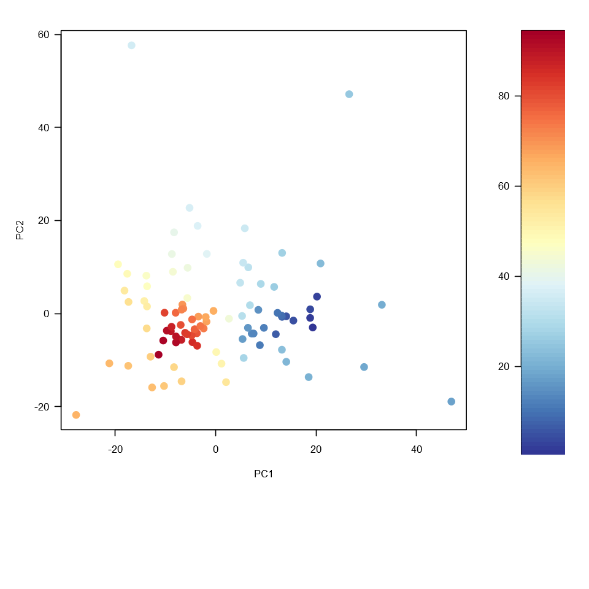


#### 2.2.4.2 Plotting the  pseudo-time ordering in a tSNE map


```R
plotOrderMBtsne(sc)
```


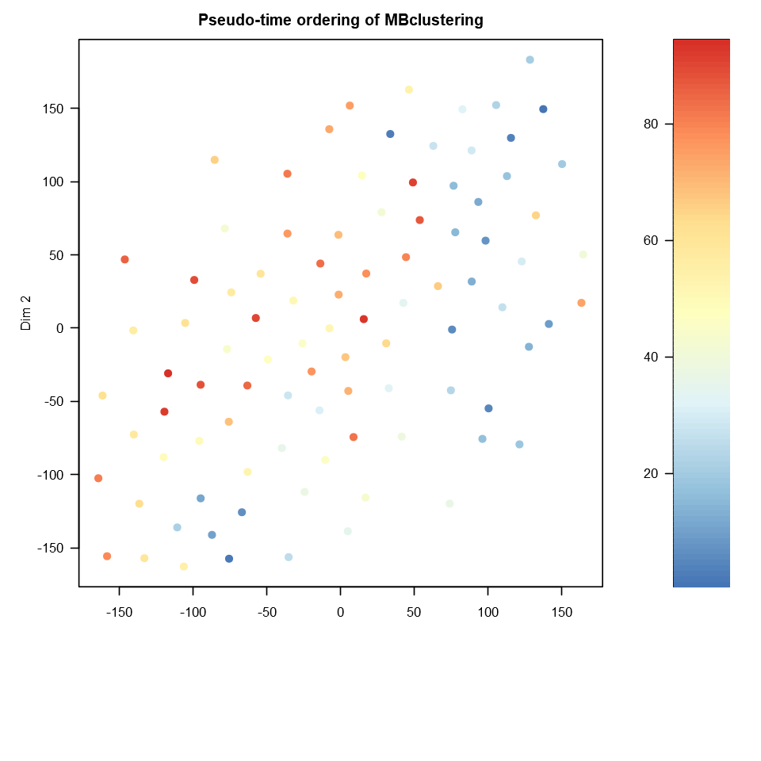


#### 2.2.4.3 Plotting the Model-based clusters in heatmap


```R
MBclustheatmap(sc,hmethod="single", plot = TRUE) 
```

    Clustering k = 1,2,..., K.max (= 20): .. done
    Bootstrapping, b = 1,2,..., B (= 50)  [one "." per sample]:
    .................................................. 50 
    


<ol class=list-inline>
	<li>2</li>
	<li>1</li>
	<li>3</li>
</ol>


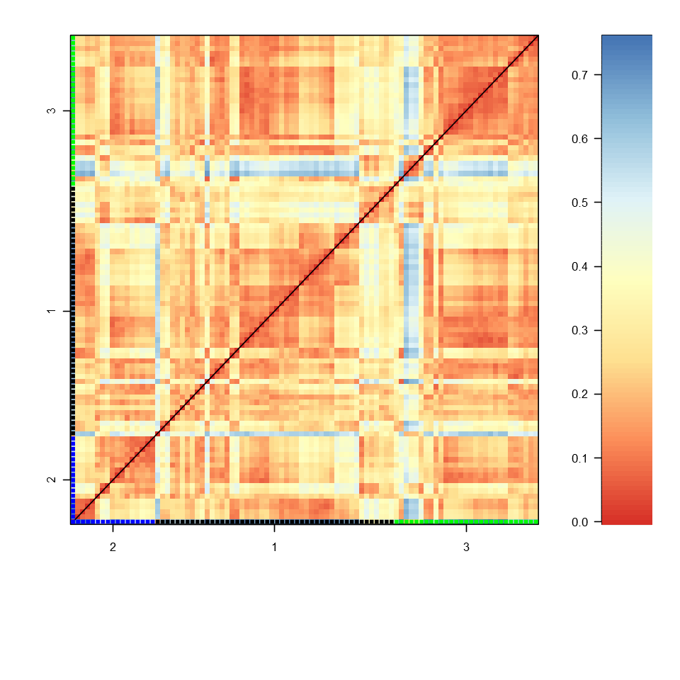


#### 2.2.4.4 Plotting the gene expression of a particular gene in a tSNE map


```R
g='ENSG00000210082'                #### Plotting the expression of  MT-RNR2
plotexptsneMB(sc,g)
```


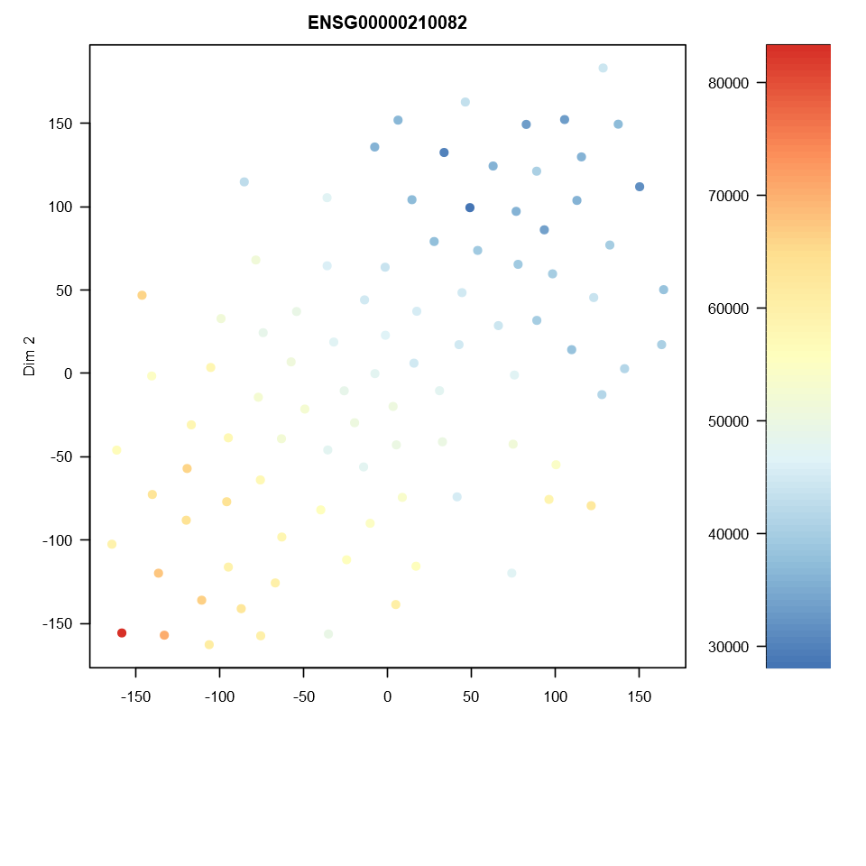


#### 2.2.4.5 Plotting the gene expression of a particular gene in a PCA plot


```R
g <- "ENSG00000210082"       #### Plotting the expression of  MT-RNR2
PlotMBexpPCA(sc,g)
```


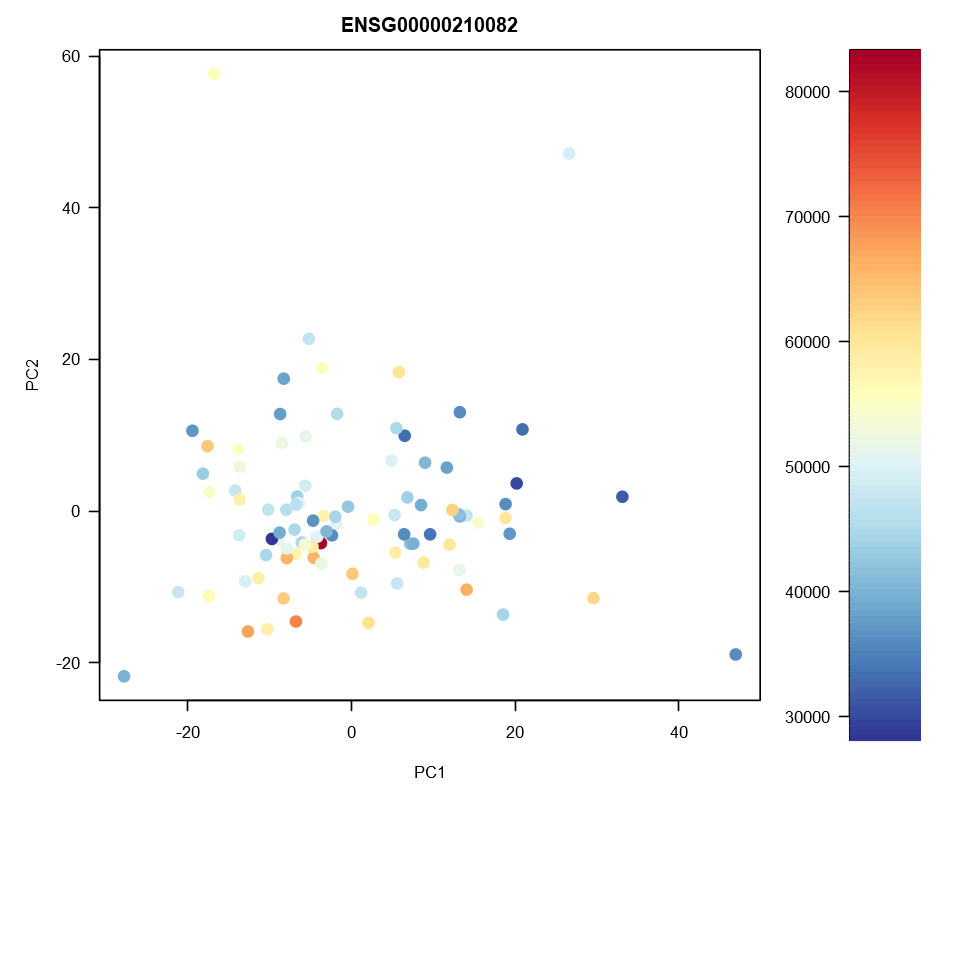


## 3. Determining differentially expressed genes (DEGs)

Differentially expressed genes between individual clusters are identified using the significance analysis of sequencing data (SAMseq), which is a new function in significance analysis of microarrays (Li and Tibshirani 2011) in the samr package v2.0 (Tibshirani et all., 2015). SAMseq is a non-parametric statistical function dependent on Wilcoxon rank statistic that equalizes the sizes of the library by a resampling method accounting for the various sequencing depths. The analysis is implemented over the pure raw dataset that has the unnormalized expression read counts after excluding the ERCCs. Furthermore, DEGs in each cluster comparing to all the remaining clusters are determined using binomial differential expression, which is based on binomial counting statistics.


## 3.1 Identifying DEGs using SAMseq

The user can define DEGs between all clusters generated by either K-means or model based clustering by applying the “DEGanalysis” function. Another alternative is to define DEGs between particular clusters generated by either K-means or model based clustering by applying the “DEGanalysis2clust” function. The outcome of these two functions is a list of two components:
- The first component is a data frame showing the Ensembl gage name and the symbole of the detected DEGs
- The second component is table showing the comparisons, Target cluster, Number of genes and the File name. This component will be used for the downstream analysis.

### 3.1.1 Determining DEGs between two particular clusters


```R
####### differential expression analysis between cluster 2 and cluster 3 of the Model-Based clustering using FDR of 0.05
MBcdiff<-DEGanalysis2clust(sc,Clustering="MB",K=3,fdr=0.05,name="Name",First="CL2",Second="CL3",export = TRUE,quiet=TRUE)   
#### To show the result table
head(MBcdiff[[1]])                  # The first component 
head(MBcdiff[[2]])                  # The second component 
```

    The results of DEGs are saved in your directory 
    Low-regulated genes in the CL3 in CL2 VS CL3
    The results of DEGs are saved in your directory 
    Up-regulated genes in the CL3 in CL2 VS CL3
    


<table>
<thead><tr><th scope=col>DEGsE</th><th scope=col>DEGsS</th></tr></thead>
<tbody>
	<tr><td>ENSG00000010292</td><td>NCAPD2         </td></tr>
	<tr><td>ENSG00000011426</td><td>ANLN           </td></tr>
	<tr><td>ENSG00000024526</td><td>DEPDC1         </td></tr>
	<tr><td>ENSG00000072571</td><td>HMMR           </td></tr>
	<tr><td>ENSG00000076382</td><td>SPAG5          </td></tr>
	<tr><td>ENSG00000079616</td><td>KIF22          </td></tr>
</tbody>
</table>


<table>
<thead><tr><th scope=col>Comparisons</th><th scope=col>Target cluster</th><th scope=col>Gene number</th><th scope=col>File name</th><th scope=col>Gene number</th><th scope=col>File name</th></tr></thead>
<tbody>
	<tr><td>CL2 VS CL3                         </td><td>CL3                                </td><td>26                                 </td><td>Up-regulated-NameCL3inCL2VSCL3.csv </td><td>146                                </td><td>Low-regulated-NameCL3inCL2VSCL3.csv</td></tr>
	<tr><td>CL2 VS CL3                         </td><td>CL2                                </td><td>26                                 </td><td>Low-regulated-NameCL2inCL2VSCL3.csv</td><td>146                                </td><td>Up-regulated-NameCL2inCL2VSCL3.csv </td></tr>
</tbody>
</table>


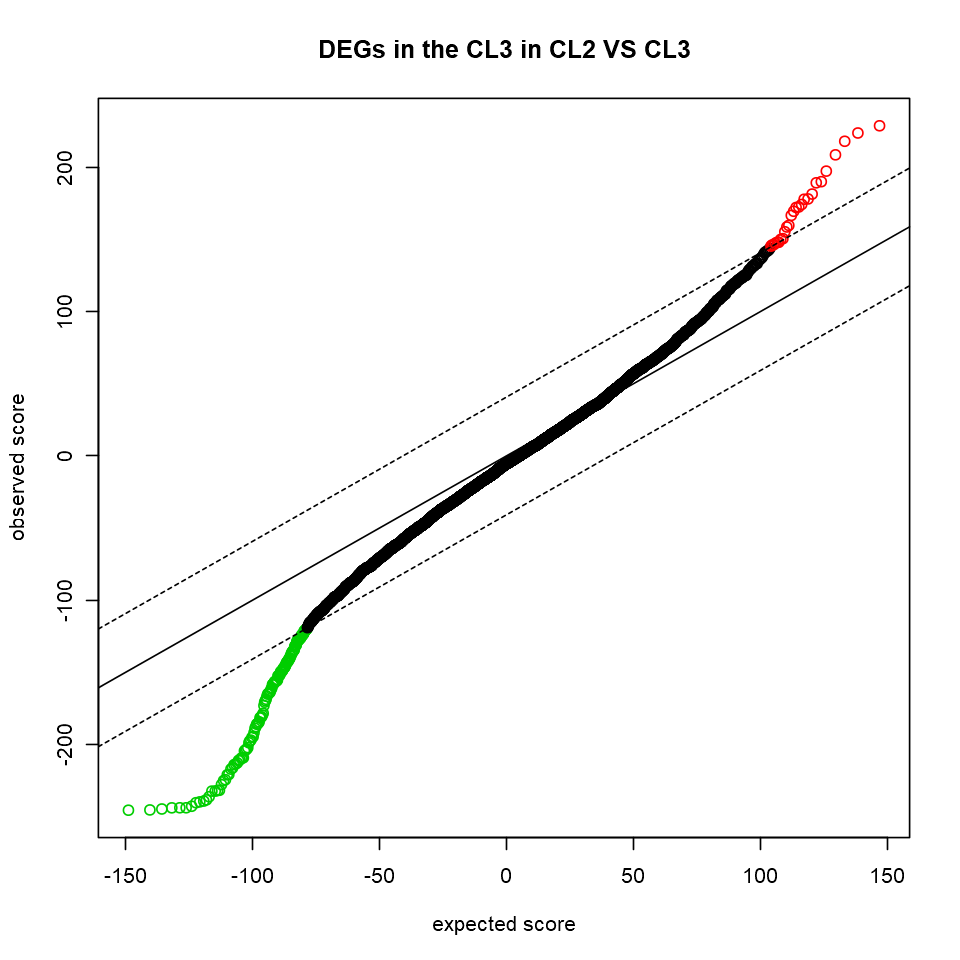


### 3.1.2 Determining DEGs between all clusters

##                                         ¤¤¤¤¤¤¤¤¤¤¤¤¤¤¤¤ Running this cell will overwrite the previous one ¤¤¤¤¤¤¤¤¤¤¤¤¤¤¤¤


```R
MBcdiff<-DEGanalysis(sc,Clustering="MB",K=3,fdr=0.05,name="all_clusters",export = TRUE,quiet=TRUE)   ####### differential expression analysis between all clusters
#### To show the result table
head(MBcdiff[[1]])                  # The first component 
head(MBcdiff[[2]])                  # The second component
```


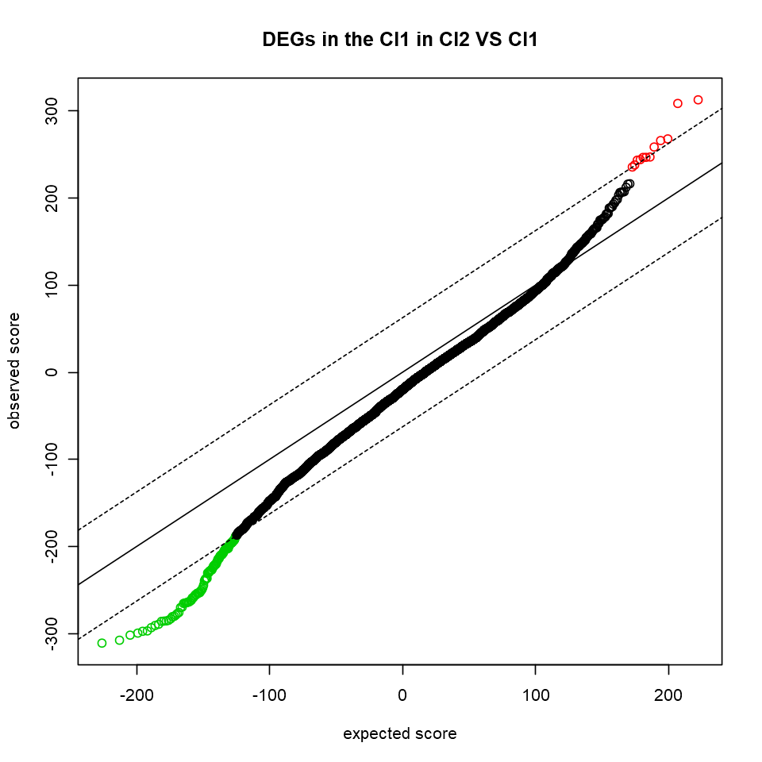


<table>
<thead><tr><th scope=col>DEGsE</th><th scope=col>DEGsS</th></tr></thead>
<tbody>
	<tr><td>ENSG00000010292</td><td>NCAPD2         </td></tr>
	<tr><td>ENSG00000011426</td><td>ANLN           </td></tr>
	<tr><td>ENSG00000024526</td><td>DEPDC1         </td></tr>
	<tr><td>ENSG00000072571</td><td>HMMR           </td></tr>
	<tr><td>ENSG00000076382</td><td>SPAG5          </td></tr>
	<tr><td>ENSG00000079616</td><td>KIF22          </td></tr>
</tbody>
</table>


<table>
<thead><tr><th scope=col>Comparisons</th><th scope=col>Target cluster</th><th scope=col>Gene number</th><th scope=col>File name</th><th scope=col>Gene number</th><th scope=col>File name</th></tr></thead>
<tbody>
	<tr><td>Cl2 VS Cl3                                 </td><td>Cl3                                        </td><td>26                                         </td><td>Up-regulated-all_clustersCl3inCl2VSCl3.csv </td><td>146                                        </td><td>Low-regulated-all_clustersCl3inCl2VSCl3.csv</td></tr>
	<tr><td>Cl2 VS Cl1                                 </td><td>Cl1                                        </td><td>12                                         </td><td>Up-regulated-all_clustersCl1inCl2VSCl1.csv </td><td>115                                        </td><td>Low-regulated-all_clustersCl1inCl2VSCl1.csv</td></tr>
	<tr><td>Cl3 VS Cl1                                 </td><td>Cl1                                        </td><td> 0                                         </td><td>Up-regulated-all_clustersCl1inCl3VSCl1.csv </td><td> 10                                        </td><td>Low-regulated-all_clustersCl1inCl3VSCl1.csv</td></tr>
	<tr><td>Cl2 VS Cl3                                 </td><td>Cl2                                        </td><td>26                                         </td><td>Low-regulated-all_clustersCl2inCl2VSCl3.csv</td><td>146                                        </td><td>Up-regulated-all_clustersCl2inCl2VSCl3.csv </td></tr>
	<tr><td>Cl2 VS Cl1                                 </td><td>Cl2                                        </td><td>12                                         </td><td>Low-regulated-all_clustersCl2inCl2VSCl1.csv</td><td>115                                        </td><td>Up-regulated-all_clustersCl2inCl2VSCl1.csv </td></tr>
	<tr><td>Cl3 VS Cl1                                 </td><td>Cl3                                        </td><td> 0                                         </td><td>Low-regulated-all_clustersCl3inCl3VSCl1.csv</td><td> 10                                        </td><td>Up-regulated-all_clustersCl3inCl3VSCl1.csv </td></tr>
</tbody>
</table>


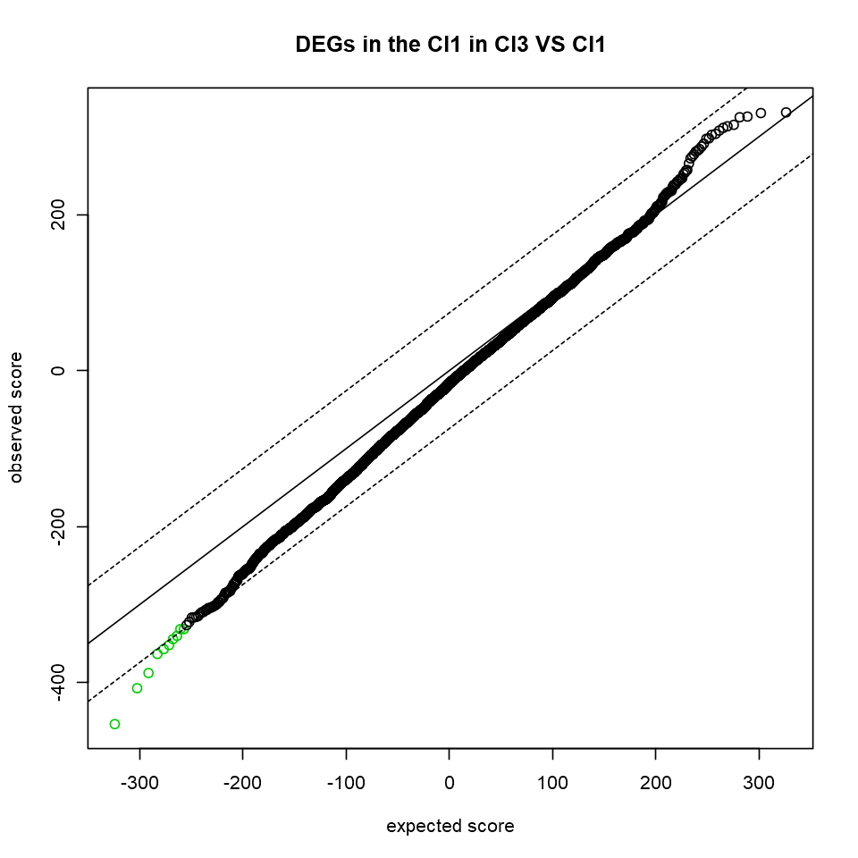


```R
#### To show the result table
head(MBcdiff[[1]])                  # The first component 
head(MBcdiff[[2]])                  # The second component
```


<table>
<thead><tr><th scope=col>DEGsE</th><th scope=col>DEGsS</th></tr></thead>
<tbody>
	<tr><td>ENSG00000010292</td><td>NCAPD2         </td></tr>
	<tr><td>ENSG00000011426</td><td>ANLN           </td></tr>
	<tr><td>ENSG00000024526</td><td>DEPDC1         </td></tr>
	<tr><td>ENSG00000072571</td><td>HMMR           </td></tr>
	<tr><td>ENSG00000076382</td><td>SPAG5          </td></tr>
	<tr><td>ENSG00000079616</td><td>KIF22          </td></tr>
</tbody>
</table>


<table>
<thead><tr><th scope=col>Comparisons</th><th scope=col>Target cluster</th><th scope=col>Gene number</th><th scope=col>File name</th><th scope=col>Gene number</th><th scope=col>File name</th></tr></thead>
<tbody>
	<tr><td>Cl2 VS Cl3                                 </td><td>Cl3                                        </td><td>26                                         </td><td>Up-regulated-all_clustersCl3inCl2VSCl3.csv </td><td>146                                        </td><td>Low-regulated-all_clustersCl3inCl2VSCl3.csv</td></tr>
	<tr><td>Cl2 VS Cl1                                 </td><td>Cl1                                        </td><td>12                                         </td><td>Up-regulated-all_clustersCl1inCl2VSCl1.csv </td><td>115                                        </td><td>Low-regulated-all_clustersCl1inCl2VSCl1.csv</td></tr>
	<tr><td>Cl3 VS Cl1                                 </td><td>Cl1                                        </td><td> 0                                         </td><td>Up-regulated-all_clustersCl1inCl3VSCl1.csv </td><td> 10                                        </td><td>Low-regulated-all_clustersCl1inCl3VSCl1.csv</td></tr>
	<tr><td>Cl2 VS Cl3                                 </td><td>Cl2                                        </td><td>26                                         </td><td>Low-regulated-all_clustersCl2inCl2VSCl3.csv</td><td>146                                        </td><td>Up-regulated-all_clustersCl2inCl2VSCl3.csv </td></tr>
	<tr><td>Cl2 VS Cl1                                 </td><td>Cl2                                        </td><td>12                                         </td><td>Low-regulated-all_clustersCl2inCl2VSCl1.csv</td><td>115                                        </td><td>Up-regulated-all_clustersCl2inCl2VSCl1.csv </td></tr>
	<tr><td>Cl3 VS Cl1                                 </td><td>Cl3                                        </td><td> 0                                         </td><td>Low-regulated-all_clustersCl3inCl3VSCl1.csv</td><td> 10                                        </td><td>Up-regulated-all_clustersCl3inCl3VSCl1.csv </td></tr>
</tbody>
</table>


#### 3.2 Identifying DEGs using binomial differential expression

The function MBClustDiffGenes identifies differentially regulated genes for each cluster of the Model-Based clustering in 
comparison to the ensemble of all cells. It returns a list with a data.frame element for each cluster that contains the mean expression across all cells not in the cluster (mean.ncl) and in the cluster (mean.cl), the fold-change in the cluster versus all remaining cells (fc), and the p-value for differential expression between all cells in a cluster and all remaining cells. The p-value is computed based on the overlap of negative binomials fitted to the count distributions within the two groups akin to DESeq.


```R
MBcdiffBinomial<-MBClustDiffGenes(sc,K=3,fdr=.01,export=TRUE, quiet=T)    ########## Binomial differential expression analysis
#### To show the result table
head(MBcdiffBinomial[[1]])                  # The first component 
head(MBcdiffBinomial[[2]])                  # The second component
```


<table>
<thead><tr><th scope=col>DEGsE</th><th scope=col>DEGsS</th></tr></thead>
<tbody>
	<tr><td>ENSG00000075624</td><td>ACTB           </td></tr>
	<tr><td>ENSG00000094804</td><td>CDC6           </td></tr>
	<tr><td>ENSG00000101447</td><td>FAM83D         </td></tr>
	<tr><td>ENSG00000103187</td><td>COTL1          </td></tr>
	<tr><td>ENSG00000104738</td><td>MCM4           </td></tr>
	<tr><td>ENSG00000112118</td><td>MCM3           </td></tr>
</tbody>
</table>


<table>
<thead><tr><th scope=col>Target Cluster</th><th scope=col>VS</th><th scope=col>Gene number</th><th scope=col>File name</th><th scope=col>Gene number</th><th scope=col>File name</th></tr></thead>
<tbody>
	<tr><td>Cluster 1            </td><td>Remaining Clusters   </td><td> 13                  </td><td>Up-DEG-cluster1.csv  </td><td> 25                  </td><td>Down-DEG-cluster1.csv</td></tr>
	<tr><td>Cluster 2            </td><td>Remaining Clusters   </td><td>333                  </td><td>Up-DEG-cluster2.csv  </td><td>313                  </td><td>Down-DEG-cluster2.csv</td></tr>
	<tr><td>Cluster 3            </td><td>Remaining Clusters   </td><td> 65                  </td><td>Up-DEG-cluster3.csv  </td><td>133                  </td><td>Down-DEG-cluster3.csv</td></tr>
</tbody>
</table>


### Plotting the DEGs

Volcano plots are used to readily show the DEGs by plotting significance versus fold-change on the y and x axes, respectively.


```R
name<-MBcdiffBinomial[[2]][2,4]    ############ Selecting the "Up-DEG-cluster2.csv " from the DEGs' binomial table  ##############
#name<-MBcdiff[[2]][4,6]    ############ Selecting the "Up-DEG-cluster2.csv " from the DEGs' SAMseq table  ##############
U<-read.csv(file=paste0(name),head=TRUE,sep=",")
Vplot<-VolcanoPlot(U,value=0.001,name=name,FS=.3,fc=0.5)
#### In case the output of this function is an error "Error in plot.window(...): need finite 'ylim' values", the adj should be set to TRUE
### In case the user would like to get the names of the significant DEGs then FS should be set to a value of 0.3 or higher.
```


## 4. Identifying biomarkers (decision trees and networking analysis) 

There are several methods to identify biomarkers, among them are decision trees and hub detection through networking analysis. The outcome of STRING analysis is stored in tab separated values (TSV) files. These TSV files served as an input to check both the connectivity degree and the betweenness centrality, which reflects the communication flow in the defined PPI networks 

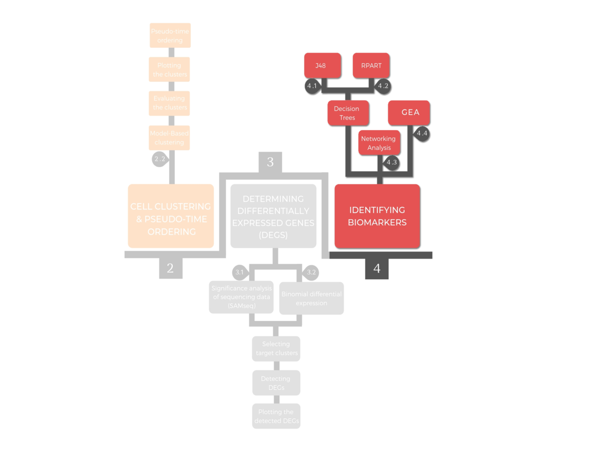

Decision trees are one of the most efficient classification techniques in biomarkers discovery.  Here we use it to predict the sub-population of a target cell based on transcriptomic data. Two types of decision trees can be performed: classification and regression trees (CART) and J48. The decision tree analysis is implemented over a training dataset, which consisted of the DEGs obtained by either SAMseq or the binomial differential expression. The performance of the generated trees can be evaluated for error estimation by ten-fold cross validation assessment using the "J48DTeval" and "RpartEVAL" functions.
The decision tree analysis requires the dataset to be class vectored by applying the “ClassVectoringDT” function.


```R
sigDEG<-cdiff[[1]]             # DEGs gene list from SANseq
#sigDEG<-cdiffBinomial[[1]]      # DEGs gene list from Binomial analysis
First="CL2"
Second="CL3"
DATAforDT<-ClassVectoringDT(sc,Clustering="MB",K=3,First=First,Second=Second,sigDEG)
```

    The DEGs filtered normalized dataset contains:
     Genes: 8 
     cells: 46

### 4.1. J48 Decision Tree


```R
j48dt<-J48DT(DATAforDT)
summary(j48dt) 
```

    J48 pruned tree
    ------------------
    
    MTRNR2 <= 41518.323682
    |   PXK <= 46.784923
    |   |   PPP5C <= 370.82892: CL2 (4.0/1.0)
    |   |   PPP5C > 370.82892: CL3 (4.0)
    |   PXK > 46.784923: CL2 (7.0)
    MTRNR2 > 41518.323682
    |   MTRNR2 <= 53816.109212: CL3 (18.0/1.0)
    |   MTRNR2 > 53816.109212
    |   |   COG8 <= 92.793396
    |   |   |   ELP1 <= 176.101741: CL2 (5.0)
    |   |   |   ELP1 > 176.101741: CL3 (3.0/1.0)
    |   |   COG8 > 92.793396: CL3 (5.0)
    
    Number of Leaves  : 	7
    
    Size of the tree : 	13
    
    


    
    === Summary ===
    
    Correctly Classified Instances          43               93.4783 %
    Incorrectly Classified Instances         3                6.5217 %
    Kappa statistic                          0.8583
    Mean absolute error                      0.1027
    Root mean squared error                  0.2266
    Relative absolute error                 21.9638 %
    Root relative squared error             46.9338 %
    Total Number of Instances               46     
    
    === Confusion Matrix ===
    
      a  b   <-- classified as
     15  2 |  a = CL2
      1 28 |  b = CL3


#### 4.1.1. Evaluating the performance of the J48 Decision Tree


```R
j48dt<-J48DTeval(DATAforDT,num.folds=10,First=First,Second=Second)
```

    Fold 1 of 10 
    Fold 2 of 10 
    Fold 3 of 10 
    Fold 4 of 10 
    Fold 5 of 10 
    Fold 6 of 10 
    Fold 7 of 10 
    Fold 8 of 10 
    Fold 9 of 10 
    Fold 10 of 10 
    TP FN FP TN 
     1 16  4 25 
                 CL2 CL3
    PredictedCL2   1   4
    PredictedCL3  16  25
    J48 SN: 0.05882353
    J48 SP: 0.862069
    J48 ACC: 0.5652174
    J48 MCC: -0.1226773
    

### 4.2. RPART Decision Tree


```R
rpartDT<-RpartDT(DATAforDT)
```

    n= 46 
    
    node), split, n, loss, yval, (yprob)
          * denotes terminal node
    
     1) root 46 17 CL3 (0.36956522 0.63043478)  
       2) MTRNR2< 41999.57 15  5 CL2 (0.66666667 0.33333333)  
         4) PXK>=48.33224 7  0 CL2 (1.00000000 0.00000000) *
         5) PXK< 48.33224 8  3 CL3 (0.37500000 0.62500000)  
          10) PPP5C< 388.1959 4  1 CL2 (0.75000000 0.25000000)  
            20) ACTB< 55652.35 3  0 CL2 (1.00000000 0.00000000) *
            21) ACTB>=55652.35 1  0 CL3 (0.00000000 1.00000000) *
          11) PPP5C>=388.1959 4  0 CL3 (0.00000000 1.00000000) *
       3) MTRNR2>=41999.57 31  7 CL3 (0.22580645 0.77419355)  
         6) MTRNR2>=58620.64 9  4 CL2 (0.55555556 0.44444444)  
          12) ELP1< 77.58087 4  0 CL2 (1.00000000 0.00000000) *
          13) ELP1>=77.58087 5  1 CL3 (0.20000000 0.80000000)  
            26) ACTB< 37059.54 1  0 CL2 (1.00000000 0.00000000) *
            27) ACTB>=37059.54 4  0 CL3 (0.00000000 1.00000000) *
         7) MTRNR2< 58620.64 22  2 CL3 (0.09090909 0.90909091)  
          14) PXK>=234.4688 1  0 CL2 (1.00000000 0.00000000) *
          15) PXK< 234.4688 21  1 CL3 (0.04761905 0.95238095)  
            30) ELP1>=237.6652 3  1 CL3 (0.33333333 0.66666667)  
              60) PPP5C>=489.0979 1  0 CL2 (1.00000000 0.00000000) *
              61) PPP5C< 489.0979 2  0 CL3 (0.00000000 1.00000000) *
            31) ELP1< 237.6652 18  0 CL3 (0.00000000 1.00000000) *
    


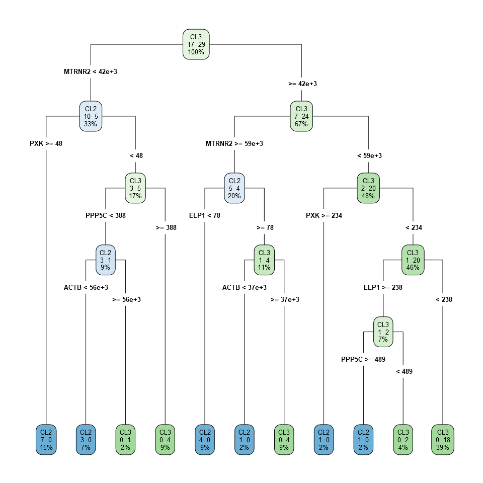


#### 4.2.1. Evaluating the performance of the RPART Decision Tree


```R
rpartEVAL<-RpartEVAL(DATAforDT,num.folds=10,First=First,Second=Second)
```

    Fold 1 of 10 
    Fold 2 of 10 
    Fold 3 of 10 
    Fold 4 of 10 
    Fold 5 of 10 
    Fold 6 of 10 
    Fold 7 of 10 
    Fold 8 of 10 
    Fold 9 of 10 
    Fold 10 of 10 
    TP FN FP TN 
     9  8 14 15 
                 CL2 CL3
    PredictedCL2   9  14
    PredictedCL3   8  15
    Rpart SN: 0.5294118
    Rpart SP: 0.5172414
    Rpart ACC: 0.5217391
    Rpart MCC: 0.04503773
    

### 4.3. Networking Analysis

To define protein-protein interactions (PPI) over a list of genes, STRING-api is used. The outcome of STRING analysis was stored in tab separated values (TSV) files. These TSV files served as an input to check both the connectivity degree and the betweenness centrality, which reflects the communication flow in the defined PPI networks.

### 4.3.1 All DEGs


```R
DEGs="All DEGs"
FileName=paste0(DEGs)

#data<-MBcdiffBinomial[[1]] [,2]    # DEGs gene list from Binomial analysis
data<-MBcdiff[[1]] [,2]             # From the table of the differential expression analysis between all pairs of clusters

ppi<-PPI(data,FileName)

networking<-NetAnalysis(ppi)
networking                            ##### In case the Examine response components = 200 and an error "linkmat[i, ]" appeared, that means there are no PPI.

network<-Networking(data,FileName)
```

    Examine response components = 200 	 200 means successful 
    

    No encoding supplied: defaulting to UTF-8.
    

    Number of nodes:  171 
    Number of links:  3931 
    Link Density:  22.9883 
    The connectance of the graph:  0.1352253 
    Mean Distences 1.689381 
    Average Path Length 1.689381 
     
    


<table>
<thead><tr><th></th><th scope=col>names</th><th scope=col>degree</th><th scope=col>betweenness</th></tr></thead>
<tbody>
	<tr><th scope=row>89</th><td>CDC20    </td><td>108      </td><td>200.80162</td></tr>
	<tr><th scope=row>107</th><td>CDK1     </td><td>107      </td><td>240.05487</td></tr>
	<tr><th scope=row>40</th><td>PLK1     </td><td>106      </td><td>162.42845</td></tr>
	<tr><th scope=row>13</th><td>CCNB1    </td><td>104      </td><td> 49.31934</td></tr>
	<tr><th scope=row>37</th><td>MAD2L1   </td><td>102      </td><td> 91.56594</td></tr>
	<tr><th scope=row>30</th><td>CCNA2    </td><td>101      </td><td>169.77904</td></tr>
	<tr><th scope=row>52</th><td>AURKB    </td><td>101      </td><td>204.28162</td></tr>
	<tr><th scope=row>17</th><td>NDC80    </td><td>100      </td><td> 61.01072</td></tr>
	<tr><th scope=row>32</th><td>BUB1B    </td><td>100      </td><td> 94.01062</td></tr>
	<tr><th scope=row>33</th><td>CCNB2    </td><td>100      </td><td> 41.28941</td></tr>
	<tr><th scope=row>45</th><td>BUB1     </td><td>100      </td><td>155.08390</td></tr>
	<tr><th scope=row>4</th><td>AURKA    </td><td> 99      </td><td> 13.25971</td></tr>
	<tr><th scope=row>16</th><td>KIF11    </td><td> 99      </td><td> 66.09399</td></tr>
	<tr><th scope=row>87</th><td>KIF2C    </td><td> 99      </td><td>131.11762</td></tr>
	<tr><th scope=row>90</th><td>CDCA8    </td><td> 97      </td><td>102.63555</td></tr>
	<tr><th scope=row>121</th><td>TOP2A    </td><td> 97      </td><td> 52.27875</td></tr>
	<tr><th scope=row>25</th><td>CENPE    </td><td> 95      </td><td> 38.28040</td></tr>
	<tr><th scope=row>75</th><td>CENPF    </td><td> 95      </td><td> 57.46790</td></tr>
	<tr><th scope=row>29</th><td>NUF2     </td><td> 94      </td><td> 56.20195</td></tr>
	<tr><th scope=row>44</th><td>BIRC5    </td><td> 94      </td><td> 68.31694</td></tr>
	<tr><th scope=row>81</th><td>TTK      </td><td> 94      </td><td> 84.71821</td></tr>
	<tr><th scope=row>41</th><td>TPX2     </td><td> 93      </td><td>105.79144</td></tr>
	<tr><th scope=row>69</th><td>UBE2C    </td><td> 93      </td><td>238.75612</td></tr>
	<tr><th scope=row>105</th><td>PRC1     </td><td> 92      </td><td> 59.65976</td></tr>
	<tr><th scope=row>8</th><td>DLGAP5   </td><td> 90      </td><td> 28.42951</td></tr>
	<tr><th scope=row>39</th><td>MELK     </td><td> 90      </td><td> 34.85504</td></tr>
	<tr><th scope=row>78</th><td>ASPM     </td><td> 89      </td><td> 50.66695</td></tr>
	<tr><th scope=row>106</th><td>KIF20A   </td><td> 89      </td><td> 40.18122</td></tr>
	<tr><th scope=row>15</th><td>KIF23    </td><td> 88      </td><td> 14.97653</td></tr>
	<tr><th scope=row>103</th><td>PTTG1    </td><td> 88      </td><td> 66.48419</td></tr>
	<tr><th scope=row>...</th><td>...</td><td>...</td><td>...</td></tr>
	<tr><th scope=row>149</th><td>PLIN3  </td><td>2      </td><td>0      </td></tr>
	<tr><th scope=row>150</th><td>SDCBP  </td><td>2      </td><td>0      </td></tr>
	<tr><th scope=row>34</th><td>CBR3   </td><td>1      </td><td>0      </td></tr>
	<tr><th scope=row>46</th><td>COL3A1 </td><td>1      </td><td>0      </td></tr>
	<tr><th scope=row>68</th><td>HN1    </td><td>1      </td><td>0      </td></tr>
	<tr><th scope=row>83</th><td>RBMX   </td><td>1      </td><td>0      </td></tr>
	<tr><th scope=row>92</th><td>CMTR1  </td><td>1      </td><td>0      </td></tr>
	<tr><th scope=row>93</th><td>PHACTR4</td><td>1      </td><td>0      </td></tr>
	<tr><th scope=row>108</th><td>WDR6   </td><td>1      </td><td>0      </td></tr>
	<tr><th scope=row>111</th><td>PRMT2  </td><td>1      </td><td>0      </td></tr>
	<tr><th scope=row>113</th><td>LAMB2  </td><td>1      </td><td>0      </td></tr>
	<tr><th scope=row>116</th><td>MXD3   </td><td>1      </td><td>0      </td></tr>
	<tr><th scope=row>138</th><td>TMUB2  </td><td>1      </td><td>0      </td></tr>
	<tr><th scope=row>142</th><td>CABYR  </td><td>1      </td><td>0      </td></tr>
	<tr><th scope=row>143</th><td>PHF19  </td><td>1      </td><td>0      </td></tr>
	<tr><th scope=row>147</th><td>MRPL15 </td><td>1      </td><td>0      </td></tr>
	<tr><th scope=row>154</th><td>TIMP3  </td><td>1      </td><td>0      </td></tr>
	<tr><th scope=row>156</th><td>MTHFD1 </td><td>1      </td><td>0      </td></tr>
	<tr><th scope=row>157</th><td>COTL1  </td><td>1      </td><td>0      </td></tr>
	<tr><th scope=row>161</th><td>CMTR2  </td><td>1      </td><td>0      </td></tr>
	<tr><th scope=row>162</th><td>KDM5B  </td><td>1      </td><td>0      </td></tr>
	<tr><th scope=row>163</th><td>CLPX   </td><td>1      </td><td>0      </td></tr>
	<tr><th scope=row>164</th><td>PTTG1IP</td><td>1      </td><td>0      </td></tr>
	<tr><th scope=row>165</th><td>SLC25A3</td><td>1      </td><td>0      </td></tr>
	<tr><th scope=row>166</th><td>FBXO8  </td><td>1      </td><td>0      </td></tr>
	<tr><th scope=row>167</th><td>PTK2   </td><td>1      </td><td>0      </td></tr>
	<tr><th scope=row>168</th><td>PSAP   </td><td>1      </td><td>0      </td></tr>
	<tr><th scope=row>169</th><td>MFSD12 </td><td>1      </td><td>0      </td></tr>
	<tr><th scope=row>170</th><td>MOB3A  </td><td>1      </td><td>0      </td></tr>
	<tr><th scope=row>171</th><td>PHF7   </td><td>1      </td><td>0      </td></tr>
</tbody>
</table>


    Examine response components = 200 	 200 means successful 
    
     You can see the network with high resolution by clicking on the following link: 
     https://string-db.org/api/highres_image/network?identifiers=NCAPD2%0dANLN%0dDEPDC1%0dHMMR%0dSPAG5%0dKIF22%0dNDC80%0dAURKA%0dTPX2%0dBIRC5%0dRANGAP1%0dCDKN3%0dCDC25B%0dFAM83D%0dPLIN3%0dISYNA1%0dTTK%0dKIF20A%0dSMC4%0dMIIP%0dCDC20%0dNEK2%0dCENPF%0dPHF19%0dKIF18A%0dCKS2%0dDLGAP5%0dTRAF2%0dKNSTRN%0dPIMREG%0dATP8B3%0dTOP2A%0dCCNB1%0dPSRC1%0dCDCA8%0dTROAP%0dCKAP2%0dARHGEF39%0dNUSAP1%0dKIF23%0dKNL1%0dCEP55%0dKIF20B%0dCENPE%0dGAS2L3%0dTOB1%0dKIF2C%0dNUF2%0dCALM2%0dCCNA2%0dMKI67%0dBUB1B%0dCCNB2%0dCBR3%0dCCNF%0dHMGB2%0dPTTG1%0dPLK1%0dTUBA1C%0dREEP4%0dPTK2%0dCKAP2L%0dBUB1%0dCDK1%0dARL6IP1%0dCKS1B%0dRNF26%0dUBE2C%0dCKAP5%0dPNMA1%0dTGIF1%0dAURKB%0dCDCA2%0dIFIT1%0dTUBB4B%0dJPT1%0dHYLS1%0dPRC1%0dMXD3%0dTACC3%0dCABYR%0dSGO2%0dPBK%0dDBF4%0dGTSE1%0dPPP2R5C%0dTOM1%0dKIF14%0dBTG1%0dKIF11%0dPIF1%0dRBMX%0dUGCG%0dPOC1A%0dRAD21%0dCOL3A1%0dTMUB2%0dPTTG1IP%0dPHACTR4%0dASPM%0dCENPT%0dCAMSAP2%0dCDC25C%0dWDR6%0dAPOLD1%0dMRTFB%0dCDC27%0dSPDL1%0dDNAJB1%0dTUBB2A%0dKLHDC8B%0dPMAIP1%0dCDC42EP2%0dMAD2L1%0dTUBA1A%0dLAMB2%0dCMTR2%0dTNFAIP8L1%0dDZIP3%0dRNF4%0dCEP70%0dDNAJC16%0dBBS9%0dRACGAP1%0dZNF544%0dNBPF1%0dPSAP%0dPHF7%0dGOLIM4%0dCALCOCO1%0dG2E3%0dBRD8%0dBORA%0dSDCBP%0dSLC4A2%0dFZD6%0dNUMB%0dMELK%0dFOSL1%0dARID4B%0dPOMT1%0dCMTR1%0dCEP19%0dKDM5B%0dIL17RC%0dDMAP1%0dMCM6%0dMCM5%0dMCM4%0dPCNA%0dFEN1%0dCCNE2%0dTYMS%0dHIST1H4C%0dCDC45%0dMTHFD1%0dLDHB%0dDUT%0dMCM7%0dC19orf48%0dMCM2%0dC1QBP%0dGINS2%0dSLC25A3%0dCDC6%0dRPL8%0dAPEX1%0dHELLS%0dMRPL15%0dRFC4%0dRRM2%0dC2orf48%0dGMNN%0dPAX6%0dANLN%0dDEPDC1%0dKIF22%0dNDC80%0dAURKA%0dBIRC5%0dFAM83D%0dTTK%0dBRD8%0dKIF20A%0dCDC20%0dNEK2%0dCENPF%0dHJURP%0dCKS2%0dDLGAP5%0dKNSTRN%0dPIMREG%0dTOP2A%0dPSRC1%0dCDCA8%0dTROAP%0dCKAP2%0dARHGEF39%0dTUBB2A%0dNUSAP1%0dKIF23%0dGAS2L3%0dPIF1%0dKIF2C%0dNUF2%0dCCNA2%0dCDC42EP2%0dBUB3%0dBUB1B%0dCBR3%0dCCNF%0dMELK%0dPLEKHA7%0dPLK1%0dTUBA1C%0dPBK%0dCKAP2L%0dCDK1%0dARL6IP1%0dCKS1B%0dRNF26%0dUBE2C%0dCKAP5%0dAPOLD1%0dAURKB%0dCDCA2%0dTUBB4B%0dHYLS1%0dMXD3%0dMOB3A%0dCALCOCO1%0dHMMR%0dSPAG5%0dPLIN3%0dPPP2R5D%0dSMC4%0dKDM5B%0dMKI67%0dPRMT2%0dHMGB2%0dMAD2L1%0dBUB1%0dTGIF1%0dCDC27%0dTPX2%0dRANGAP1%0dCCNB1%0dCALCOCO2%0dFBXO43%0dMFSD12%0dYY1AP1%0dKIF15%0dDCP2%0dTUBB6%0dH2AFX%0dMIIP%0dLANCL2%0dKIF11%0dCCNB2%0dLDLRAP1%0dFBXO8%0dTRAIP%0dIQGAP3%0dPHACTR4%0dCYB5RL%0dCDKN3%0dCEP70%0dREEP4%0dCDC25B%0dCALM2%0dVPS26B%0dRACGAP1%0dJPT1%0dPRC1%0dASPM%0dCENPE%0dPOGK%0dRBMX%0dSLC25A25%0dCLPX%0dEXOC2%0dKIF14%0dTOB1%0dATP6V1B2%0dKIF20B%0dCABYR%0dBTD%0dIFIT1%0dMCM4%0dPCNA%0dMCM6%0dRFC4%0dMCM5%0dEFHC1%0dMCM3%0dGCG%0dCHAF1B%0dCCNE2%0dMCM7%0dUNG%0dTIMP3%0dCOTL1%0dTUBGCP3%0dVPS51%0dTENT2%0dMARCH3%0dPSMD2%0dH2AFX%0dHIST1H4C%0dMPZL1&species=9606


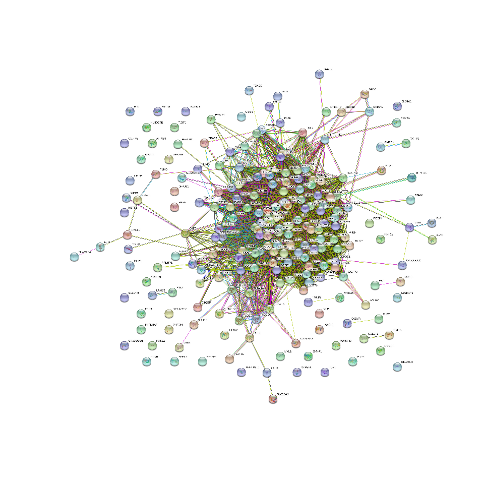


### 4.3.2 Particular set of DEGs


```R
############ Selecting the DEGs' table  ##############
#DEGs=cdiffBinomial[[2]][2,4]     # UP-regulated genes in cluster 2 (from the Binomial analysis)
DEGs=MBcdiff[[2]][2,6]             # UP-regulated genes in cluster 2 (from SAMseq)
FileName=paste0(DEGs)

data<-read.csv(file=paste0(DEGs),head=TRUE,sep=",")
data<-data[,3]

ppi<-PPI(data,FileName)

networking<-NetAnalysis(ppi)
networking                            ##### In case the Examine response components = 200 and an error "linkmat[i, ]" appeared, that means there are no PPI.

network<-Networking(data,FileName)

```

    Examine response components = 200 	 200 means successful 
    

    No encoding supplied: defaulting to UTF-8.
    

    Number of nodes:  87 
    Number of links:  1805 
    Link Density:  20.74713 
    The connectance of the graph:  0.2412457 
    Mean Distences 1.387005 
    Average Path Length 1.387005 
     
    


<table>
<thead><tr><th></th><th scope=col>names</th><th scope=col>degree</th><th scope=col>betweenness</th></tr></thead>
<tbody>
	<tr><th scope=row>21</th><td>PLK1     </td><td>69       </td><td>49.225835</td></tr>
	<tr><th scope=row>6</th><td>CCNB1    </td><td>68       </td><td>16.168104</td></tr>
	<tr><th scope=row>51</th><td>CDC20    </td><td>68       </td><td>55.767606</td></tr>
	<tr><th scope=row>62</th><td>CDK1     </td><td>67       </td><td>58.670028</td></tr>
	<tr><th scope=row>17</th><td>CCNB2    </td><td>66       </td><td>19.232805</td></tr>
	<tr><th scope=row>28</th><td>AURKB    </td><td>65       </td><td>30.037603</td></tr>
	<tr><th scope=row>37</th><td>UBE2C    </td><td>65       </td><td>77.460367</td></tr>
	<tr><th scope=row>50</th><td>KIF2C    </td><td>65       </td><td>40.693785</td></tr>
	<tr><th scope=row>52</th><td>CDCA8    </td><td>65       </td><td>52.382926</td></tr>
	<tr><th scope=row>1</th><td>AURKA    </td><td>64       </td><td> 2.949365</td></tr>
	<tr><th scope=row>9</th><td>KIF11    </td><td>64       </td><td>13.941676</td></tr>
	<tr><th scope=row>16</th><td>BUB1B    </td><td>64       </td><td>22.773281</td></tr>
	<tr><th scope=row>19</th><td>MAD2L1   </td><td>64       </td><td>21.620141</td></tr>
	<tr><th scope=row>25</th><td>BUB1     </td><td>64       </td><td>22.770363</td></tr>
	<tr><th scope=row>10</th><td>NDC80    </td><td>63       </td><td>17.109227</td></tr>
	<tr><th scope=row>12</th><td>CENPE    </td><td>63       </td><td> 8.104818</td></tr>
	<tr><th scope=row>15</th><td>CCNA2    </td><td>63       </td><td>13.821273</td></tr>
	<tr><th scope=row>24</th><td>BIRC5    </td><td>63       </td><td>30.527222</td></tr>
	<tr><th scope=row>40</th><td>CENPF    </td><td>63       </td><td>23.853202</td></tr>
	<tr><th scope=row>60</th><td>PRC1     </td><td>63       </td><td>32.092674</td></tr>
	<tr><th scope=row>14</th><td>NUF2     </td><td>62       </td><td>12.474772</td></tr>
	<tr><th scope=row>22</th><td>TPX2     </td><td>62       </td><td>35.478865</td></tr>
	<tr><th scope=row>46</th><td>TTK      </td><td>62       </td><td>40.003044</td></tr>
	<tr><th scope=row>69</th><td>TOP2A    </td><td>62       </td><td>17.505360</td></tr>
	<tr><th scope=row>3</th><td>DLGAP5   </td><td>60       </td><td> 1.274445</td></tr>
	<tr><th scope=row>59</th><td>HMMR     </td><td>60       </td><td>16.308939</td></tr>
	<tr><th scope=row>61</th><td>KIF20A   </td><td>60       </td><td>16.477782</td></tr>
	<tr><th scope=row>20</th><td>MELK     </td><td>59       </td><td>11.007927</td></tr>
	<tr><th scope=row>8</th><td>KIF23    </td><td>58       </td><td> 3.441654</td></tr>
	<tr><th scope=row>41</th><td>NEK2     </td><td>58       </td><td>36.317410</td></tr>
	<tr><th scope=row>...</th><td>...</td><td>...</td><td>...</td></tr>
	<tr><th scope=row>45</th><td>BUB3      </td><td>36        </td><td>47.6641571</td></tr>
	<tr><th scope=row>18</th><td>HMGB2     </td><td>30        </td><td> 0.0000000</td></tr>
	<tr><th scope=row>76</th><td>CDC27     </td><td>30        </td><td> 0.0000000</td></tr>
	<tr><th scope=row>23</th><td>TUBA1C    </td><td>26        </td><td>22.5750000</td></tr>
	<tr><th scope=row>2</th><td>CDC25B    </td><td>25        </td><td> 0.0000000</td></tr>
	<tr><th scope=row>75</th><td>H2AFX     </td><td>23        </td><td> 0.0000000</td></tr>
	<tr><th scope=row>64</th><td>RANGAP1   </td><td>20        </td><td> 0.1111111</td></tr>
	<tr><th scope=row>72</th><td>PPP2R5D   </td><td>20        </td><td> 0.0000000</td></tr>
	<tr><th scope=row>36</th><td>TUBB4B    </td><td>18        </td><td>23.0190476</td></tr>
	<tr><th scope=row>58</th><td>TUBB2A    </td><td>13        </td><td> 0.6250000</td></tr>
	<tr><th scope=row>77</th><td>GAS2L3    </td><td>11        </td><td> 0.0000000</td></tr>
	<tr><th scope=row>57</th><td>ARHGEF39  </td><td>10        </td><td> 5.6825397</td></tr>
	<tr><th scope=row>11</th><td>CEP70     </td><td> 9        </td><td> 0.0000000</td></tr>
	<tr><th scope=row>66</th><td>FBXO43    </td><td> 9        </td><td> 0.0000000</td></tr>
	<tr><th scope=row>29</th><td>TUBB6     </td><td> 8        </td><td> 0.0000000</td></tr>
	<tr><th scope=row>32</th><td>PIF1      </td><td> 8        </td><td> 0.0000000</td></tr>
	<tr><th scope=row>33</th><td>TRAIP     </td><td> 7        </td><td> 0.0312500</td></tr>
	<tr><th scope=row>47</th><td>PSRC1     </td><td> 6        </td><td> 0.0000000</td></tr>
	<tr><th scope=row>67</th><td>PAX6      </td><td> 6        </td><td> 0.1726190</td></tr>
	<tr><th scope=row>82</th><td>CALM2     </td><td> 4        </td><td> 0.0000000</td></tr>
	<tr><th scope=row>81</th><td>ATP6V1B2  </td><td> 3        </td><td> 0.0000000</td></tr>
	<tr><th scope=row>49</th><td>IFIT1     </td><td> 2        </td><td> 1.0000000</td></tr>
	<tr><th scope=row>53</th><td>SLC25A25  </td><td> 2        </td><td> 0.0000000</td></tr>
	<tr><th scope=row>84</th><td>ARL6IP1   </td><td> 2        </td><td> 0.0000000</td></tr>
	<tr><th scope=row>54</th><td>PHACTR4   </td><td> 1        </td><td> 0.0000000</td></tr>
	<tr><th scope=row>65</th><td>MXD3      </td><td> 1        </td><td> 0.0000000</td></tr>
	<tr><th scope=row>83</th><td>EXOC2     </td><td> 1        </td><td> 0.0000000</td></tr>
	<tr><th scope=row>85</th><td>FBXO8     </td><td> 1        </td><td> 0.0000000</td></tr>
	<tr><th scope=row>86</th><td>BRD8      </td><td> 1        </td><td> 0.0000000</td></tr>
	<tr><th scope=row>87</th><td>MFSD12    </td><td> 1        </td><td> 0.0000000</td></tr>
</tbody>
</table>


    Examine response components = 200 	 200 means successful 
    
     You can see the network with high resolution by clicking on the following link: 
     https://string-db.org/api/highres_image/network?identifiers=PAX6%0dANLN%0dDEPDC1%0dKIF22%0dNDC80%0dAURKA%0dBIRC5%0dFAM83D%0dTTK%0dBRD8%0dKIF20A%0dCDC20%0dNEK2%0dCENPF%0dHJURP%0dCKS2%0dDLGAP5%0dKNSTRN%0dPIMREG%0dTOP2A%0dPSRC1%0dCDCA8%0dTROAP%0dCKAP2%0dARHGEF39%0dTUBB2A%0dNUSAP1%0dKIF23%0dGAS2L3%0dPIF1%0dKIF2C%0dNUF2%0dCCNA2%0dCDC42EP2%0dBUB3%0dBUB1B%0dCBR3%0dCCNF%0dMELK%0dPLEKHA7%0dPLK1%0dTUBA1C%0dPBK%0dCKAP2L%0dCDK1%0dARL6IP1%0dCKS1B%0dRNF26%0dUBE2C%0dCKAP5%0dAPOLD1%0dAURKB%0dCDCA2%0dTUBB4B%0dHYLS1%0dMXD3%0dMOB3A%0dCALCOCO1%0dHMMR%0dSPAG5%0dPLIN3%0dPPP2R5D%0dSMC4%0dKDM5B%0dMKI67%0dPRMT2%0dHMGB2%0dMAD2L1%0dBUB1%0dTGIF1%0dCDC27%0dTPX2%0dRANGAP1%0dCCNB1%0dCALCOCO2%0dFBXO43%0dMFSD12%0dYY1AP1%0dKIF15%0dDCP2%0dTUBB6%0dH2AFX%0dMIIP%0dLANCL2%0dKIF11%0dCCNB2%0dLDLRAP1%0dFBXO8%0dTRAIP%0dIQGAP3%0dPHACTR4%0dCYB5RL%0dCDKN3%0dCEP70%0dREEP4%0dCDC25B%0dCALM2%0dVPS26B%0dRACGAP1%0dJPT1%0dPRC1%0dASPM%0dCENPE%0dPOGK%0dRBMX%0dSLC25A25%0dCLPX%0dEXOC2%0dKIF14%0dTOB1%0dATP6V1B2%0dKIF20B%0dCABYR%0dBTD%0dIFIT1&species=9606


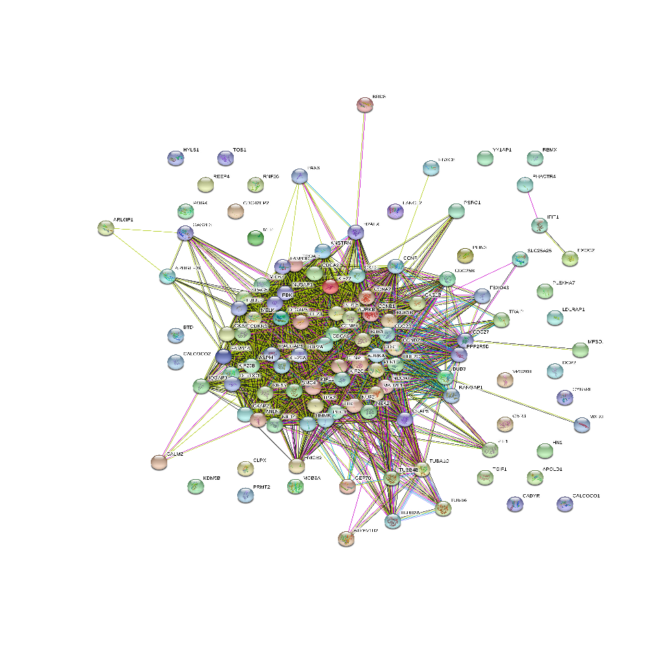


### 4.4 Gene Enrichment Analysis


```R
dbs <- listEnrichrDbs()
head(dbs)
#print(dbs)
```


<table>
<thead><tr><th scope=col>geneCoverage</th><th scope=col>genesPerTerm</th><th scope=col>libraryName</th><th scope=col>link</th><th scope=col>numTerms</th></tr></thead>
<tbody>
	<tr><td>13362                                                   </td><td> 275                                                    </td><td>Genome_Browser_PWMs                                     </td><td>http://hgdownload.cse.ucsc.edu/goldenPath/hg18/database/</td><td>615                                                     </td></tr>
	<tr><td>27884                                                   </td><td>1284                                                    </td><td>TRANSFAC_and_JASPAR_PWMs                                </td><td>http://jaspar.genereg.net/html/DOWNLOAD/                </td><td>326                                                     </td></tr>
	<tr><td> 6002                                                   </td><td>  77                                                    </td><td>Transcription_Factor_PPIs                               </td><td>                                                        </td><td>290                                                     </td></tr>
	<tr><td>47172                                                   </td><td>1370                                                    </td><td>ChEA_2013                                               </td><td>http://amp.pharm.mssm.edu/lib/cheadownload.jsp          </td><td>353                                                     </td></tr>
	<tr><td>47107                                                   </td><td> 509                                                    </td><td>Drug_Perturbations_from_GEO_2014                        </td><td>http://www.ncbi.nlm.nih.gov/geo/                        </td><td>701                                                     </td></tr>
	<tr><td>21493                                                   </td><td>3713                                                    </td><td>ENCODE_TF_ChIP-seq_2014                                 </td><td>http://genome.ucsc.edu/ENCODE/downloads.html            </td><td>498                                                     </td></tr>
</tbody>
</table>


```R
############ Selecting the DEGs' table  ##############
#DEGs=MBcdiffBinomial[[2]][2,4]     # Up-regulated genes in cluster 2 (from the Binomial analysis)
DEGs=MBcdiff[[2]][2,6]              # UP-regulated genes in cluster 2 (from SAMseq)
data<-read.csv(file=paste0(DEGs),head=TRUE,sep=",")
data<-as.character(data[,3])

dbs <- c("KEGG_2013","GO_Molecular_Function_2015", "GO_Biological_Process_2015")
enriched <- enrichr(data, dbs)
KEGG_2013<-enriched[[1]][,c(1,2,3,9)]
GO_Molecular_Function_2015<-enriched[[2]][,c(1,2,3,9)]
GO_Biological_Process_2015<-enriched[[3]][,c(1,2,3,9)]

GEA<-rbind(KEGG_2013,GO_Molecular_Function_2015,GO_Biological_Process_2015)
GEA
```

    Uploading data to Enrichr... Done.
      Querying KEGG_2013... Done.
      Querying GO_Molecular_Function_2015... Done.
      Querying GO_Biological_Process_2015... Done.
    Parsing results... Done.
    


<table>
<thead><tr><th scope=col>Term</th><th scope=col>Overlap</th><th scope=col>P.value</th><th scope=col>Genes</th></tr></thead>
<tbody>
	<tr><td>HSA04110 CELL CYCLE                                                </td><td>11/115                                                             </td><td>6.014797e-11                                                       </td><td>CDC20;CCNA2;CCNB2;CCNB1;CDC27;PLK1;BUB1B;BUB3;BUB1;CDC25B;MAD2L1   </td></tr>
	<tr><td>HSA04120 UBIQUITIN MEDIATED PROTEOLYSIS                            </td><td>3/40                                                               </td><td>1.566972e-03                                                       </td><td>CDC20;UBE2C;CDC27                                                  </td></tr>
	<tr><td>HSA05130 PATHOGENIC ESCHERICHIA COLI INFECTION EHEC                </td><td>3/53                                                               </td><td>3.519592e-03                                                       </td><td>TUBA1C;TUBB6;TUBB2A                                                </td></tr>
	<tr><td>HSA05131 PATHOGENIC ESCHERICHIA COLI INFECTION EPEC                </td><td>3/53                                                               </td><td>3.519592e-03                                                       </td><td>TUBA1C;TUBB6;TUBB2A                                                </td></tr>
	<tr><td>HSA04540 GAP JUNCTION                                              </td><td>3/98                                                               </td><td>1.897360e-02                                                       </td><td>TUBA1C;TUBB6;TUBB2A                                                </td></tr>
	<tr><td>HSA00780 BIOTIN METABOLISM                                         </td><td>1/4                                                                </td><td>2.280392e-02                                                       </td><td>BTD                                                                </td></tr>
	<tr><td>HSA04115 P53 SIGNALING PATHWAY                                     </td><td>2/68                                                               </td><td>5.841184e-02                                                       </td><td>CCNB2;CCNB1                                                        </td></tr>
	<tr><td>HSA00440 AMINOPHOSPHONATE METABOLISM                               </td><td>1/16                                                               </td><td>8.816835e-02                                                       </td><td>PRMT2                                                              </td></tr>
	<tr><td>HSA00626 NAPHTHALENE AND ANTHRACENE DEGRADATION                    </td><td>1/18                                                               </td><td>9.863286e-02                                                       </td><td>PRMT2                                                              </td></tr>
	<tr><td>HSA04950 MATURITY ONSET DIABETES OF THE YOUNG                      </td><td>1/25                                                               </td><td>1.343298e-01                                                       </td><td>PAX6                                                               </td></tr>
	<tr><td>HSA00450 SELENOAMINO ACID METABOLISM                               </td><td>1/29                                                               </td><td>1.540951e-01                                                       </td><td>PRMT2                                                              </td></tr>
	<tr><td>HSA04740 OLFACTORY TRANSDUCTION                                    </td><td>1/31                                                               </td><td>1.638093e-01                                                       </td><td>CALM2                                                              </td></tr>
	<tr><td>HSA05040 HUNTINGTONS DISEASE                                       </td><td>1/31                                                               </td><td>1.638093e-01                                                       </td><td>CALM2                                                              </td></tr>
	<tr><td>HSA00340 HISTIDINE METABOLISM                                      </td><td>1/41                                                               </td><td>2.107461e-01                                                       </td><td>PRMT2                                                              </td></tr>
	<tr><td>HSA00590 ARACHIDONIC ACID METABOLISM                               </td><td>1/54                                                               </td><td>2.678794e-01                                                       </td><td>CBR3                                                               </td></tr>
	<tr><td>HSA00150 ANDROGEN AND ESTROGEN METABOLISM                          </td><td>1/54                                                               </td><td>2.678794e-01                                                       </td><td>PRMT2                                                              </td></tr>
	<tr><td>HSA00350 TYROSINE METABOLISM                                       </td><td>1/59                                                               </td><td>2.887449e-01                                                       </td><td>PRMT2                                                              </td></tr>
	<tr><td>HSA00380 TRYPTOPHAN METABOLISM                                     </td><td>1/60                                                               </td><td>2.928467e-01                                                       </td><td>PRMT2                                                              </td></tr>
	<tr><td>HSA05214 GLIOMA                                                    </td><td>1/64                                                               </td><td>3.090208e-01                                                       </td><td>CALM2                                                              </td></tr>
	<tr><td>HSA05120 EPITHELIAL CELL SIGNALING IN HELICOBACTER PYLORI INFECTION</td><td>1/68                                                               </td><td>3.248280e-01                                                       </td><td>ATP6V1B2                                                           </td></tr>
	<tr><td>HSA04720 LONG TERM POTENTIATION                                    </td><td>1/69                                                               </td><td>3.287235e-01                                                       </td><td>CALM2                                                              </td></tr>
	<tr><td>HSA04070 PHOSPHATIDYLINOSITOL SIGNALING SYSTEM                     </td><td>1/78                                                               </td><td>3.627952e-01                                                       </td><td>CALM2                                                              </td></tr>
	<tr><td>HSA05210 COLORECTAL CANCER                                         </td><td>1/85                                                               </td><td>3.881052e-01                                                       </td><td>BIRC5                                                              </td></tr>
	<tr><td>HSA05222 SMALL CELL LUNG CANCER                                    </td><td>1/87                                                               </td><td>3.951517e-01                                                       </td><td>CKS1B                                                              </td></tr>
	<tr><td>HSA04512 ECM RECEPTOR INTERACTION                                  </td><td>1/87                                                               </td><td>3.951517e-01                                                       </td><td>HMMR                                                               </td></tr>
	<tr><td>HSA04912 GNRH SIGNALING PATHWAY                                    </td><td>1/97                                                               </td><td>4.291960e-01                                                       </td><td>CALM2                                                              </td></tr>
	<tr><td>HSA04916 MELANOGENESIS                                             </td><td>1/102                                                              </td><td>4.454987e-01                                                       </td><td>CALM2                                                              </td></tr>
	<tr><td>HSA00190 OXIDATIVE PHOSPHORYLATION                                 </td><td>1/128                                                              </td><td>5.231165e-01                                                       </td><td>ATP6V1B2                                                           </td></tr>
	<tr><td>HSA04910 INSULIN SIGNALING PATHWAY                                 </td><td>1/135                                                              </td><td>5.421053e-01                                                       </td><td>CALM2                                                              </td></tr>
	<tr><td>HSA04020 CALCIUM SIGNALING PATHWAY                                 </td><td>1/174                                                              </td><td>6.349653e-01                                                       </td><td>CALM2                                                              </td></tr>
	<tr><td>...</td><td>...</td><td>...</td><td>...</td></tr>
	<tr><td>defense response to other organism (GO:0098542)                                       </td><td>1/328                                                                                 </td><td>0.8514916                                                                             </td><td>IFIT1                                                                                 </td></tr>
	<tr><td>regulation of cell adhesion (GO:0030155)                                              </td><td>1/336                                                                                 </td><td>0.8582975                                                                             </td><td>KIF14                                                                                 </td></tr>
	<tr><td>regulation of sequence-specific DNA binding transcription factor activity (GO:0051090)</td><td>1/338                                                                                 </td><td>0.8599501                                                                             </td><td>PRMT2                                                                                 </td></tr>
	<tr><td>alcohol metabolic process (GO:0006066)                                                </td><td>1/340                                                                                 </td><td>0.8615836                                                                             </td><td>LDLRAP1                                                                               </td></tr>
	<tr><td>cytokine-mediated signaling pathway (GO:0019221)                                      </td><td>1/342                                                                                 </td><td>0.8631982                                                                             </td><td>IFIT1                                                                                 </td></tr>
	<tr><td>Fc receptor signaling pathway (GO:0038093)                                            </td><td>1/352                                                                                 </td><td>0.8709954                                                                             </td><td>CDK1                                                                                  </td></tr>
	<tr><td>regulation of endopeptidase activity (GO:0052548)                                     </td><td>1/354                                                                                 </td><td>0.8725011                                                                             </td><td>BIRC5                                                                                 </td></tr>
	<tr><td>tissue morphogenesis (GO:0048729)                                                     </td><td>1/358                                                                                 </td><td>0.8754605                                                                             </td><td>PHACTR4                                                                               </td></tr>
	<tr><td>cellular metal ion homeostasis (GO:0006875)                                           </td><td>1/361                                                                                 </td><td>0.8776353                                                                             </td><td>ATP6V1B2                                                                              </td></tr>
	<tr><td>negative regulation of transport (GO:0051051)                                         </td><td>1/361                                                                                 </td><td>0.8776353                                                                             </td><td>RANGAP1                                                                               </td></tr>
	<tr><td>protein oligomerization (GO:0051259)                                                  </td><td>1/366                                                                                 </td><td>0.8811765                                                                             </td><td>RBMX                                                                                  </td></tr>
	<tr><td>monovalent inorganic cation transport (GO:0015672)                                    </td><td>1/384                                                                                 </td><td>0.8931041                                                                             </td><td>ATP6V1B2                                                                              </td></tr>
	<tr><td>cellular cation homeostasis (GO:0030003)                                              </td><td>1/389                                                                                 </td><td>0.8962012                                                                             </td><td>ATP6V1B2                                                                              </td></tr>
	<tr><td>mRNA processing (GO:0006397)                                                          </td><td>1/397                                                                                 </td><td>0.9009727                                                                             </td><td>RBMX                                                                                  </td></tr>
	<tr><td>cellular ion homeostasis (GO:0006873)                                                 </td><td>1/402                                                                                 </td><td>0.9038437                                                                             </td><td>ATP6V1B2                                                                              </td></tr>
	<tr><td>embryonic morphogenesis (GO:0048598)                                                  </td><td>1/403                                                                                 </td><td>0.9044079                                                                             </td><td>PAX6                                                                                  </td></tr>
	<tr><td>regulation of cellular response to stress (GO:0080135)                                </td><td>1/404                                                                                 </td><td>0.9049689                                                                             </td><td>H2AFX                                                                                 </td></tr>
	<tr><td>organ morphogenesis (GO:0009887)                                                      </td><td>1/405                                                                                 </td><td>0.9055266                                                                             </td><td>PAX6                                                                                  </td></tr>
	<tr><td>regulation of cell morphogenesis (GO:0022604)                                         </td><td>1/408                                                                                 </td><td>0.9071802                                                                             </td><td>CDC42EP2                                                                              </td></tr>
	<tr><td>secretion by cell (GO:0032940)                                                        </td><td>1/415                                                                                 </td><td>0.9109280                                                                             </td><td>EXOC2                                                                                 </td></tr>
	<tr><td>metal ion homeostasis (GO:0055065)                                                    </td><td>1/422                                                                                 </td><td>0.9145257                                                                             </td><td>ATP6V1B2                                                                              </td></tr>
	<tr><td>cellular component morphogenesis (GO:0032989)                                         </td><td>1/437                                                                                 </td><td>0.9217572                                                                             </td><td>KIF14                                                                                 </td></tr>
	<tr><td>anion transport (GO:0006820)                                                          </td><td>1/443                                                                                 </td><td>0.9244769                                                                             </td><td>RACGAP1                                                                               </td></tr>
	<tr><td>immune response-regulating cell surface receptor signaling pathway (GO:0002768)       </td><td>1/444                                                                                 </td><td>0.9249210                                                                             </td><td>CDK1                                                                                  </td></tr>
	<tr><td>cellular chemical homeostasis (GO:0055082)                                            </td><td>1/452                                                                                 </td><td>0.9283817                                                                             </td><td>ATP6V1B2                                                                              </td></tr>
	<tr><td>sensory perception (GO:0007600)                                                       </td><td>1/457                                                                                 </td><td>0.9304638                                                                             </td><td>PAX6                                                                                  </td></tr>
	<tr><td>response to other organism (GO:0051707)                                               </td><td>1/462                                                                                 </td><td>0.9324860                                                                             </td><td>IFIT1                                                                                 </td></tr>
	<tr><td>nitrogen compound transport (GO:0071705)                                              </td><td>1/464                                                                                 </td><td>0.9332784                                                                             </td><td>CKAP5                                                                                 </td></tr>
	<tr><td>cation homeostasis (GO:0055080)                                                       </td><td>1/465                                                                                 </td><td>0.9336711                                                                             </td><td>ATP6V1B2                                                                              </td></tr>
	<tr><td>organic hydroxy compound metabolic process (GO:1901615)                               </td><td>1/476                                                                                 </td><td>0.9378430                                                                             </td><td>LDLRAP1                                                                               </td></tr>
</tbody>
</table>


