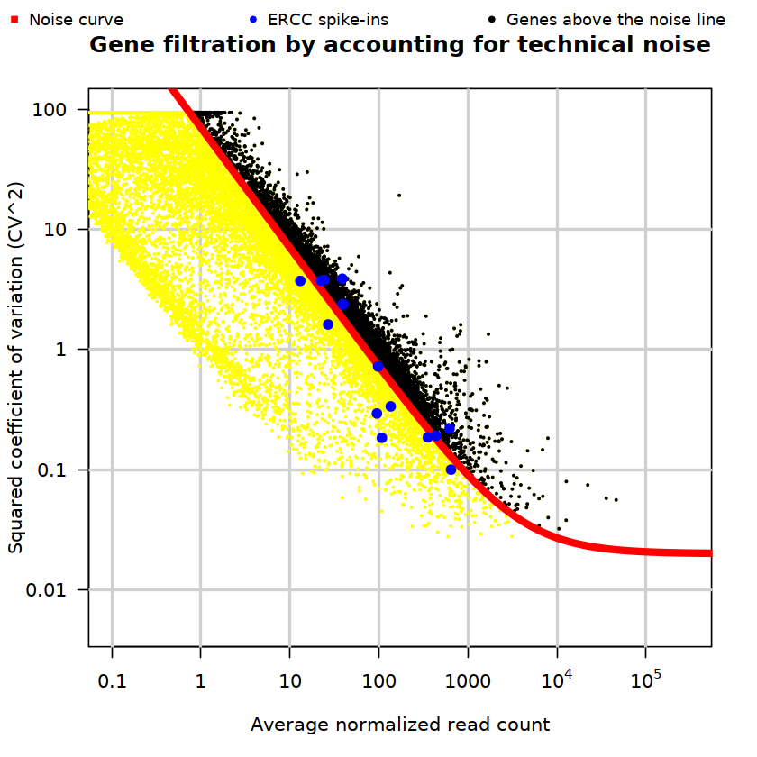
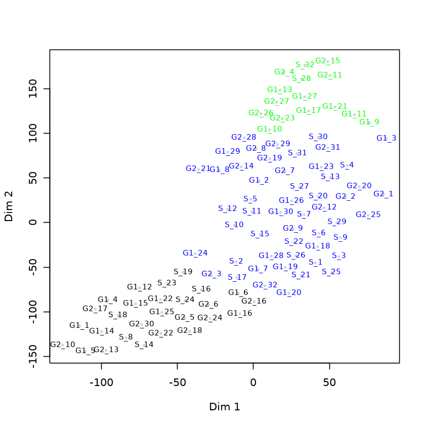
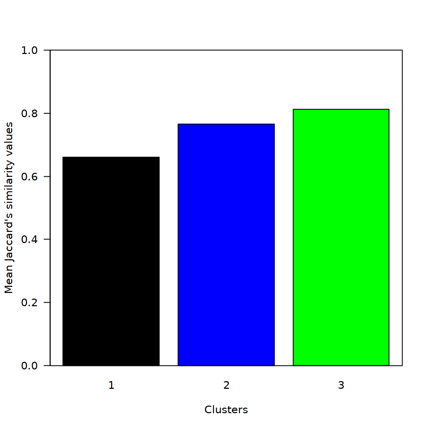
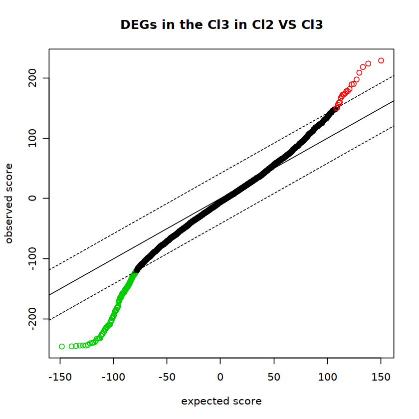
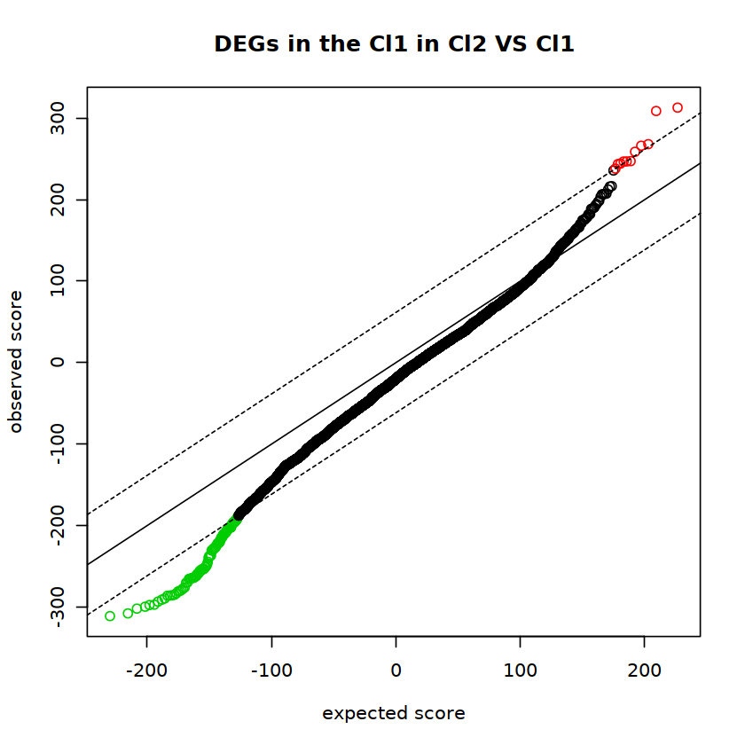

# ** DIscBIO: a user-friendly and reproducible pipeline for the discovery of scRNA-seq biomarkers**

The pipeline consists of four successive steps: data pre-processing, cellular clustering and pseudo-temporal ordering, determining differential expressed genes and identifying biomarkers.


## Required Packages


```R
require(tsne)
require(pheatmap)
require(MASS)
require(cluster)
require(mclust)
require(flexmix)
require(lattice)
require(fpc)
require(amap)
require(RColorBrewer)
require(locfit)
require(TSCAN)
require(genefilter)
require(statmod)
require(ggplot2)
require(gplots)
require(DESeq2)
require(matrixStats)
require(robustbase)
require(philentropy)
require(igraph)
require(boot)
require(biomaRt)
require(tidyr)
require(calibrate)
require(partykit)
require(RWeka)
require(rpart)
require(rpart.plot)
require(imager)
require(png)
require(NetIndices) 
require(httr)
require(jsonlite)
require(tidyverse)
require(samr)

source("RaceID_class.R")
source("DiscBIO_class.R")

```

    Loading required package: tsne
    Loading required package: pheatmap
    Loading required package: MASS
    Loading required package: cluster
    Loading required package: mclust
    Package 'mclust' version 5.4.3
    Type 'citation("mclust")' for citing this R package in publications.
    Loading required package: flexmix
    Loading required package: lattice
    Loading required package: fpc
    Loading required package: amap
    Loading required package: RColorBrewer
    Loading required package: locfit
    locfit 1.5-9.1 	 2013-03-22
    Loading required package: TSCAN
    Loading required package: genefilter
    
    Attaching package: ‘genefilter’
    
    The following object is masked from ‘package:MASS’:
    
        area
    
    Loading required package: statmod
    Loading required package: ggplot2
    Loading required package: gplots
    
    Attaching package: ‘gplots’
    
    The following object is masked from ‘package:stats’:
    
        lowess
    
    Loading required package: DESeq2
    Loading required package: S4Vectors
    Loading required package: stats4
    Loading required package: BiocGenerics
    Loading required package: parallel
    
    Attaching package: ‘BiocGenerics’
    
    The following objects are masked from ‘package:parallel’:
    
        clusterApply, clusterApplyLB, clusterCall, clusterEvalQ,
        clusterExport, clusterMap, parApply, parCapply, parLapply,
        parLapplyLB, parRapply, parSapply, parSapplyLB
    
    The following object is masked from ‘package:flexmix’:
    
        unique
    
    The following objects are masked from ‘package:stats’:
    
        IQR, mad, sd, var, xtabs
    
    The following objects are masked from ‘package:base’:
    
        anyDuplicated, append, as.data.frame, basename, cbind, colMeans,
        colnames, colSums, dirname, do.call, duplicated, eval, evalq,
        Filter, Find, get, grep, grepl, intersect, is.unsorted, lapply,
        lengths, Map, mapply, match, mget, order, paste, pmax, pmax.int,
        pmin, pmin.int, Position, rank, rbind, Reduce, rowMeans, rownames,
        rowSums, sapply, setdiff, sort, table, tapply, union, unique,
        unsplit, which, which.max, which.min
    
    
    Attaching package: ‘S4Vectors’
    
    The following object is masked from ‘package:gplots’:
    
        space
    
    The following object is masked from ‘package:base’:
    
        expand.grid
    
    Loading required package: IRanges
    Loading required package: GenomicRanges
    Loading required package: GenomeInfoDb
    Loading required package: SummarizedExperiment
    Loading required package: Biobase
    Welcome to Bioconductor
    
        Vignettes contain introductory material; view with
        'browseVignettes()'. To cite Bioconductor, see
        'citation("Biobase")', and for packages 'citation("pkgname")'.
    
    Loading required package: DelayedArray
    Loading required package: matrixStats
    
    Attaching package: ‘matrixStats’
    
    The following objects are masked from ‘package:Biobase’:
    
        anyMissing, rowMedians
    
    The following objects are masked from ‘package:genefilter’:
    
        rowSds, rowVars
    
    Loading required package: BiocParallel
    
    Attaching package: ‘DelayedArray’
    
    The following objects are masked from ‘package:matrixStats’:
    
        colMaxs, colMins, colRanges, rowMaxs, rowMins, rowRanges
    
    The following objects are masked from ‘package:base’:
    
        aperm, apply
    
    Loading required package: robustbase
    
    Attaching package: ‘robustbase’
    
    The following objects are masked from ‘package:matrixStats’:
    
        colMedians, rowMedians
    
    The following object is masked from ‘package:Biobase’:
    
        rowMedians
    
    Loading required package: philentropy
    
    Attaching package: ‘philentropy’
    
    The following object is masked from ‘package:SummarizedExperiment’:
    
        distance
    
    The following object is masked from ‘package:GenomicRanges’:
    
        distance
    
    The following object is masked from ‘package:IRanges’:
    
        distance
    
    Loading required package: igraph
    
    Attaching package: ‘igraph’
    
    The following objects are masked from ‘package:DelayedArray’:
    
        path, simplify
    
    The following object is masked from ‘package:GenomicRanges’:
    
        union
    
    The following object is masked from ‘package:IRanges’:
    
        union
    
    The following object is masked from ‘package:S4Vectors’:
    
        union
    
    The following objects are masked from ‘package:BiocGenerics’:
    
        normalize, path, union
    
    The following object is masked from ‘package:flexmix’:
    
        clusters
    
    The following objects are masked from ‘package:stats’:
    
        decompose, spectrum
    
    The following object is masked from ‘package:base’:
    
        union
    
    Loading required package: boot
    
    Attaching package: ‘boot’
    
    The following object is masked from ‘package:robustbase’:
    
        salinity
    
    The following object is masked from ‘package:flexmix’:
    
        boot
    
    The following object is masked from ‘package:lattice’:
    
        melanoma
    
    Loading required package: biomaRt
    Loading required package: tidyr
    
    Attaching package: ‘tidyr’
    
    The following object is masked from ‘package:igraph’:
    
        crossing
    
    The following object is masked from ‘package:S4Vectors’:
    
        expand
    
    Loading required package: calibrate
    Loading required package: partykit
    Loading required package: grid
    Loading required package: libcoin
    Loading required package: mvtnorm
    
    Attaching package: ‘partykit’
    
    The following object is masked from ‘package:SummarizedExperiment’:
    
        width
    
    The following object is masked from ‘package:DelayedArray’:
    
        width
    
    The following object is masked from ‘package:GenomicRanges’:
    
        width
    
    The following object is masked from ‘package:IRanges’:
    
        width
    
    The following object is masked from ‘package:S4Vectors’:
    
        width
    
    The following object is masked from ‘package:BiocGenerics’:
    
        width
    
    Loading required package: RWeka
    Loading required package: rpart
    Loading required package: rpart.plot
    Loading required package: imager
    Warning message in library(package, lib.loc = lib.loc, character.only = TRUE, logical.return = TRUE, :
    “there is no package called ‘imager’”Loading required package: png
    Loading required package: NetIndices
    Loading required package: httr
    
    Attaching package: ‘httr’
    
    The following object is masked from ‘package:Biobase’:
    
        content
    
    Loading required package: jsonlite
    Loading required package: tidyverse
    ── Attaching packages ─────────────────────────────────────── tidyverse 1.2.1 ──
    ✔ tibble  2.1.1       ✔ dplyr   0.8.0.1
    ✔ readr   1.3.1       ✔ stringr 1.4.0  
    ✔ purrr   0.3.2       ✔ forcats 0.4.0  
    ── Conflicts ────────────────────────────────────────── tidyverse_conflicts() ──
    ✖ dplyr::as_data_frame()   masks tibble::as_data_frame(), igraph::as_data_frame()
    ✖ dplyr::collapse()        masks IRanges::collapse()
    ✖ dplyr::combine()         masks Biobase::combine(), BiocGenerics::combine()
    ✖ purrr::compose()         masks igraph::compose()
    ✖ httr::content()          masks Biobase::content()
    ✖ dplyr::count()           masks matrixStats::count()
    ✖ tidyr::crossing()        masks igraph::crossing()
    ✖ dplyr::desc()            masks IRanges::desc()
    ✖ tidyr::expand()          masks S4Vectors::expand()
    ✖ dplyr::filter()          masks stats::filter()
    ✖ dplyr::first()           masks S4Vectors::first()
    ✖ purrr::flatten()         masks jsonlite::flatten()
    ✖ dplyr::groups()          masks igraph::groups()
    ✖ dplyr::lag()             masks stats::lag()
    ✖ purrr::map()             masks mclust::map()
    ✖ BiocGenerics::Position() masks ggplot2::Position(), base::Position()
    ✖ purrr::reduce()          masks GenomicRanges::reduce(), IRanges::reduce()
    ✖ dplyr::rename()          masks S4Vectors::rename()
    ✖ dplyr::select()          masks biomaRt::select(), MASS::select()
    ✖ purrr::simplify()        masks igraph::simplify(), DelayedArray::simplify()
    ✖ dplyr::slice()           masks IRanges::slice()
    ✖ readr::spec()            masks genefilter::spec()
    Loading required package: samr


## Loading datasets

The dataset should be formatted in a data frame where columns refer to samples and rows refer to genes. Usually, the last rows refer to external RNA controls consortium (ERCC) spike-ins but this pipeline can also be run without them.  


```R
load("valuesG1ms.Rdata")            # Loading the full raw dataset
cat("The valuesG1ms dataset contains:","\n","Genes: ",length(valuesG1ms[,1]),"\n","cells: ",length(valuesG1ms[1,]),"\n")

load("MLSrawWithoutERCC.Rdata")    # Loading the raw dataset that does not have ERCC spike/ins
cat("The MLSrawWithoutERCC dataset contains:","\n","Genes: ",length(MLSrawWithoutERCC[,1]),"\n","cells: ",length(MLSrawWithoutERCC[1,]))
```

    The valuesG1ms dataset contains: 
     Genes:  59838 
     cells:  94 
    The MLSrawWithoutERCC dataset contains: 
     Genes:  59746 
     cells:  94

## 1. Data Pre-processing

Prior to applying data analysis methods, it is standard to pre-process the raw read counts resulted from the sequencing. The preprocessing approach depends on the existence or absence of ERCC spike-ins. In both cases, it includes normalization of read counts and gene filtering. 

#### Normalization of read counts
To account for RNA composition and sequencing depth among samples (single-cells), the normalization method “median of ratios” is used. This method takes the ratio of the gene instantaneous median to the total counts for all genes in that cell (column median). The gene instantaneous median is the product of multiplying the median of the total counts across all cells (row median) with the read of the target gene in each cell. This normalization method makes it possible to compare the normalized counts for each gene equally between samples.

#### Gene filtering
The key idea in filtering genes is to appoint the genes that manifest abundant variation across samples. Filtering genes is a critical step due to its dramatic impact on the downstream analysis. In case the raw data includes ERCC spike-ins, genes will be filtered based on variability in comparison to a noise level estimated from the ERCC spike-ins according to an algorithm developed by Brennecke et al (Brennecke et al., 2013). This algorithm utilizes the dependence of technical noise on the average read count and fits a model to the ERCC spike-ins. In case the raw data does not include ERCC spike-ins, genes will be filtered based on minimum expression in certain number of cells.


### 1.1. Filtering and normalizing the raw data that includes ERCCs

Filtering the raw data that includes ERCCs can be done by applying the “NoiseFiltering” function, which includes 7 parameters: 
Object: the full raw dataset
percentile and CV: to determine the valid ERCC spike-ins gene_names2: gene list excluding the names of the ERCC spike-ins geneCol, FgeneCol and erccCol: color-code of the genes and ERCC spike-ins 
Val=T: to plot just the valid ERCC spike-ins 
Val=F: to plot all the ERCC spike-ins 

After generating a list of filtered genes, the function "PSCANseq" sould be implemented to create 17 slots to store the results and the parameters. The normalization method “median of ratios” can be applied by running the "Normalizedata" function. This function will discard cells with less than mintotal transcripts.


### 1.2. Filtering and normalizing the raw data that does not include ERCCs

The function "PSCANseq" sould be implimented to creat 17 slots to store the results and the parameters. The normalization method “median of ratios” can be applied over the raw dataset that does not include ERCCs by running the "Normalizedata" function. This function will discard cells with less than mintotal transcripts. Genes that are not expressed at minexpr transcripts in at least minnumber cells are discarded. 


```R
# Selecting the filtering method
NoisFiltering=TRUE           # 1.1. Filtering and normalizing the raw data that includes ERCCs
#NoisFiltering=FALSE         # 1.2. Filtering and normalizing the raw data that does not include ERCCs

if (NoisFiltering==TRUE){
    percentile=0.8
    CV = 0.3 
    
    Object= valuesG1ms
    gene_names<-read.table("GeneNames.txt",header=F)
    gene_names <- as.list(sub("*\\..*", "", unlist(gene_names)))       # Remove .x from gene ID's, since they can't be handled later on
    gene_names2 <- head(gene_names,-92)

    geneCol<-"yellow"
    FgeneCol<-"black"
    erccCol<-"blue"
    noiseF<-NoiseFiltering(Object,percentile,CV,gene_names2,geneCol,FgeneCol,erccCol,Val=T)       # Val=F  will plot all the ERCC spike-ins

    sc<- PSCANseq(MLSrawWithoutERCC)
    sc<- Normalizedata(sc,mintotal=1000)
    gene_list<-noiseF
    gene_names<-rownames(sc@ndata)
    idx_genes <- is.element(gene_names, gene_list)
    gene_names2 <- gene_names[idx_genes]
    filteredDataset<- sc@ndata[gene_names2,]
    cat("The gene filtering method= Noise filtering","\n","\n") 
    cat("The Filtered Normalized dataset is called: filteredDataset","\n","\n") 
    cat("The filtered Normalized dataset contains:","\n","Genes:",length(filteredDataset[,1]),"\n","cells:",length(filteredDataset[1,]),"\n","\n")
    save(filteredDataset,file="filteredDataset.Rdata")
    sc@fdata<-filteredDataset

    ############# Generating a filtered dataset with raw data for DEG analysis
    gene_list<-noiseF
    gene_names<-rownames(MLSrawWithoutERCC)
    idx_genes <- is.element(gene_names, gene_list)
    gene_names2 <- gene_names[idx_genes]
    LipoNoisFilteredRawDataset<- MLSrawWithoutERCC[gene_names2,]
    cat("The Nois Filtered Raw dataset contains:","\n","Genes:",length(LipoNoisFilteredRawDataset[,1]),"\n","cells:",length(LipoNoisFilteredRawDataset[1,]))
    save(LipoNoisFilteredRawDataset,file="LipoNoisFilteredRawDataset.Rdata")
}else{
    sc<- PSCANseq(MLSrawWithoutERCC)
    
    MIínExp<- mean(rowMeans(MLSrawWithoutERCC,na.rm=TRUE))
    MinNumber<- round(length(MLSrawWithoutERCC[1,])/3)    # To be expressed in at least one third of the cells.
    
    sc<- Normalizedata(sc, mintotal=1000, minexpr=MIínExp, minnumber=MinNumber, maxexpr=Inf, downsample=FALSE, dsn=1, rseed=17000)
    cat("Number of genes that passt the filtering: ",dim(sc@fdata)[1],"\n","\n")
    filteredGenes<-rownames(sc@fdata)
    write.csv(filteredGenes, file = "Expression_filtering_genes.csv")
    gene_list<-filteredGenes
    gene_names<-rownames(MLSrawWithoutERCC)
    idx_genes <- is.element(gene_names, gene_list)
    gene_names2 <- gene_names[idx_genes]
    LipoExpFilteredrawdata<- MLSrawWithoutERCC[gene_names2,]
    save(LipoExpFilteredrawdata,file="LipoExpFilteredrawdata.Rdata")
    cat("The gene filtering method: Expression Level","\n","\n") 
    cat("The Filtered Raw dataset is called: LipoExpFilteredrawdata","\n","\n") 

    cat("The Filtered Raw dataset contains:","\n","Genes:",length(LipoExpFilteredrawdata[,1]),"\n","cells:",length(LipoExpFilteredrawdata[1,])) 
}
```

    Cut-off value for the ERCCs=  12.5 
     
    Coefficients of the fit: 
            a0    a1tilde 
     0.0200366 70.4893629 
    Explained variances of log CV^2 values=  0.84 
     
    Number of genes that passt the filtering=  5684 
     
    The filtered gene list was saved as: Noise_filtering_genes_test 
    The gene filtering method= Noise filtering 
     
    The Filtered Normalized dataset is called: filteredDataset 
     
    The filtered Normalized dataset contains: 
     Genes: 5684 
     cells: 94 
     
    The Nois Filtered Raw dataset contains: 
     Genes: 5684 
     cells: 94





## 2. Cellular Clustering and Pseudo Time ordering

Cellular clustering is performed according to the gene expression profiles to detect cellular sub-population with unique properties. After clustering, pseudo-temporal ordering is generated to indicate the cellular differentiation degree. 


### 2.1. K-means Clustering

Rare cell type Identification algorithm (RaceID) was used to cluster the pre-processed data using k-means on a similarity distance matrix, which was based on Pearson correlation and the similarity matrix was computed as “1 – Pearson correlation”. The approach of the proposed clustering, i.e., applying k-means on a similarity distance matrix using the Euclidean metric, improves cluster separation. RaceID estimates the number of clusters by finding the minimal clusters' number at the saturation level of gap statistics, which standardizes the within-cluster dispersion. 


```R
K=3  # Number of Clusters
sc<- Clustexp(sc, clustnr=20,bootnr=50,metric="pearson",do.gap=T,SE.method="Tibs2001SEmax",SE.factor=.25,B.gap=50,cln=K,rseed=17000)
plotGap(sc)
```

    boot 1 
    boot 2 
    boot 3 
    boot 4 
    boot 5 
    boot 6 
    boot 7 
    boot 8 
    boot 9 
    boot 10 
    boot 11 
    boot 12 
    boot 13 
    boot 14 
    boot 15 
    boot 16 
    boot 17 
    boot 18 
    boot 19 
    boot 20 
    boot 21 
    boot 22 
    boot 23 
    boot 24 
    boot 25 
    boot 26 
    boot 27 
    boot 28 
    boot 29 
    boot 30 
    boot 31 
    boot 32 
    boot 33 
    boot 34 
    boot 35 
    boot 36 
    boot 37 
    boot 38 
    boot 39 
    boot 40 
    boot 41 
    boot 42 
    boot 43 
    boot 44 
    boot 45 
    boot 46 
    boot 47 
    boot 48 
    boot 49 
    boot 50 


#### 2.1.1. Defining the Cells in the clusters generated by k-means clustering


```R
sc<- comptSNE(sc,rseed=15555)
Clusters<-sc@kmeans$kpart
KmeansClusters<-Clusters   # To be used for defining DEGs
save(KmeansClusters,file="KmeansClusters.Rdata")
AllClusters<-sc@cpart   
sc@cpart <- Clusters    
cat("\t","     Cell-ID"," Cluster Number","\n")
Clusters
```

    sigma summary: Min. : 0.140828484033208 |1st Qu. : 0.174199368111191 |Median : 0.191732234667552 |Mean : 0.199444692434548 |3rd Qu. : 0.215217261451393 |Max. : 0.347831223915885 |
    Epoch: Iteration #100 error is: 11.7659608519942
    Epoch: Iteration #200 error is: 0.916835138158965
    Epoch: Iteration #300 error is: 0.609613929870353
    Epoch: Iteration #400 error is: 0.325391625428338
    Epoch: Iteration #500 error is: 0.260314392077331
    Epoch: Iteration #600 error is: 0.256195222042328
    Epoch: Iteration #700 error is: 0.255168691520433
    Epoch: Iteration #800 error is: 0.253988583960379
    Epoch: Iteration #900 error is: 0.253152604179865
    Epoch: Iteration #1000 error is: 0.2529161401464


    	      Cell-ID  Cluster Number 


<dl class=dl-horizontal>
	<dt>G1_1</dt>
		<dd>1</dd>
	<dt>G1_2</dt>
		<dd>2</dd>
	<dt>G1_3</dt>
		<dd>2</dd>
	<dt>G1_4</dt>
		<dd>1</dd>
	<dt>G1_5</dt>
		<dd>1</dd>
	<dt>G1_6</dt>
		<dd>1</dd>
	<dt>G1_7</dt>
		<dd>2</dd>
	<dt>G1_8</dt>
		<dd>2</dd>
	<dt>G1_9</dt>
		<dd>3</dd>
	<dt>G1_10</dt>
		<dd>3</dd>
	<dt>G1_11</dt>
		<dd>3</dd>
	<dt>G1_12</dt>
		<dd>1</dd>
	<dt>G1_13</dt>
		<dd>3</dd>
	<dt>G1_14</dt>
		<dd>1</dd>
	<dt>G1_15</dt>
		<dd>1</dd>
	<dt>G1_16</dt>
		<dd>1</dd>
	<dt>G1_17</dt>
		<dd>3</dd>
	<dt>G1_18</dt>
		<dd>2</dd>
	<dt>G1_19</dt>
		<dd>2</dd>
	<dt>G1_20</dt>
		<dd>2</dd>
	<dt>G1_21</dt>
		<dd>3</dd>
	<dt>G1_22</dt>
		<dd>1</dd>
	<dt>G1_23</dt>
		<dd>2</dd>
	<dt>G1_24</dt>
		<dd>2</dd>
	<dt>G1_25</dt>
		<dd>1</dd>
	<dt>G1_26</dt>
		<dd>2</dd>
	<dt>G1_27</dt>
		<dd>3</dd>
	<dt>G1_28</dt>
		<dd>2</dd>
	<dt>G1_29</dt>
		<dd>2</dd>
	<dt>G1_30</dt>
		<dd>2</dd>
	<dt>S_1</dt>
		<dd>2</dd>
	<dt>S_2</dt>
		<dd>2</dd>
	<dt>S_3</dt>
		<dd>2</dd>
	<dt>S_4</dt>
		<dd>2</dd>
	<dt>S_5</dt>
		<dd>2</dd>
	<dt>S_6</dt>
		<dd>2</dd>
	<dt>S_7</dt>
		<dd>2</dd>
	<dt>S_8</dt>
		<dd>1</dd>
	<dt>S_9</dt>
		<dd>2</dd>
	<dt>S_10</dt>
		<dd>2</dd>
	<dt>S_11</dt>
		<dd>2</dd>
	<dt>S_12</dt>
		<dd>2</dd>
	<dt>S_13</dt>
		<dd>2</dd>
	<dt>S_14</dt>
		<dd>1</dd>
	<dt>S_15</dt>
		<dd>2</dd>
	<dt>S_16</dt>
		<dd>1</dd>
	<dt>S_17</dt>
		<dd>2</dd>
	<dt>S_18</dt>
		<dd>1</dd>
	<dt>S_19</dt>
		<dd>1</dd>
	<dt>S_20</dt>
		<dd>2</dd>
	<dt>S_21</dt>
		<dd>2</dd>
	<dt>S_22</dt>
		<dd>2</dd>
	<dt>S_23</dt>
		<dd>1</dd>
	<dt>S_24</dt>
		<dd>1</dd>
	<dt>S_25</dt>
		<dd>2</dd>
	<dt>S_26</dt>
		<dd>2</dd>
	<dt>S_27</dt>
		<dd>2</dd>
	<dt>S_28</dt>
		<dd>3</dd>
	<dt>S_29</dt>
		<dd>2</dd>
	<dt>S_30</dt>
		<dd>2</dd>
	<dt>S_31</dt>
		<dd>2</dd>
	<dt>S_32</dt>
		<dd>3</dd>
	<dt>G2_1</dt>
		<dd>2</dd>
	<dt>G2_2</dt>
		<dd>2</dd>
	<dt>G2_3</dt>
		<dd>2</dd>
	<dt>G2_4</dt>
		<dd>3</dd>
	<dt>G2_5</dt>
		<dd>1</dd>
	<dt>G2_6</dt>
		<dd>1</dd>
	<dt>G2_7</dt>
		<dd>2</dd>
	<dt>G2_8</dt>
		<dd>2</dd>
	<dt>G2_9</dt>
		<dd>2</dd>
	<dt>G2_10</dt>
		<dd>1</dd>
	<dt>G2_11</dt>
		<dd>3</dd>
	<dt>G2_12</dt>
		<dd>2</dd>
	<dt>G2_13</dt>
		<dd>1</dd>
	<dt>G2_14</dt>
		<dd>2</dd>
	<dt>G2_15</dt>
		<dd>3</dd>
	<dt>G2_16</dt>
		<dd>1</dd>
	<dt>G2_17</dt>
		<dd>1</dd>
	<dt>G2_18</dt>
		<dd>1</dd>
	<dt>G2_19</dt>
		<dd>2</dd>
	<dt>G2_20</dt>
		<dd>2</dd>
	<dt>G2_21</dt>
		<dd>2</dd>
	<dt>G2_22</dt>
		<dd>1</dd>
	<dt>G2_23</dt>
		<dd>3</dd>
	<dt>G2_24</dt>
		<dd>1</dd>
	<dt>G2_25</dt>
		<dd>2</dd>
	<dt>G2_26</dt>
		<dd>3</dd>
	<dt>G2_27</dt>
		<dd>3</dd>
	<dt>G2_28</dt>
		<dd>2</dd>
	<dt>G2_29</dt>
		<dd>2</dd>
	<dt>G2_30</dt>
		<dd>1</dd>
	<dt>G2_31</dt>
		<dd>2</dd>
	<dt>G2_32</dt>
		<dd>2</dd>
</dl>


#### 2.1.2- Evaluating the stability and consistancy of the clusters

PSCAN enables the robustness assessment of the detected clusters in terms of stability and consistency using Jaccard’s similarity statistics and silhouette coefficients. Jaccard’s similarity index provides a comparison of members among clusters to evaluate the stability of the clusters with a range from 0% to 100%. The higher the percentage, the more stable the cluster is. Silhouette coefficients estimate how close each sample in one cluster is to samples in the neighboring clusters, reflecting the consistency of each cluster with a range of [-1, 1]. The higher the cluster mean coefficient, the more consistent the cluster is.


```R
# Silhouette of k-means clusters
par(mar=c(6,2,4,2))
plotSilhouette(sc)   
```


```R
Clustering="K-means" # Jaccard of k-means clusters
#Clustering="MB"       # Jaccard of Model based clusters
Jaccard(sc,Clustering)
```


<ol class=list-inline>
	<li>0.671</li>
	<li>0.768</li>
	<li>0.681</li>
</ol>


#### 2.1.3. Cluster plotting using tSNE maps

Here you visualize the K-means clusters using t-distributed stochastic neighbor embedding (tSNE), which is a non-linear dimensionality reduction method that places neighbor cells close to each other. 


```R
plottSNE(sc)
```


```R
plotKmeansLabelstSNE(sc) # To plot the the ID of the cells in eacj cluster
```





```R
plotSymbolstSNE(sc,types=sub("(\\_\\d+)$","", names(sc@ndata)))    
# To plot the cells colored according to their group based on cell-cycle phases.
```


### Defining outlier cells based on K-means Clustering

In case the user decided to remove outlier cells, the user should set RemovingOutliers to TRUE and then start from the beginning (Data Pre-processing). 


```R
outlg<-round(length(sc@fdata[,1])/200)     # The cell will be considered as an outlier if it has a minimum of 0.5% of the number of filtered genes as outlier genes. 
Outliers<- FindOutliersKM(sc, outminc=5,outlg=outlg,probthr=.5*1e-3,thr=2**-(1:40),outdistquant=1)

RemovingOutliers=FALSE     
# RemovingOutliers=TRUE                    # Removing the defined outlier cells based on K-means Clustering

if(RemovingOutliers==TRUE){
    names(Outliers)=NULL
    Outliers
    valuesG1ms=valuesG1ms[-Outliers]
    MLSrawWithoutERCC=MLSrawWithoutERCC[-Outliers]

    dim(valuesG1ms)
    dim(MLSrawWithoutERCC)

    colnames(valuesG1ms)
    colnames(MLSrawWithoutERCC)
    cat("Outlier cells were removed, now you need to start from the beginning")
}

```

    The following cells are considered as outlier cells: 1 13 22 
     G1_1 G1_13 G1_22 
        1    13    22 


#### 2.1.4. Cellular pseudo-time ordering based on k-means clusters 


```R
sampleNames<-colnames(sc@fdata)
Order<-KmeanOrder(sc@fdata,Clusters,sampleNames)
sc@kordering<-Order
sc@ndata<-rbind(sc@ndata,sc@kordering)
rownames(sc@ndata)[nrow(sc@ndata)]<-"Pseudo-time ordering of Kmeans clustering"  # in case the user wanted to repeat this step the name: "Pseudo-time ordering of Kmeans clustering" should be change each time.
g<-rownames(sc@ndata)[nrow(sc@ndata)]
plotExptSNE(sc,g)
```

       order orderID
    1      1    S_14
    2      2     S_8
    3      3   G2_30
    4      4   G2_22
    5      5   G1_14
    6      6   G2_18
    7      7   G2_24
    8      8    S_16
    9      9    G2_5
    10    10   G1_25
    11    11    S_18
    12    12   G1_15
    13    13    G1_4
    14    14    G2_6
    15    15    G1_5
    16    16   G1_22
    17    17    S_24
    18    18   G1_12
    19    19   G2_13
    20    20   G2_17
    21    21    S_19
    22    22    S_23
    23    23   G1_16
    24    24    G1_1
    25    25   G2_16
    26    26    G1_6
    27    27   G2_10
    28    28    G2_3
    29    29    S_17
    30    30    S_25
    31    31     S_1
    32    32   G1_19
    33    33   G2_32
    34    34   G1_28
    35    35    S_26
    36    36    G2_1
    37    37   G2_25
    38    38    S_22
    39    39     S_3
    40    40   G1_24
    41    41    S_15
    42    42     S_2
    43    43   G1_18
    44    44    S_21
    45    45   G1_20
    46    46    G2_9
    47    47    G1_7
    48    48     S_9
    49    49    G1_3
    50    50    G2_2
    51    51     S_6
    52    52    S_29
    53    53     S_4
    54    54     S_5
    55    55    S_11
    56    56   G2_20
    57    57    S_10
    58    58   G1_26
    59    59     S_7
    60    60    S_13
    61    61    S_12
    62    62   G1_30
    63    63    S_27
    64    64    S_20
    65    65   G1_23
    66    66    S_31
    67    67   G2_12
    68    68   G2_29
    69    69   G2_21
    70    70    S_30
    71    71   G1_29
    72    72    G1_2
    73    73   G2_14
    74    74    G2_7
    75    75   G2_19
    76    76   G2_31
    77    77    G1_8
    78    78    G2_8
    79    79   G2_28
    80    80    G1_9
    81    81   G1_11
    82    82   G2_26
    83    83   G1_10
    84    84   G2_23
    85    85   G2_27
    86    86   G1_17
    87    87   G1_21
    88    88   G1_13
    89    89   G1_27
    90    90    S_28
    91    91   G2_11
    92    92    S_32
    93    93    G2_4
    94    94   G2_15


#### 2.1.5 Plotting the K-means clusters in heatmap

The similarities between single-cells were computed by Euclidean distances of Pearson transcriptome correlation matrix. Based on these similarities, a heatmap portrayal of cell-to-cell distances was plotted using Euclidean as the distance measure and the single linkage as the clustering method, cluster centers were ordered by hierarchic clustering. 


```R
KMclustheatmap(sc)    # Plotting the K-means clusters in heatmap
```


<ol class=list-inline>
	<li>3</li>
	<li>1</li>
	<li>2</li>
</ol>


### 2.2. Model-Based clustering

Model-based clustering assumes that the data are generated by a model and attempts to recover the original model from the data to define cellular clusters.

#### 2.2.1. Defining the Cells in the clusters generated by model-based clustering


```R
K=3
procdataTSCAN<-sc@fdata
lpsmclustMB <- exprmclust(procdataTSCAN,clusternum =K,reduce = T)
MBClusters<-lpsmclustMB$clusterid   # To be used for defining DEGs
sc@MBclusters<-MBClusters
cat("\t","     Cell-ID"," Cluster Number","\n")
MBClusters
save(MBClusters,file="MBClusters.Rdata")
```

    	      Cell-ID  Cluster Number 


<dl class=dl-horizontal>
	<dt>G1_1</dt>
		<dd>1</dd>
	<dt>G1_2</dt>
		<dd>1</dd>
	<dt>G1_3</dt>
		<dd>1</dd>
	<dt>G1_4</dt>
		<dd>1</dd>
	<dt>G1_5</dt>
		<dd>1</dd>
	<dt>G1_6</dt>
		<dd>1</dd>
	<dt>G1_7</dt>
		<dd>1</dd>
	<dt>G1_8</dt>
		<dd>1</dd>
	<dt>G1_9</dt>
		<dd>1</dd>
	<dt>G1_10</dt>
		<dd>1</dd>
	<dt>G1_11</dt>
		<dd>1</dd>
	<dt>G1_12</dt>
		<dd>1</dd>
	<dt>G1_13</dt>
		<dd>1</dd>
	<dt>G1_14</dt>
		<dd>1</dd>
	<dt>G1_15</dt>
		<dd>1</dd>
	<dt>G1_16</dt>
		<dd>1</dd>
	<dt>G1_17</dt>
		<dd>1</dd>
	<dt>G1_18</dt>
		<dd>1</dd>
	<dt>G1_19</dt>
		<dd>1</dd>
	<dt>G1_20</dt>
		<dd>3</dd>
	<dt>G1_21</dt>
		<dd>1</dd>
	<dt>G1_22</dt>
		<dd>1</dd>
	<dt>G1_23</dt>
		<dd>1</dd>
	<dt>G1_24</dt>
		<dd>1</dd>
	<dt>G1_25</dt>
		<dd>1</dd>
	<dt>G1_26</dt>
		<dd>2</dd>
	<dt>G1_27</dt>
		<dd>1</dd>
	<dt>G1_28</dt>
		<dd>3</dd>
	<dt>G1_29</dt>
		<dd>1</dd>
	<dt>G1_30</dt>
		<dd>1</dd>
	<dt>S_1</dt>
		<dd>3</dd>
	<dt>S_2</dt>
		<dd>1</dd>
	<dt>S_3</dt>
		<dd>3</dd>
	<dt>S_4</dt>
		<dd>3</dd>
	<dt>S_5</dt>
		<dd>3</dd>
	<dt>S_6</dt>
		<dd>3</dd>
	<dt>S_7</dt>
		<dd>1</dd>
	<dt>S_8</dt>
		<dd>1</dd>
	<dt>S_9</dt>
		<dd>3</dd>
	<dt>S_10</dt>
		<dd>1</dd>
	<dt>S_11</dt>
		<dd>3</dd>
	<dt>S_12</dt>
		<dd>3</dd>
	<dt>S_13</dt>
		<dd>3</dd>
	<dt>S_14</dt>
		<dd>3</dd>
	<dt>S_15</dt>
		<dd>1</dd>
	<dt>S_16</dt>
		<dd>1</dd>
	<dt>S_17</dt>
		<dd>3</dd>
	<dt>S_18</dt>
		<dd>1</dd>
	<dt>S_19</dt>
		<dd>3</dd>
	<dt>S_20</dt>
		<dd>3</dd>
	<dt>S_21</dt>
		<dd>3</dd>
	<dt>S_22</dt>
		<dd>3</dd>
	<dt>S_23</dt>
		<dd>3</dd>
	<dt>S_24</dt>
		<dd>1</dd>
	<dt>S_25</dt>
		<dd>3</dd>
	<dt>S_26</dt>
		<dd>3</dd>
	<dt>S_27</dt>
		<dd>3</dd>
	<dt>S_28</dt>
		<dd>3</dd>
	<dt>S_29</dt>
		<dd>3</dd>
	<dt>S_30</dt>
		<dd>3</dd>
	<dt>S_31</dt>
		<dd>1</dd>
	<dt>S_32</dt>
		<dd>3</dd>
	<dt>G2_1</dt>
		<dd>1</dd>
	<dt>G2_2</dt>
		<dd>2</dd>
	<dt>G2_3</dt>
		<dd>1</dd>
	<dt>G2_4</dt>
		<dd>3</dd>
	<dt>G2_5</dt>
		<dd>2</dd>
	<dt>G2_6</dt>
		<dd>2</dd>
	<dt>G2_7</dt>
		<dd>2</dd>
	<dt>G2_8</dt>
		<dd>2</dd>
	<dt>G2_9</dt>
		<dd>1</dd>
	<dt>G2_10</dt>
		<dd>3</dd>
	<dt>G2_11</dt>
		<dd>1</dd>
	<dt>G2_12</dt>
		<dd>3</dd>
	<dt>G2_13</dt>
		<dd>1</dd>
	<dt>G2_14</dt>
		<dd>2</dd>
	<dt>G2_15</dt>
		<dd>2</dd>
	<dt>G2_16</dt>
		<dd>1</dd>
	<dt>G2_17</dt>
		<dd>1</dd>
	<dt>G2_18</dt>
		<dd>2</dd>
	<dt>G2_19</dt>
		<dd>2</dd>
	<dt>G2_20</dt>
		<dd>2</dd>
	<dt>G2_21</dt>
		<dd>2</dd>
	<dt>G2_22</dt>
		<dd>1</dd>
	<dt>G2_23</dt>
		<dd>2</dd>
	<dt>G2_24</dt>
		<dd>2</dd>
	<dt>G2_25</dt>
		<dd>1</dd>
	<dt>G2_26</dt>
		<dd>2</dd>
	<dt>G2_27</dt>
		<dd>3</dd>
	<dt>G2_28</dt>
		<dd>2</dd>
	<dt>G2_29</dt>
		<dd>2</dd>
	<dt>G2_30</dt>
		<dd>1</dd>
	<dt>G2_31</dt>
		<dd>1</dd>
	<dt>G2_32</dt>
		<dd>1</dd>
</dl>


#### 2.2.2. Cluster plotting using PCA and tSNE maps

To visualize the detected clusters, two common dimensionality reduction tools are implemented: tSNE map and principal component analysis (PCA), which is a linear dimensionality reduction method that preserves the global structure and shows how the measurements themselves are related to each other.  


```R
Plotmclust (lpsmclustMB)
```


```R
PCAplotSymbols(lpsmclustMB$pcareduceres,sc@fdata)
```


```R
# Plotting the model-based clusters in tSNE maps
sc@MBclusters<-lpsmclustMB
sc<- comptsneMB(sc,rseed=15555)
plottsneMB(sc)
plotMBLabelstSNE(sc)
```

    This function takes time

    sigma summary: Min. : 38.4914978648748 |1st Qu. : 42.9672869120877 |Median : 45.7336241172451 |Mean : 47.2423249643292 |3rd Qu. : 50.7105126779753 |Max. : 73.7307741725683 |
    Epoch: Iteration #500 error is: 0.608233282504434
    Epoch: Iteration #1000 error is: 0.597577895108978
    Epoch: Iteration #1500 error is: 0.597054005007593
    Epoch: Iteration #2000 error is: 0.59478833216114
    Epoch: Iteration #2500 error is: 0.785133695910099
    Epoch: Iteration #3000 error is: 0.467442752493165
    Epoch: Iteration #3500 error is: 0.467349316975901
    Epoch: Iteration #4000 error is: 0.467341397783741
    Epoch: Iteration #4500 error is: 0.467329835708217
    Epoch: Iteration #5000 error is: 0.467315499731271


#### 2.2.3. Evaluating the stability and consistancy of the clusters


```R
# Silhouette of Model-based clusters
par(mar=c(6,2,4,2))
sc@MBclusters<-lpsmclustMB
plotsilhouetteMB(sc)
```


```R
Clustering="MB"       # Jaccard of Model based clusters
Jaccard(sc,Clustering)
```


<ol class=list-inline>
	<li>0.66</li>
	<li>0.766</li>
	<li>0.812</li>
</ol>





### Defining outlier cells based on Model-Based Clustering


```R
outlg<-round(length(sc@fdata[,1])/100)     # The cell will be considered as an outlier if it has a minimum of 0.5% of the number of filtered genes as outlier genes. 
Outliers<- FindOutliersMB(sc, outminc=5,outlg=outlg,probthr=.5*1e-3,thr=2**-(1:40),outdistquant=1)

RemovingOutliers=FALSE     
# RemovingOutliers=TRUE                    # Removing the defined outlier cells based on Model-Based Clustering

if(RemovingOutliers==TRUE){
    names(Outliers)=NULL
    Outliers
    valuesG1ms=valuesG1ms[-Outliers]
    MLSrawWithoutERCC=MLSrawWithoutERCC[-Outliers]

    dim(valuesG1ms)
    dim(MLSrawWithoutERCC)

    colnames(valuesG1ms)
    colnames(MLSrawWithoutERCC)
    cat("Outlier cells were removed, now you need to start from the beginning")
}
```

    boot 1 
    boot 2 
    boot 3 
    boot 4 
    boot 5 
    boot 6 
    boot 7 
    boot 8 
    boot 9 
    boot 10 
    boot 11 
    boot 12 
    boot 13 
    boot 14 
    boot 15 
    boot 16 
    boot 17 
    boot 18 
    boot 19 
    boot 20 
    boot 21 
    boot 22 
    boot 23 
    boot 24 
    boot 25 
    boot 26 
    boot 27 
    boot 28 
    boot 29 
    boot 30 
    boot 31 
    boot 32 
    boot 33 
    boot 34 
    boot 35 
    boot 36 
    boot 37 
    boot 38 
    boot 39 
    boot 40 
    boot 41 
    boot 42 
    boot 43 
    boot 44 
    boot 45 
    boot 46 
    boot 47 
    boot 48 
    boot 49 
    boot 50 
    The following cells are considered as outlier cells:  
    named integer(0)


### 2.2.4. Cellular pseudo-time ordering based on Model-based clusters


```R
sampleNames<-colnames(procdataTSCAN)
sc@MBclusters<-lpsmclustMB

Names<-names(sc@MBclusters$clusterid)

MBorder<-MB_Order(lpsmclustMB,sampleNames,Names)
sc@MBordering<-MBorder
```

       order orderID
    1      1   G2_21
    2      2   G2_18
    3      3   G2_15
    4      4   G2_14
    5      5   G2_20
    6      6   G1_26
    7      7    G2_5
    8      8   G2_19
    9      9   G2_23
    10    10   G2_24
    11    11    G2_6
    12    12    G2_8
    13    13   G2_29
    14    14   G2_26
    15    15    G2_7
    16    16   G2_28
    17    17    G2_2
    18    18   G1_17
    19    19    G2_1
    20    20   G2_11
    21    21   G2_13
    22    22   G2_30
    23    23    G1_8
    24    24   G2_25
    25    25    G1_5
    26    26   G1_10
    27    27   G1_27
    28    28    G2_9
    29    29    G1_2
    30    30   G2_31
    31    31   G2_32
    32    32   G1_21
    33    33   G1_16
    34    34   G1_30
    35    35    G1_4
    36    36   G1_22
    37    37    G1_9
    38    38   G1_14
    39    39    G1_1
    40    40   G1_13
    41    41   G1_29
    42    42   G1_24
    43    43   G2_17
    44    44   G1_18
    45    45   G2_16
    46    46   G1_12
    47    47   G1_19
    48    48   G1_11
    49    49   G1_15
    50    50    G2_3
    51    51     S_7
    52    52    G1_6
    53    53   G1_25
    54    54    G1_7
    55    55   G2_22
    56    56    G1_3
    57    57   G1_23
    58    58    S_18
    59    59     S_8
    60    60    S_10
    61    61    S_15
    62    62    S_24
    63    63    S_16
    64    64     S_2
    65    65    S_31
    66    66   G2_10
    67    67    S_27
    68    68     S_9
    69    69    S_25
    70    70   G1_20
    71    71   G1_28
    72    72     S_6
    73    73    S_32
    74    74   G2_27
    75    75    S_28
    76    76     S_5
    77    77    S_26
    78    78    S_12
    79    79    S_14
    80    80    S_20
    81    81    S_17
    82    82    S_30
    83    83    S_23
    84    84    S_11
    85    85    S_22
    86    86     S_4
    87    87   G2_12
    88    88     S_1
    89    89    S_13
    90    90    S_29
    91    91    G2_4
    92    92    S_19
    93    93    S_21
    94    94     S_3


```R
MBordertable<-cbind(lpsmclustMB$pcareduceres,MBorder)
PlotMBorderPCA(MBordertable)
```


```R
sc@ndata<-rbind(sc@ndata,sc@MBordering)
rownames(sc@ndata)[nrow(sc@ndata)]<-"Pseudo-time ordering of MBclustering"     # in case the user wanted to repeat this step the name: "Pseudo-time ordering of MBclustering" should be change each time.
g<-rownames(sc@ndata)[nrow(sc@ndata)]
plotexptsneMB(sc,g)
```


#### 2.2.5 Plotting the Model-based clusters in heatmap


```R
MBclustheatmap(sc)                  # Plotting the model based clusters in heatmap
```


<ol class=list-inline>
	<li>2</li>
	<li>1</li>
	<li>3</li>
</ol>


## 3. Determining differentially expressed genes (DEGs)

Differentially expressed genes between individual clusters are identified using the significance analysis of sequencing data (SAMseq), which is a new function in significance analysis of microarrays (Li and Tibshirani 2011) in the samr package v2.0 (Tibshirani et all., 2015). SAMseq is a non-parametric statistical function dependent on Wilcoxon rank statistic that equalizes the sizes of the library by a resampling method accounting for the various sequencing depths. The analysis is implemented over the pure raw dataset that has the unnormalized expression read counts after excluding the ERCCs. Furthermore, DEGs in each cluster comparing to all the remaining clusters are determined using binomial differential expression, which is based on binomial counting statistics.


## 3.1. Determining DEGs between individual clusters

The user can define DEGs between all clusters generated by either K-means or model based clustering by applying the “DEGanalysis” function. Another alternative is to define DEGs between particular clusters generated by either K-means or model based clustering by applying the “DEGanalysisM” function. 


```R
# Loading the dataset for the differential expression analysis
load("LipoNoisFilteredRawDataset.Rdata")                           # From the noise filtering     
#load("LipoExpFilteredrawdata.Rdata")                              # From the expression filtering

# Selecting the clustering method
#Cluster_ID<-KmeansClusters
Cluster_ID<-MBClusters 

```

### 3.1.1 Determining DEGs between two particular clusters


```R
First<-"CL2"
Second<-"CL3"
name<-"M"
fdr=0.05

cdiff<-DEGanalysisM(LipoNoisFilteredRawDataset,Cluster_ID,fdr,name,First,Second)
```

    [1] 17 29
    Estimating sequencing depths...
    Resampling to get new data matrices...
    perm= 1
    perm= 2
    perm= 3
    perm= 4
    perm= 5
    perm= 6
    perm= 7
    perm= 8
    perm= 9
    perm= 10
    perm= 11
    perm= 12
    perm= 13
    perm= 14
    perm= 15
    perm= 16
    perm= 17
    perm= 18
    perm= 19
    perm= 20
    perm= 21
    perm= 22
    perm= 23
    perm= 24
    perm= 25
    perm= 26
    perm= 27
    perm= 28
    perm= 29
    perm= 30
    perm= 31
    perm= 32
    perm= 33
    perm= 34
    perm= 35
    perm= 36
    perm= 37
    perm= 38
    perm= 39
    perm= 40
    perm= 41
    perm= 42
    perm= 43
    perm= 44
    perm= 45
    perm= 46
    perm= 47
    perm= 48
    perm= 49
    perm= 50
    perm= 51
    perm= 52
    perm= 53
    perm= 54
    perm= 55
    perm= 56
    perm= 57
    perm= 58
    perm= 59
    perm= 60
    perm= 61
    perm= 62
    perm= 63
    perm= 64
    perm= 65
    perm= 66
    perm= 67
    perm= 68
    perm= 69
    perm= 70
    perm= 71
    perm= 72
    perm= 73
    perm= 74
    perm= 75
    perm= 76
    perm= 77
    perm= 78
    perm= 79
    perm= 80
    perm= 81
    perm= 82
    perm= 83
    perm= 84
    perm= 85
    perm= 86
    perm= 87
    perm= 88
    perm= 89
    perm= 90
    perm= 91
    perm= 92
    perm= 93
    perm= 94
    perm= 95
    perm= 96
    perm= 97
    perm= 98
    perm= 99
    perm= 100
    Number of thresholds chosen (all possible thresholds) = 1050
    Getting all the cutoffs for the thresholds...
    Getting number of false positives in the permutation...
    Low-regulated genes in the CL3 in CL2 VS CL3
    Up-regulated genes in the CL3 in CL2 VS CL3
    The results of DEGs are saved in your directory 
      Comparisons Target cluster Up-regulated genes
    1  CL2 VS CL3            CL3                 20
    2  CL2 VS CL3            CL2                 20
                             File name Low-regulated genes
    1  Up-regulated-MCL3inCL2VSCL3.csv                 145
    2 Low-regulated-MCL2inCL2VSCL3.csv                 145
                             File name
    1 Low-regulated-MCL3inCL2VSCL3.csv
    2  Up-regulated-MCL2inCL2VSCL3.csv


```R
cdiff[[2]]  #### To show the result table
```


<table>
<caption>A data.frame: 2 × 6</caption>
<thead>
	<tr><th scope=col>Comparisons</th><th scope=col>Target cluster</th><th scope=col>Up-regulated genes</th><th scope=col>File name</th><th scope=col>Low-regulated genes</th><th scope=col>File name</th></tr>
	<tr><th scope=col>&lt;chr&gt;</th><th scope=col>&lt;chr&gt;</th><th scope=col>&lt;int&gt;</th><th scope=col>&lt;chr&gt;</th><th scope=col>&lt;int&gt;</th><th scope=col>&lt;chr&gt;</th></tr>
</thead>
<tbody>
	<tr><td>CL2 VS CL3</td><td>CL3</td><td>20</td><td>Up-regulated-MCL3inCL2VSCL3.csv </td><td>145</td><td>Low-regulated-MCL3inCL2VSCL3.csv</td></tr>
	<tr><td>CL2 VS CL3</td><td>CL2</td><td>20</td><td>Low-regulated-MCL2inCL2VSCL3.csv</td><td>145</td><td>Up-regulated-MCL2inCL2VSCL3.csv </td></tr>
</tbody>
</table>


### 3.1.2 Determining DEGs between all clusters


```R
fdr=0.05
name<-"MB0.05"
sigDEGs<-DEGanalysis(LipoNoisFilteredRawDataset,Cluster_ID,K,fdr,name)
```

    The dataset is ready for differential expression analysis[1] Cl2 Cl3 Cl1
    Levels: Cl1 Cl2 Cl3
    Number of comparisons:  6 
    Estimating sequencing depths...
    Resampling to get new data matrices...
    perm= 1
    perm= 2
    perm= 3
    perm= 4
    perm= 5
    perm= 6
    perm= 7
    perm= 8
    perm= 9
    perm= 10
    perm= 11
    perm= 12
    perm= 13
    perm= 14
    perm= 15
    perm= 16
    perm= 17
    perm= 18
    perm= 19
    perm= 20
    perm= 21
    perm= 22
    perm= 23
    perm= 24
    perm= 25
    perm= 26
    perm= 27
    perm= 28
    perm= 29
    perm= 30
    perm= 31
    perm= 32
    perm= 33
    perm= 34
    perm= 35
    perm= 36
    perm= 37
    perm= 38
    perm= 39
    perm= 40
    perm= 41
    perm= 42
    perm= 43
    perm= 44
    perm= 45
    perm= 46
    perm= 47
    perm= 48
    perm= 49
    perm= 50
    perm= 51
    perm= 52
    perm= 53
    perm= 54
    perm= 55
    perm= 56
    perm= 57
    perm= 58
    perm= 59
    perm= 60
    perm= 61
    perm= 62
    perm= 63
    perm= 64
    perm= 65
    perm= 66
    perm= 67
    perm= 68
    perm= 69
    perm= 70
    perm= 71
    perm= 72
    perm= 73
    perm= 74
    perm= 75
    perm= 76
    perm= 77
    perm= 78
    perm= 79
    perm= 80
    perm= 81
    perm= 82
    perm= 83
    perm= 84
    perm= 85
    perm= 86
    perm= 87
    perm= 88
    perm= 89
    perm= 90
    perm= 91
    perm= 92
    perm= 93
    perm= 94
    perm= 95
    perm= 96
    perm= 97
    perm= 98
    perm= 99
    perm= 100
    Number of thresholds chosen (all possible thresholds) = 1050
    Getting all the cutoffs for the thresholds...
    Getting number of false positives in the permutation...
    Low-regulated genes in the Cl3 in Cl2 VS Cl3
    Up-regulated genes in the Cl3 in Cl2 VS Cl3
    Estimating sequencing depths...
    Resampling to get new data matrices...
    perm= 1
    perm= 2
    perm= 3
    perm= 4
    perm= 5
    perm= 6
    perm= 7
    perm= 8
    perm= 9
    perm= 10
    perm= 11
    perm= 12
    perm= 13
    perm= 14
    perm= 15
    perm= 16
    perm= 17
    perm= 18
    perm= 19
    perm= 20
    perm= 21
    perm= 22
    perm= 23
    perm= 24
    perm= 25
    perm= 26
    perm= 27
    perm= 28
    perm= 29
    perm= 30
    perm= 31
    perm= 32
    perm= 33
    perm= 34
    perm= 35
    perm= 36
    perm= 37
    perm= 38
    perm= 39
    perm= 40
    perm= 41
    perm= 42
    perm= 43
    perm= 44
    perm= 45
    perm= 46
    perm= 47
    perm= 48
    perm= 49
    perm= 50
    perm= 51
    perm= 52
    perm= 53
    perm= 54
    perm= 55
    perm= 56
    perm= 57
    perm= 58
    perm= 59
    perm= 60
    perm= 61
    perm= 62
    perm= 63
    perm= 64
    perm= 65
    perm= 66
    perm= 67
    perm= 68
    perm= 69
    perm= 70
    perm= 71
    perm= 72
    perm= 73
    perm= 74
    perm= 75
    perm= 76
    perm= 77
    perm= 78
    perm= 79
    perm= 80
    perm= 81
    perm= 82
    perm= 83
    perm= 84
    perm= 85
    perm= 86
    perm= 87
    perm= 88
    perm= 89
    perm= 90
    perm= 91
    perm= 92
    perm= 93
    perm= 94
    perm= 95
    perm= 96
    perm= 97
    perm= 98
    perm= 99
    perm= 100
    Number of thresholds chosen (all possible thresholds) = 638
    Getting all the cutoffs for the thresholds...
    Getting number of false positives in the permutation...





    Low-regulated genes in the Cl1 in Cl2 VS Cl1
    Up-regulated genes in the Cl1 in Cl2 VS Cl1
    Estimating sequencing depths...
    Resampling to get new data matrices...
    perm= 1
    perm= 2
    perm= 3
    perm= 4
    perm= 5
    perm= 6
    perm= 7
    perm= 8
    perm= 9
    perm= 10
    perm= 11
    perm= 12
    perm= 13
    perm= 14
    perm= 15
    perm= 16
    perm= 17
    perm= 18
    perm= 19
    perm= 20
    perm= 21
    perm= 22
    perm= 23
    perm= 24
    perm= 25
    perm= 26
    perm= 27
    perm= 28
    perm= 29
    perm= 30
    perm= 31
    perm= 32
    perm= 33
    perm= 34
    perm= 35
    perm= 36
    perm= 37
    perm= 38
    perm= 39
    perm= 40
    perm= 41
    perm= 42
    perm= 43
    perm= 44
    perm= 45
    perm= 46
    perm= 47
    perm= 48
    perm= 49
    perm= 50
    perm= 51
    perm= 52
    perm= 53
    perm= 54
    perm= 55
    perm= 56
    perm= 57
    perm= 58
    perm= 59
    perm= 60
    perm= 61
    perm= 62
    perm= 63
    perm= 64
    perm= 65
    perm= 66
    perm= 67
    perm= 68
    perm= 69
    perm= 70
    perm= 71
    perm= 72
    perm= 73
    perm= 74
    perm= 75
    perm= 76
    perm= 77
    perm= 78
    perm= 79
    perm= 80
    perm= 81
    perm= 82
    perm= 83
    perm= 84
    perm= 85
    perm= 86
    perm= 87
    perm= 88
    perm= 89
    perm= 90
    perm= 91
    perm= 92
    perm= 93
    perm= 94
    perm= 95
    perm= 96
    perm= 97
    perm= 98
    perm= 99
    perm= 100
    Number of thresholds chosen (all possible thresholds) = 584
    Getting all the cutoffs for the thresholds...
    Getting number of false positives in the permutation...





    Low-regulated genes in the Cl1 in Cl3 VS Cl1
    The results of DEGs are saved in your directory 
      Comparisons Target cluster Up-regulated genes
    1  Cl2 VS Cl3            Cl3                 20
    2  Cl2 VS Cl1            Cl1                 11
    3  Cl3 VS Cl1            Cl1                  0
    4  Cl2 VS Cl3            Cl2                 20
    5  Cl2 VS Cl1            Cl2                 11
    6  Cl3 VS Cl1            Cl3                  0
                                  File name Low-regulated genes
    1  Up-regulated-MB0.05Cl3inCl2VSCl3.csv                 145
    2  Up-regulated-MB0.05Cl1inCl2VSCl1.csv                 113
    3  Up-regulated-MB0.05Cl1inCl3VSCl1.csv                   7
    4 Low-regulated-MB0.05Cl2inCl2VSCl3.csv                 145
    5 Low-regulated-MB0.05Cl2inCl2VSCl1.csv                 113
    6 Low-regulated-MB0.05Cl3inCl3VSCl1.csv                   7
                                  File name
    1 Low-regulated-MB0.05Cl3inCl2VSCl3.csv
    2 Low-regulated-MB0.05Cl1inCl2VSCl1.csv
    3 Low-regulated-MB0.05Cl1inCl3VSCl1.csv
    4  Up-regulated-MB0.05Cl2inCl2VSCl3.csv
    5  Up-regulated-MB0.05Cl2inCl2VSCl1.csv
    6  Up-regulated-MB0.05Cl3inCl3VSCl1.csv


```R
sigDEGs[[2]]  #### To show the result table
```


<table>
<caption>A data.frame: 6 × 6</caption>
<thead>
	<tr><th scope=col>Comparisons</th><th scope=col>Target cluster</th><th scope=col>Up-regulated genes</th><th scope=col>File name</th><th scope=col>Low-regulated genes</th><th scope=col>File name</th></tr>
	<tr><th scope=col>&lt;chr&gt;</th><th scope=col>&lt;chr&gt;</th><th scope=col>&lt;int&gt;</th><th scope=col>&lt;chr&gt;</th><th scope=col>&lt;int&gt;</th><th scope=col>&lt;chr&gt;</th></tr>
</thead>
<tbody>
	<tr><td>Cl2 VS Cl3</td><td>Cl3</td><td>20</td><td>Up-regulated-MB0.05Cl3inCl2VSCl3.csv </td><td>145</td><td>Low-regulated-MB0.05Cl3inCl2VSCl3.csv</td></tr>
	<tr><td>Cl2 VS Cl1</td><td>Cl1</td><td>11</td><td>Up-regulated-MB0.05Cl1inCl2VSCl1.csv </td><td>113</td><td>Low-regulated-MB0.05Cl1inCl2VSCl1.csv</td></tr>
	<tr><td>Cl3 VS Cl1</td><td>Cl1</td><td> 0</td><td>Up-regulated-MB0.05Cl1inCl3VSCl1.csv </td><td>  7</td><td>Low-regulated-MB0.05Cl1inCl3VSCl1.csv</td></tr>
	<tr><td>Cl2 VS Cl3</td><td>Cl2</td><td>20</td><td>Low-regulated-MB0.05Cl2inCl2VSCl3.csv</td><td>145</td><td>Up-regulated-MB0.05Cl2inCl2VSCl3.csv </td></tr>
	<tr><td>Cl2 VS Cl1</td><td>Cl2</td><td>11</td><td>Low-regulated-MB0.05Cl2inCl2VSCl1.csv</td><td>113</td><td>Up-regulated-MB0.05Cl2inCl2VSCl1.csv </td></tr>
	<tr><td>Cl3 VS Cl1</td><td>Cl3</td><td> 0</td><td>Low-regulated-MB0.05Cl3inCl3VSCl1.csv</td><td>  7</td><td>Up-regulated-MB0.05Cl3inCl3VSCl1.csv </td></tr>
</tbody>
</table>


### Plotting the DEGs

Volcano plots are used to readily show the DEGs by plotting significance versus fold-change on the y and x axes, respectively.


```R
############ Selecting the DEGs' table  ##############
DEGs<-sigDEGs[[2]][1,6]     # From the table of the differential expression analysis between all pairs of clusters
# DEGs<-cdiff[[2]][1,4]     # From the single comparison table
```


```R
U<-read.csv(file=paste0(DEGs),head=TRUE,sep=",")
dim(U)
fc=0.5
Value=0.01
Vplot<-VolcanoPlot(U,Value,DEGs,fc,adj=F,FS=0.01)   
#### In case the output of this function is an error "Error in plot.window(...): need finite 'ylim' values", the adj should be set to TRUE
### In case the user would like to get the names of the significant DEGs then FS should be set to a value of 0.3 or higher.
```


<ol class=list-inline>
	<li>145</li>
	<li>9</li>
</ol>


## 4. Identifying biomarkers (decision trees and networking analysis) 

There are several methods to identify biomarkers, among them are decision trees and hub detection through networking analysis. The outcome of STRING analysis is stored in tab separated values (TSV) files. These TSV files served as an input to check both the connectivity degree and the betweenness centrality, which reflects the communication flow in the defined PPI networks 


Decision trees are one of the most efficient classification techniques in biomarkers discovery.  Here we use it to predict the sub-population of a target cell based on transcriptomic data. Two types of decision trees can be performed: classification and regression trees (CART) and J48. The decision tree analysis is implemented over a training dataset, which consisted of the DEGs obtained by either SAMseq or the binomial differential expression. The performance of the generated trees can be evaluated for error estimation by ten-fold cross validation assessment using the "J48DTeval" and "RpartEVAL" functions.
The decision tree analysis requires the dataset to be class vectored by applying the “ClassVectoringDT” function.


```R
############# Selecting the Clustering Method ##########
#Cluster_ID<-KmeansClusters
Cluster_ID<-MBClusters 

############# Selecting the target clusters ##########
First<-"CL2"
Second<-"CL3"

############# Selecting the target DEGs' table that includes all the DEGs ##########
sigDEG<-sigDEGs[[1]]    # From the table of the differential expression analysis between all pairs of clusters
# sigDEG<-cdiff[[1]]     # From the single comparison table

DATAforDT<-ClassVectoringDT(MLSrawWithoutERCC,Cluster_ID,K,First,Second,sigDEG)
```

    The DEGs filtered normalized dataset contains: 
     Genes: 203 
     cells: 46

### 4.1. J48 Decision Tree


```R
j48dt<-J48DT(DATAforDT)
summary(j48dt) 
```

    J48 pruned tree
    ------------------
    
    KIF20A <= 471.86359: CL3 (30.0/1.0)
    KIF20A > 471.86359: CL2 (16.0)
    
    Number of Leaves  : 	2
    
    Size of the tree : 	3
    


    
    === Summary ===
    
    Correctly Classified Instances          45               97.8261 %
    Incorrectly Classified Instances         1                2.1739 %
    Kappa statistic                          0.9528
    Mean absolute error                      0.042 
    Root mean squared error                  0.145 
    Relative absolute error                  8.9922 %
    Root relative squared error             30.0308 %
    Total Number of Instances               46     
    
    === Confusion Matrix ===
    
      a  b   <-- classified as
     16  1 |  a = CL2
      0 29 |  b = CL3


#### 4.1.1. Evaluating the performance of the J48 Decision Tree


```R
j48dt<-J48DTeval(DATAforDT,num.folds=10,First,Second)
```

    Fold 1 of 10 
    Fold 2 of 10 
    Fold 3 of 10 
    Fold 4 of 10 
    Fold 5 of 10 
    Fold 6 of 10 
    Fold 7 of 10 
    Fold 8 of 10 
    Fold 9 of 10 
    Fold 10 of 10 
    TP FN FP TN 
    13  4  4 25 
                 CL2 CL3
    PredictedCL2  13   4
    PredictedCL3   4  25
    J48 SN: 0.7647059
    J48 SP: 0.862069
    J48 ACC: 0.826087
    J48 MCC: 0.6267748


### 4.2. RPART Decision Tree


```R
rpartDT<-RpartDT(DATAforDT)
```

    n= 46 
    
    node), split, n, loss, yval, (yprob)
          * denotes terminal node
    
    1) root 46 17 CL3 (0.36956522 0.63043478)  
      2) AURKA>=543.8824 18  1 CL2 (0.94444444 0.05555556)  
        4) CDC27>=68.20032 17  0 CL2 (1.00000000 0.00000000) *
        5) CDC27< 68.20032 1  0 CL3 (0.00000000 1.00000000) *
      3) AURKA< 543.8824 28  0 CL3 (0.00000000 1.00000000) *


#### 4.2.1. Evaluating the performance of the RPART Decision Tree


```R
rpartEVAL<-RpartEVAL(DATAforDT,num.folds=10,First,Second)
```

    Fold 1 of 10 
    Fold 2 of 10 
    Fold 3 of 10 
    Fold 4 of 10 
    Fold 5 of 10 
    Fold 6 of 10 
    Fold 7 of 10 
    Fold 8 of 10 
    Fold 9 of 10 
    Fold 10 of 10 
    TP FN FP TN 
    12  5  2 27 
                 CL2 CL3
    PredictedCL2  12   2
    PredictedCL3   5  27
    Rpart SN: 0.7058824
    Rpart SP: 0.9310345
    Rpart ACC: 0.8478261
    Rpart MCC: 0.6681396


### 4.3. Networking Analysis

To define protein-protein interactions (PPI) over a list of genes, STRING-api is used. The outcome of STRING analysis was stored in tab separated values (TSV) files. These TSV files served as an input to check both the connectivity degree and the betweenness centrality, which reflects the communication flow in the defined PPI networks.


```R
############ Selecting the DEGs' table  ##############
DEGs<-sigDEGs[[2]][1,6]     # From the table of the differential expression analysis between all pairs of clusters
# DEGs<-cdiff[[2]][1,4]     # From the single comparison table
```


```R
data<-read.csv(file=paste0(DEGs),head=TRUE,sep=",")
data<-data[,3]

FileName=paste0(DEGs)

ppi<-PPI(data,FileName)
ppi

networking<-NetAnalysis(ppi)
networking                            ##### In case the Examine response components = 200 and an error "linkmat[i, ]" appeared, that means there are no PPI.

```

    Examine response components = 200 	 200 means successful 


    No encoding supplied: defaulting to UTF-8.


<table>
<caption>A tibble: 2314 × 13</caption>
<thead>
	<tr><th scope=col>stringId_A</th><th scope=col>stringId_B</th><th scope=col>preferredName_A</th><th scope=col>preferredName_B</th><th scope=col>ncbiTaxonId</th><th scope=col>score</th><th scope=col>nscore</th><th scope=col>fscore</th><th scope=col>pscore</th><th scope=col>ascore</th><th scope=col>escore</th><th scope=col>dscore</th><th scope=col>tscore</th></tr>
	<tr><th scope=col>&lt;chr&gt;</th><th scope=col>&lt;chr&gt;</th><th scope=col>&lt;chr&gt;</th><th scope=col>&lt;chr&gt;</th><th scope=col>&lt;dbl&gt;</th><th scope=col>&lt;dbl&gt;</th><th scope=col>&lt;dbl&gt;</th><th scope=col>&lt;dbl&gt;</th><th scope=col>&lt;dbl&gt;</th><th scope=col>&lt;dbl&gt;</th><th scope=col>&lt;dbl&gt;</th><th scope=col>&lt;dbl&gt;</th><th scope=col>&lt;dbl&gt;</th></tr>
</thead>
<tbody>
	<tr><td>ENSP00000216911</td><td>ENSP00000160827</td><td>AURKA </td><td>KIF22 </td><td>9606</td><td>0.913</td><td>0</td><td>0</td><td>0</td><td>0.858</td><td>0.175</td><td>0.0</td><td>0.316000</td></tr>
	<tr><td>ENSP00000245960</td><td>ENSP00000216911</td><td>CDC25B</td><td>AURKA </td><td>9606</td><td>0.984</td><td>0</td><td>0</td><td>0</td><td>0.146</td><td>0.379</td><td>0.9</td><td>0.739000</td></tr>
	<tr><td>ENSP00000247191</td><td>ENSP00000160827</td><td>DLGAP5</td><td>KIF22 </td><td>9606</td><td>0.606</td><td>0</td><td>0</td><td>0</td><td>0.334</td><td>0.056</td><td>0.0</td><td>0.423000</td></tr>
	<tr><td>ENSP00000247191</td><td>ENSP00000206595</td><td>DLGAP5</td><td>G2E3  </td><td>9606</td><td>0.444</td><td>0</td><td>0</td><td>0</td><td>0.377</td><td>0.000</td><td>0.0</td><td>0.144000</td></tr>
	<tr><td>ENSP00000247191</td><td>ENSP00000216911</td><td>DLGAP5</td><td>AURKA </td><td>9606</td><td>0.999</td><td>0</td><td>0</td><td>0</td><td>0.946</td><td>0.387</td><td>0.9</td><td>0.736000</td></tr>
	<tr><td>ENSP00000249776</td><td>ENSP00000160827</td><td>KNSTRN</td><td>KIF22 </td><td>9606</td><td>0.556</td><td>0</td><td>0</td><td>0</td><td>0.405</td><td>0.115</td><td>0.0</td><td>0.224000</td></tr>
	<tr><td>ENSP00000249776</td><td>ENSP00000216911</td><td>KNSTRN</td><td>AURKA </td><td>9606</td><td>0.539</td><td>0</td><td>0</td><td>0</td><td>0.482</td><td>0.000</td><td>0.0</td><td>0.145000</td></tr>
	<tr><td>ENSP00000249776</td><td>ENSP00000247191</td><td>KNSTRN</td><td>DLGAP5</td><td>9606</td><td>0.741</td><td>0</td><td>0</td><td>0</td><td>0.518</td><td>0.000</td><td>0.0</td><td>0.485000</td></tr>
	<tr><td>ENSP00000250056</td><td>ENSP00000160827</td><td>FAM64A</td><td>KIF22 </td><td>9606</td><td>0.544</td><td>0</td><td>0</td><td>0</td><td>0.339</td><td>0.000</td><td>0.0</td><td>0.339000</td></tr>
	<tr><td>ENSP00000250056</td><td>ENSP00000216911</td><td>FAM64A</td><td>AURKA </td><td>9606</td><td>0.738</td><td>0</td><td>0</td><td>0</td><td>0.700</td><td>0.000</td><td>0.0</td><td>0.163000</td></tr>
	<tr><td>ENSP00000250056</td><td>ENSP00000247191</td><td>FAM64A</td><td>DLGAP5</td><td>9606</td><td>0.843</td><td>0</td><td>0</td><td>0</td><td>0.793</td><td>0.000</td><td>0.0</td><td>0.272000</td></tr>
	<tr><td>ENSP00000250056</td><td>ENSP00000249776</td><td>FAM64A</td><td>KNSTRN</td><td>9606</td><td>0.523</td><td>0</td><td>0</td><td>0</td><td>0.381</td><td>0.000</td><td>0.0</td><td>0.260000</td></tr>
	<tr><td>ENSP00000256442</td><td>ENSP00000160827</td><td>CCNB1 </td><td>KIF22 </td><td>9606</td><td>0.846</td><td>0</td><td>0</td><td>0</td><td>0.727</td><td>0.203</td><td>0.0</td><td>0.352000</td></tr>
	<tr><td>ENSP00000256442</td><td>ENSP00000216911</td><td>CCNB1 </td><td>AURKA </td><td>9606</td><td>0.991</td><td>0</td><td>0</td><td>0</td><td>0.925</td><td>0.291</td><td>0.0</td><td>0.858000</td></tr>
	<tr><td>ENSP00000256442</td><td>ENSP00000245960</td><td>CCNB1 </td><td>CDC25B</td><td>9606</td><td>0.990</td><td>0</td><td>0</td><td>0</td><td>0.466</td><td>0.216</td><td>0.9</td><td>0.802000</td></tr>
	<tr><td>ENSP00000256442</td><td>ENSP00000247191</td><td>CCNB1 </td><td>DLGAP5</td><td>9606</td><td>0.987</td><td>0</td><td>0</td><td>0</td><td>0.976</td><td>0.000</td><td>0.0</td><td>0.506000</td></tr>
	<tr><td>ENSP00000256442</td><td>ENSP00000249776</td><td>CCNB1 </td><td>KNSTRN</td><td>9606</td><td>0.842</td><td>0</td><td>0</td><td>0</td><td>0.820</td><td>0.000</td><td>0.0</td><td>0.155000</td></tr>
	<tr><td>ENSP00000256442</td><td>ENSP00000250056</td><td>CCNB1 </td><td>FAM64A</td><td>9606</td><td>0.799</td><td>0</td><td>0</td><td>0</td><td>0.766</td><td>0.000</td><td>0.0</td><td>0.174000</td></tr>
	<tr><td>ENSP00000257909</td><td>ENSP00000160827</td><td>TROAP </td><td>KIF22 </td><td>9606</td><td>0.733</td><td>0</td><td>0</td><td>0</td><td>0.699</td><td>0.000</td><td>0.0</td><td>0.150000</td></tr>
	<tr><td>ENSP00000257909</td><td>ENSP00000216911</td><td>TROAP </td><td>AURKA </td><td>9606</td><td>0.818</td><td>0</td><td>0</td><td>0</td><td>0.815</td><td>0.000</td><td>0.0</td><td>0.055000</td></tr>
	<tr><td>ENSP00000257909</td><td>ENSP00000247191</td><td>TROAP </td><td>DLGAP5</td><td>9606</td><td>0.851</td><td>0</td><td>0</td><td>0</td><td>0.804</td><td>0.000</td><td>0.0</td><td>0.271000</td></tr>
	<tr><td>ENSP00000257909</td><td>ENSP00000250056</td><td>TROAP </td><td>FAM64A</td><td>9606</td><td>0.869</td><td>0</td><td>0</td><td>0</td><td>0.699</td><td>0.000</td><td>0.0</td><td>0.581000</td></tr>
	<tr><td>ENSP00000257909</td><td>ENSP00000256442</td><td>TROAP </td><td>CCNB1 </td><td>9606</td><td>0.745</td><td>0</td><td>0</td><td>0</td><td>0.717</td><td>0.000</td><td>0.0</td><td>0.136000</td></tr>
	<tr><td>ENSP00000260363</td><td>ENSP00000160827</td><td>KIF23 </td><td>KIF22 </td><td>9606</td><td>0.938</td><td>0</td><td>0</td><td>0</td><td>0.251</td><td>0.000</td><td>0.9</td><td>0.218295</td></tr>
	<tr><td>ENSP00000260363</td><td>ENSP00000216911</td><td>KIF23 </td><td>AURKA </td><td>9606</td><td>0.974</td><td>0</td><td>0</td><td>0</td><td>0.919</td><td>0.125</td><td>0.0</td><td>0.665000</td></tr>
	<tr><td>ENSP00000260363</td><td>ENSP00000247191</td><td>KIF23 </td><td>DLGAP5</td><td>9606</td><td>0.967</td><td>0</td><td>0</td><td>0</td><td>0.951</td><td>0.056</td><td>0.0</td><td>0.359000</td></tr>
	<tr><td>ENSP00000260363</td><td>ENSP00000250056</td><td>KIF23 </td><td>FAM64A</td><td>9606</td><td>0.745</td><td>0</td><td>0</td><td>0</td><td>0.671</td><td>0.000</td><td>0.0</td><td>0.257000</td></tr>
	<tr><td>ENSP00000260363</td><td>ENSP00000256442</td><td>KIF23 </td><td>CCNB1 </td><td>9606</td><td>0.979</td><td>0</td><td>0</td><td>0</td><td>0.941</td><td>0.150</td><td>0.0</td><td>0.619000</td></tr>
	<tr><td>ENSP00000260363</td><td>ENSP00000257909</td><td>KIF23 </td><td>TROAP </td><td>9606</td><td>0.688</td><td>0</td><td>0</td><td>0</td><td>0.666</td><td>0.000</td><td>0.0</td><td>0.105000</td></tr>
	<tr><td>ENSP00000260731</td><td>ENSP00000160827</td><td>KIF11 </td><td>KIF22 </td><td>9606</td><td>0.970</td><td>0</td><td>0</td><td>0</td><td>0.569</td><td>0.169</td><td>0.9</td><td>0.234050</td></tr>
	<tr><td>⋮</td><td>⋮</td><td>⋮</td><td>⋮</td><td>⋮</td><td>⋮</td><td>⋮</td><td>⋮</td><td>⋮</td><td>⋮</td><td>⋮</td><td>⋮</td><td>⋮</td></tr>
	<tr><td>ENSP00000481110</td><td>ENSP00000313950</td><td>FAM83D</td><td>AURKB  </td><td>9606</td><td>0.746</td><td>0</td><td>0</td><td>0</td><td>0.686</td><td>0.000</td><td>0</td><td>0.224</td></tr>
	<tr><td>ENSP00000481110</td><td>ENSP00000321656</td><td>FAM83D</td><td>CDC25C </td><td>9606</td><td>0.503</td><td>0</td><td>0</td><td>0</td><td>0.446</td><td>0.000</td><td>0</td><td>0.139</td></tr>
	<tr><td>ENSP00000481110</td><td>ENSP00000323300</td><td>FAM83D</td><td>SPAG5  </td><td>9606</td><td>0.740</td><td>0</td><td>0</td><td>0</td><td>0.641</td><td>0.000</td><td>0</td><td>0.306</td></tr>
	<tr><td>ENSP00000481110</td><td>ENSP00000328228</td><td>FAM83D</td><td>CDCA2  </td><td>9606</td><td>0.628</td><td>0</td><td>0</td><td>0</td><td>0.551</td><td>0.000</td><td>0</td><td>0.207</td></tr>
	<tr><td>ENSP00000481110</td><td>ENSP00000335357</td><td>FAM83D</td><td>CDKN3  </td><td>9606</td><td>0.555</td><td>0</td><td>0</td><td>0</td><td>0.553</td><td>0.000</td><td>0</td><td>0.045</td></tr>
	<tr><td>ENSP00000481110</td><td>ENSP00000348838</td><td>FAM83D</td><td>UBE2C  </td><td>9606</td><td>0.648</td><td>0</td><td>0</td><td>0</td><td>0.591</td><td>0.000</td><td>0</td><td>0.173</td></tr>
	<tr><td>ENSP00000481110</td><td>ENSP00000355922</td><td>FAM83D</td><td>CENPF  </td><td>9606</td><td>0.729</td><td>0</td><td>0</td><td>0</td><td>0.680</td><td>0.000</td><td>0</td><td>0.187</td></tr>
	<tr><td>ENSP00000481110</td><td>ENSP00000355966</td><td>FAM83D</td><td>NEK2   </td><td>9606</td><td>0.700</td><td>0</td><td>0</td><td>0</td><td>0.609</td><td>0.000</td><td>0</td><td>0.265</td></tr>
	<tr><td>ENSP00000481110</td><td>ENSP00000356379</td><td>FAM83D</td><td>ASPM   </td><td>9606</td><td>0.693</td><td>0</td><td>0</td><td>0</td><td>0.682</td><td>0.000</td><td>0</td><td>0.074</td></tr>
	<tr><td>ENSP00000481110</td><td>ENSP00000357643</td><td>FAM83D</td><td>MKI67  </td><td>9606</td><td>0.533</td><td>0</td><td>0</td><td>0</td><td>0.533</td><td>0.000</td><td>0</td><td>0.000</td></tr>
	<tr><td>ENSP00000481110</td><td>ENSP00000358813</td><td>FAM83D</td><td>TTK    </td><td>9606</td><td>0.652</td><td>0</td><td>0</td><td>0</td><td>0.563</td><td>0.000</td><td>0</td><td>0.236</td></tr>
	<tr><td>ENSP00000481110</td><td>ENSP00000360540</td><td>FAM83D</td><td>CEP55  </td><td>9606</td><td>0.667</td><td>0</td><td>0</td><td>0</td><td>0.565</td><td>0.000</td><td>0</td><td>0.267</td></tr>
	<tr><td>ENSP00000481110</td><td>ENSP00000360793</td><td>FAM83D</td><td>KIF20B </td><td>9606</td><td>0.412</td><td>0</td><td>0</td><td>0</td><td>0.267</td><td>0.000</td><td>0</td><td>0.230</td></tr>
	<tr><td>ENSP00000481110</td><td>ENSP00000361298</td><td>FAM83D</td><td>KIF2C  </td><td>9606</td><td>0.724</td><td>0</td><td>0</td><td>0</td><td>0.585</td><td>0.000</td><td>0</td><td>0.363</td></tr>
	<tr><td>ENSP00000481110</td><td>ENSP00000361540</td><td>FAM83D</td><td>CDC20  </td><td>9606</td><td>0.812</td><td>0</td><td>0</td><td>0</td><td>0.760</td><td>0.000</td><td>0</td><td>0.247</td></tr>
	<tr><td>ENSP00000481110</td><td>ENSP00000362146</td><td>FAM83D</td><td>CDCA8  </td><td>9606</td><td>0.779</td><td>0</td><td>0</td><td>0</td><td>0.674</td><td>0.000</td><td>0</td><td>0.349</td></tr>
	<tr><td>ENSP00000481110</td><td>ENSP00000364976</td><td>FAM83D</td><td>CKS2   </td><td>9606</td><td>0.405</td><td>0</td><td>0</td><td>0</td><td>0.318</td><td>0.000</td><td>0</td><td>0.164</td></tr>
	<tr><td>ENSP00000481110</td><td>ENSP00000377492</td><td>FAM83D</td><td>HMMR   </td><td>9606</td><td>0.971</td><td>0</td><td>0</td><td>0</td><td>0.558</td><td>0.822</td><td>0</td><td>0.671</td></tr>
	<tr><td>ENSP00000481110</td><td>ENSP00000377536</td><td>FAM83D</td><td>PTTG1  </td><td>9606</td><td>0.584</td><td>0</td><td>0</td><td>0</td><td>0.544</td><td>0.000</td><td>0</td><td>0.126</td></tr>
	<tr><td>ENSP00000481110</td><td>ENSP00000377793</td><td>FAM83D</td><td>PRC1   </td><td>9606</td><td>0.600</td><td>0</td><td>0</td><td>0</td><td>0.600</td><td>0.000</td><td>0</td><td>0.000</td></tr>
	<tr><td>ENSP00000481110</td><td>ENSP00000378356</td><td>FAM83D</td><td>KIF20A </td><td>9606</td><td>0.727</td><td>0</td><td>0</td><td>0</td><td>0.700</td><td>0.000</td><td>0</td><td>0.126</td></tr>
	<tr><td>ENSP00000481110</td><td>ENSP00000378699</td><td>FAM83D</td><td>CDK1   </td><td>9606</td><td>0.687</td><td>0</td><td>0</td><td>0</td><td>0.621</td><td>0.000</td><td>0</td><td>0.206</td></tr>
	<tr><td>ENSP00000481110</td><td>ENSP00000380256</td><td>FAM83D</td><td>CCNF   </td><td>9606</td><td>0.563</td><td>0</td><td>0</td><td>0</td><td>0.193</td><td>0.000</td><td>0</td><td>0.480</td></tr>
	<tr><td>ENSP00000481110</td><td>ENSP00000404190</td><td>FAM83D</td><td>RACGAP1</td><td>9606</td><td>0.617</td><td>0</td><td>0</td><td>0</td><td>0.581</td><td>0.000</td><td>0</td><td>0.122</td></tr>
	<tr><td>ENSP00000481110</td><td>ENSP00000411532</td><td>FAM83D</td><td>TOP2A  </td><td>9606</td><td>0.776</td><td>0</td><td>0</td><td>0</td><td>0.736</td><td>0.000</td><td>0</td><td>0.188</td></tr>
	<tr><td>ENSP00000481110</td><td>ENSP00000412292</td><td>FAM83D</td><td>DEPDC1 </td><td>9606</td><td>0.640</td><td>0</td><td>0</td><td>0</td><td>0.561</td><td>0.000</td><td>0</td><td>0.213</td></tr>
	<tr><td>ENSP00000481110</td><td>ENSP00000415430</td><td>FAM83D</td><td>GTSE1  </td><td>9606</td><td>0.492</td><td>0</td><td>0</td><td>0</td><td>0.356</td><td>0.000</td><td>0</td><td>0.243</td></tr>
	<tr><td>ENSP00000481110</td><td>ENSP00000428489</td><td>FAM83D</td><td>PBK    </td><td>9606</td><td>0.750</td><td>0</td><td>0</td><td>0</td><td>0.734</td><td>0.000</td><td>0</td><td>0.100</td></tr>
	<tr><td>ENSP00000481110</td><td>ENSP00000453403</td><td>FAM83D</td><td>NUSAP1 </td><td>9606</td><td>0.587</td><td>0</td><td>0</td><td>0</td><td>0.587</td><td>0.000</td><td>0</td><td>0.000</td></tr>
	<tr><td>ENSP00000483621</td><td>ENSP00000333024</td><td>CABYR </td><td>PHF7   </td><td>9606</td><td>0.451</td><td>0</td><td>0</td><td>0</td><td>0.000</td><td>0.000</td><td>0</td><td>0.451</td></tr>
</tbody>
</table>


    Number of nodes:  106 
    Number of links:  2314 
    Link Density:  21.83019 
    The connectance of the graph:  0.2079066 
    Mean Distences 1.422996 
    Average Path Length 1.422996 
     


<table>
<caption>A data.frame: 106 × 3</caption>
<thead>
	<tr><th scope=col>names</th><th scope=col>degree</th><th scope=col>betweenness</th></tr>
	<tr><th scope=col>&lt;fct&gt;</th><th scope=col>&lt;dbl&gt;</th><th scope=col>&lt;dbl&gt;</th></tr>
</thead>
<tbody>
	<tr><td>AURKA </td><td>73</td><td>  3.48890646</td></tr>
	<tr><td>CDC25B</td><td>26</td><td>  0.00000000</td></tr>
	<tr><td>DLGAP5</td><td>69</td><td> 15.92540885</td></tr>
	<tr><td>KNSTRN</td><td>48</td><td>  0.07407407</td></tr>
	<tr><td>FAM64A</td><td>55</td><td>  1.61496973</td></tr>
	<tr><td>CCNB1 </td><td>76</td><td> 22.19399730</td></tr>
	<tr><td>TROAP </td><td>51</td><td>  0.18682059</td></tr>
	<tr><td>KIF23 </td><td>65</td><td>  7.01948042</td></tr>
	<tr><td>KIF11 </td><td>75</td><td> 28.17919670</td></tr>
	<tr><td>NDC80 </td><td>76</td><td> 23.24025851</td></tr>
	<tr><td>KIF18A</td><td>65</td><td>  4.13788074</td></tr>
	<tr><td>CEP70 </td><td>11</td><td>  0.00000000</td></tr>
	<tr><td>CENPE </td><td>75</td><td> 16.78551493</td></tr>
	<tr><td>SPDL1 </td><td>60</td><td>  9.76137196</td></tr>
	<tr><td>DBF4  </td><td>27</td><td>  0.08333333</td></tr>
	<tr><td>ANLN  </td><td>57</td><td>  0.96995743</td></tr>
	<tr><td>NUF2  </td><td>72</td><td> 17.87676876</td></tr>
	<tr><td>CCNA2 </td><td>71</td><td> 75.36626038</td></tr>
	<tr><td>BUB1B </td><td>73</td><td> 23.07285641</td></tr>
	<tr><td>CCNB2 </td><td>74</td><td> 25.50857070</td></tr>
	<tr><td>CBR3  </td><td> 1</td><td>  0.00000000</td></tr>
	<tr><td>POC1A </td><td> 9</td><td>  0.00000000</td></tr>
	<tr><td>HMGB2 </td><td>31</td><td>  0.00000000</td></tr>
	<tr><td>MAD2L1</td><td>75</td><td> 28.24346177</td></tr>
	<tr><td>RAD21 </td><td>34</td><td>  1.63026292</td></tr>
	<tr><td>MELK  </td><td>69</td><td> 21.01105619</td></tr>
	<tr><td>PLK1  </td><td>80</td><td>100.63671984</td></tr>
	<tr><td>TPX2  </td><td>71</td><td> 66.89926822</td></tr>
	<tr><td>TUBA1A</td><td>23</td><td> 11.68492063</td></tr>
	<tr><td>TUBA1C</td><td>25</td><td> 43.07408425</td></tr>
	<tr><td>⋮</td><td>⋮</td><td>⋮</td></tr>
	<tr><td>RACGAP1</td><td>64</td><td>10.061329</td></tr>
	<tr><td>TOP2A  </td><td>70</td><td> 9.911877</td></tr>
	<tr><td>DEPDC1 </td><td>59</td><td>11.456966</td></tr>
	<tr><td>PPP2R5C</td><td>24</td><td> 0.000000</td></tr>
	<tr><td>TOM1   </td><td> 1</td><td> 0.000000</td></tr>
	<tr><td>GTSE1  </td><td>60</td><td>22.573745</td></tr>
	<tr><td>RNF4   </td><td> 7</td><td> 1.000000</td></tr>
	<tr><td>PBK    </td><td>65</td><td> 2.705211</td></tr>
	<tr><td>CKAP5  </td><td>51</td><td>12.294935</td></tr>
	<tr><td>CDC27  </td><td>31</td><td> 0.000000</td></tr>
	<tr><td>GAS2L3 </td><td>15</td><td> 0.000000</td></tr>
	<tr><td>NUMB   </td><td> 2</td><td> 0.000000</td></tr>
	<tr><td>NUSAP1 </td><td>63</td><td> 2.330660</td></tr>
	<tr><td>CENPT  </td><td>28</td><td> 0.000000</td></tr>
	<tr><td>BORA   </td><td>46</td><td> 0.000000</td></tr>
	<tr><td>FAM83D </td><td>53</td><td> 0.000000</td></tr>
	<tr><td>CABYR  </td><td> 1</td><td> 0.000000</td></tr>
	<tr><td>KIF22  </td><td>60</td><td> 0.000000</td></tr>
	<tr><td>G2E3   </td><td>17</td><td> 0.000000</td></tr>
	<tr><td>BTG1   </td><td> 2</td><td> 0.000000</td></tr>
	<tr><td>SDCBP  </td><td> 2</td><td> 0.000000</td></tr>
	<tr><td>CAMSAP2</td><td> 3</td><td> 0.000000</td></tr>
	<tr><td>CALM2  </td><td> 3</td><td> 0.000000</td></tr>
	<tr><td>ARL6IP1</td><td> 3</td><td> 0.000000</td></tr>
	<tr><td>CMTR2  </td><td> 1</td><td> 0.000000</td></tr>
	<tr><td>IFIT1  </td><td> 1</td><td> 0.000000</td></tr>
	<tr><td>PTTG1IP</td><td> 1</td><td> 0.000000</td></tr>
	<tr><td>PTK2   </td><td> 1</td><td> 0.000000</td></tr>
	<tr><td>PSAP   </td><td> 1</td><td> 0.000000</td></tr>
	<tr><td>PHF7   </td><td> 1</td><td> 0.000000</td></tr>
</tbody>
</table>


```R
FileName="Up.DownDEG" 

data<-read.csv(file=paste0(DEGs),head=TRUE,sep=",")
data<-data[,3]
#data<-rownames(DATAforDT)  #####3 generating a network of all the DEGs

network<-Networking(data,FileName)
```

    Examine response components = 200 	 200 means successful 


```R
FileName="All.Up.Down.DEG" 
data<-rownames(DATAforDT)  #####3 generating a network of all the DEGs

network<-Networking(data,FileName)
```

    Examine response components = 200 	 200 means successful 


